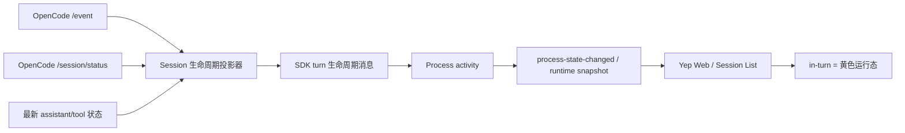

# OpenCode 生命周期投影修复计划

> 历史资料：OpenCode provider 与 4520/4521 bridge 已于 2026-08-18 从产品退役；本文仅保留当时的设计背景，不代表现行实现。
>
> 状态：方案评审稿，仅包含设计与实施计划，不包含代码修改。
>
> 日期：2026-07-18
>
> 目标会话：`ses_08ffe74ddffeseDsRg18MJUy6K`

## 1. 目标与结论

本次修复的目标不是新增一种前端状态，而是让 OpenCode 的真实运行态可靠地投影为 Yep 已有的统一状态：

- OpenCode 为 `busy` 时，Yep 必须保持 `activity: "in-turn"`，前端继续显示黄色运行圆点/Thinking 状态。
- OpenCode 为 `retry` 时，Yep 仍保持 `in-turn`，同时携带 retry 信息。
- 只有整轮真正结束后，Yep 才投影为 `idle` 并发送一次终态 `result`。
- 等待 permission/question 时投影为 `waiting-input`；用户处理后，如果 OpenCode 仍在运行，应恢复为 `in-turn`，而不是直接变为 `idle`。

前端现有状态模型和视觉组件已经具备所需能力。首要修复点在服务端 OpenCode 生命周期投影层，不能再把一次内容流结束、单个 step 完成或孤立的 `session.idle` 事件直接等价为整轮结束。

## 2. 本次调研证据

目标会话在同一时刻出现了明确的状态分裂：

| 信号 | 观测结果 | 含义 |
| --- | --- | --- |
| OpenCode `GET /session/status` | 目标 session 为 `busy` | 上游仍在执行 |
| OpenCode 进程 | `opencode serve` 仍存活 | 不是 provider 进程退出 |
| OpenCode 日志 | 后续仍出现 loop step | 不是单纯的前端漏刷新 |
| Yep process API | `state: "idle"` | Yep 已提前结束生命周期投影 |
| Yep queue | `queueDepth: 2` | 提前 idle 还可能影响队列消费时机 |
| pending input / provider error | 均未发现 | 不是审批阻塞或显式错误 |

当前托管 OpenCode provider 的终态链路如下：

1. `packages/server/src/sdk/providers/opencode.ts` 按每次消息订阅 `/event`。
2. 收到 `session.idle` 或 `session.status(type=idle)` 后立即停止 SSE reader。
3. `sendMessageAndStream()` 随后无条件产生 `result`。
4. `packages/server/src/supervisor/Process.ts` 收到任意 `result` 后调用 `transitionToIdle()`。
5. `process-state-changed` 把错误的 `idle` 继续传播给 REST/SSE/客户端。

因此，前端长时间没有更新并不是黄色圆点组件本身失效，而是服务端过早发出了整轮终态；后续 OpenCode 继续 `busy` 时，当前 per-turn SSE reader 已经退出，也没有独立生命周期监视器把状态改回 `in-turn`。

另外，OpenCode 在推理期间可能只有空的或不可展示的 reasoning part。即使 transcript 没有新增可见文本，生命周期仍必须依据运行态保持黄色圆点，不能拿“是否收到可渲染内容”推断是否完成。

## 3. 修复原则

1. **生命周期与内容流解耦**：文本、reasoning、tool part 是否产生内容，不决定 turn 是否完成。
2. **上游状态优先**：`/session/status` 的 `busy | retry | idle` 是主要运行态事实来源；事件用于低延迟更新，查询用于消歧和重连对账。
3. **终态需要合取条件**：孤立的 `idle` 只能成为“完成候选”，不能直接产生 `result`。
4. **活跃信号可撤销完成候选**：任何较新的 `busy`、`retry`、assistant/tool 活动或 pending-input 恢复都必须取消旧的 idle 候选。
5. **每轮只产生一次终态**：同一个 turn generation 只允许一次 `result`/idle transition。
6. **兼容 OpenCode 版本差异**：同时识别新版 `session.status` 和 deprecated `session.idle`，但二者都进入同一归一化状态机。
7. **前端继续消费统一模型**：不新增 `opencode-running` 之类的 provider 专用状态。

## 4. 目标链路

生命周期投影器应是 session-scoped，而不是只存在于一次内容流读取期间。内容事件仍可按当前 turn 路由，但 OpenCode session 的 `/event` 监听和状态对账至少要覆盖整个活动 turn，直到终态被确认。

## 5. 统一状态机

### 5.1 内部状态

建议引入以下内部 phase；它们不直接暴露给客户端：

- `idle`：没有活动 turn。
- `running`：OpenCode `busy` 或已观察到本轮 assistant/tool 活动。
- `retrying`：OpenCode `retry`，本轮仍未结束。
- `waiting-input`：等待 permission/question。
- `idle-candidate`：收到了 idle 信号，但尚未通过终态确认。
- `terminal`：本轮已确认完成、失败或中断，终态已发出。

每次成功提交 `prompt_async` 都生成递增的 `turnGeneration`。异步确认任务必须同时校验 generation 和 event sequence，避免旧 turn 的延迟事件结束新 turn。

### 5.2 对外映射

| OpenCode / 内部状态 | Yep `activity` | `result` | 说明 |
| --- | --- | --- | --- |
| `busy` / `running` | `in-turn` | 否 | 黄色运行态 |
| `retry` / `retrying` | `in-turn` | 否 | 保留 retryStatus |
| permission/question pending | `waiting-input` | 否 | 输入完成后重新对账 |
| `idle-candidate` | 保持上一活动态 | 否 | 不向客户端闪成 idle |
| confirmed final idle | `idle` | 是，仅一次 | 正常完成 |
| non-retryable error | `idle` 或既有错误终态 | 是，仅一次 | 同时保留错误信息 |
| abort/process exit | `terminated`/既有中断语义 | 否或既有中断结果 | 不伪装为正常完成 |

状态优先级为：

`waiting-input > retrying > running > idle-candidate > idle`。

### 5.3 终态确认协议

收到 `session.idle` 或 `session.status(idle)` 时执行以下协议：

1. 记录 `idle-candidate(generation, eventSequence)`，但保持对外 `in-turn`。
2. 启动一个短 quiet window。建议初值为 `250ms`，作为集中定义、可测试的常量，而不是散落的 magic number。
3. quiet window 内若收到 `busy`、`retry`、新的 assistant/tool 活动或输入恢复，立即取消候选。
4. quiet window 到期后查询 `GET /session/status`：
   - `busy`：恢复/保持 `running`；
   - `retry`：进入 `retrying`；
   - `idle` 或列表中已无该 session：继续检查终态内容条件；
   - 查询失败：不立即降为 idle，进入有上限的 active grace period 并重试。
5. 终态内容条件优先使用 OpenCode 最新 assistant message：`time.completed` 已存在，且 `finish` 不是 `tool-calls`/`unknown`，不存在未结算 tool/permission/question。
6. 对缺少完整 message finish 元数据的旧版 OpenCode，使用兼容回退：两个连续的 idle 对账样本、样本间无新事件且跨过 quiet window，才确认完成。
7. 仅当 generation 和 event sequence 仍与候选一致时，发出一次 `result`，随后转为 `idle` 并关闭本轮内容路由。

这里的 quiet window 只负责合并乱序/紧邻事件，不能成为唯一完成依据。真正的判定是“稳定 idle + terminal assistant/tool 状态 + generation 未变化”。

### 5.4 对账策略

采用“事件驱动为主、有限轮询兜底”，避免高频永久轮询：

- turn 提交成功后立即做一次 status bootstrap，保证首个 SSE 事件丢失时仍能进入 `in-turn`。
- 收到 idle、retry、SSE 重连或输入处理完成时立即对账。
- 活动 turn 期间以低频安全对账兜底，建议初值 `1s`；终态确认后停止。
- 对账请求必须携带/使用现有 cwd directory header，避免多目录 OpenCode server 读错实例状态。
- 同一 session 的并发对账需要合并，较旧响应不得覆盖较新的 event sequence。

当 status 查询暂时失败时，若 OpenCode 子进程仍存活且最近状态为 active，应在有上限的 grace period 内保持 `in-turn`，并记录诊断日志；超过上限且 SSE、status 和进程健康均无法证明仍在运行时，再按中断/错误路径结束，不能静默当作正常 idle。

## 6. 分层改动方案

### 6.1 共享 OpenCode 状态归一化层

新增一个服务端共享模块，职责限制为：

- 解析 `session.status`、deprecated `session.idle` 和 `/session/status` 响应。
- 统一 `busy | retry | idle` 到 Yep activity/retryStatus 的映射。
- 比较事件版本、generation 和 sequence，阻止陈旧状态回写。
- 提供纯函数状态迁移，便于使用 fake timer 和表驱动测试。

托管 provider 与 `OpenCodeBridgeService` 必须复用这一映射规则，避免 4520 bridge 与 Yep-owned OpenCode session 再次出现两套生命周期语义。状态机实例仍由各自的 session owner 管理，不强行把 bridge 和 provider 的进程管理代码耦合在一起。

建议文件边界：

- `packages/server/src/opencode-lifecycle/status.ts`：schema、解析与对外映射。
- `packages/server/src/opencode-lifecycle/projector.ts`：generation、idle candidate、对账结果的纯状态机。

最终命名可按仓库惯例调整，但不要把状态机继续堆进单个 provider 大文件。

### 6.2 托管 OpenCode provider

主要修改入口为 `packages/server/src/sdk/providers/opencode.ts`：

1. 将当前“每次消息遇到 idle 就 return”的 SSE 逻辑拆成 session event pump 与当前 turn 内容路由。
2. `prompt_async` 接受成功时显式启动 generation，并立即投影 `in-turn`。
3. `session.idle`/`session.status(idle)` 只调用 `markIdleCandidate()`，不关闭 SSE，不设置 `sawSessionIdle` 终态。
4. 只有 projector 返回 `confirmed-terminal` 时才调用 `createResultMessage()`。
5. busy/retry 和 assistant/tool 活动在没有可见文本时也必须刷新 lifecycle evidence。
6. SSE 意外结束时先用 `/session/status` 和消息状态恢复；只有恢复失败才进入错误/中断路径。
7. permission/question handler 完成后主动 reconcile：仍 busy/retry 则恢复 `in-turn`。
8. abort 时使当前 generation 失效，取消 timer、poll 和 pending fetch，防止晚到结果把 terminated process 改回 idle。

不建议在 `Process.ts` 中加入 `if (provider === "opencode")` 的补丁。`Process` 继续保持“收到真正的 `result` 才转 idle”的通用约定；根因应通过 provider 不再提前产生假 `result` 来解决。

如果实现时需要把 lifecycle transition 显式传给 `Process`，应增加 provider-neutral 的 `turn_started` / `turn_complete` 系统消息并让 Codex/OpenCode 共用，而不是增加 OpenCode 专属分支。该扩展只有在 provider 内部无法持续驱动 `Process` 时才启用。

### 6.3 4520 OpenCode bridge 对齐

`packages/server/src/opencode-bridge/OpenCodeBridgeService.ts` 已有事件处理和 `/session/status` 对账入口，实施时需要：

- 替换为共享 status parser/mapping。
- 同样采用 generation/sequence，禁止陈旧 idle 覆盖较新的 busy。
- retry 始终保持 `in-turn`，并持久化/恢复 retryStatus。
- 重连和 bootstrap 后先以 status snapshot 恢复活动态，再处理增量事件。
- pending input 的优先级与托管 provider 一致。
- confirmed terminal 与 lastTurnStatus/pendingInput 清理保持原子更新。

这样 Yep-owned OpenCode、外部 OpenCode 以及 bridge-only 模式在前端看到相同的活动语义。

### 6.4 Supervisor 与队列安全

`packages/server/src/supervisor/Process.ts` 原则上只需要回归验证，不做 provider 特判：

- 只有 confirmed `result` 才执行 `transitionToIdle()`。
- idle 之前不消费 deferred/legacy queue 中的下一条消息。
- 同一 generation 的重复 terminal event 不得重复 drain queue。
- process terminated 后的晚到 lifecycle event 必须被忽略。

这部分是必要的回归范围，因为本次现场已经出现 `queueDepth: 2`；即使 UI 状态修正，也必须证明不会因假 idle 提前提交排队消息。

### 6.5 前端

预计不需要修改生产 UI：

- `AgentActivity` 已包含 `in-turn`。
- session list、session page 和全局 session 状态都已消费 activity/process state。
- `StatusBadge` / Thinking indicator 已能显示黄色运行态。

前端工作以回归测试为主，验证 REST bootstrap、SSE 增量和 WebSocket 重连三条路径都不会把 active OpenCode session 显示为 idle。只有测试发现某条路径丢弃 `in-turn` 时，才修改对应 hook；不新增视觉或 provider 专用状态。

## 7. 预计文件范围

以下是实施阶段的预计范围，不代表本计划已经修改这些文件：

| 范围 | 预计文件 |
| --- | --- |
| 共享状态机 | `packages/server/src/opencode-lifecycle/*`（新增） |
| 托管 provider | `packages/server/src/sdk/providers/opencode.ts` |
| bridge 对齐 | `packages/server/src/opencode-bridge/OpenCodeBridgeService.ts` |
| Supervisor 回归/必要的通用协议 | `packages/server/src/supervisor/Process.ts` |
| provider 测试 | `packages/server/test/sdk/providers/opencode.test.ts` |
| bridge 测试 | `packages/server/test/opencode-bridge/*` |
| Supervisor 测试 | 对应 `Process`/queue 测试文件 |
| 客户端回归 | `useSession`、`useSessionStatuses`、`useGlobalSessions`、status badge 相关测试 |

## 8. 实施阶段

### 阶段 0：固定现场与测试夹具

- 把本次 `busy upstream / idle Yep` 的事件顺序转成最小化 fixture。
- 记录当前托管 provider 和 4520 bridge 的状态输出，作为行为基线。
- 不依赖真实 OpenCode 网络请求，先用可控 SSE、status response 和 fake timers 重现。

### 阶段 1：共享 normalizer 与纯状态机

- 实现 status schema、generation/sequence、idle candidate、retry 和 pending-input 优先级。
- 完成表驱动单元测试后再接入任何运行时。
- 这一阶段不改变客户端协议。

### 阶段 2：修复托管 provider

- 接入 session-scoped projector。
- 移除“首个 idle 立即停止 SSE + 无条件 result”的路径。
- 加入 status bootstrap、终态确认、查询失败 grace 和清理逻辑。
- 验证队列只在真正终态后继续。

### 阶段 3：对齐 4520 bridge

- 复用共享 normalizer。
- 对齐 retry、waiting-input、重连、乱序事件和终态持久化。
- 确认外部 session 与 Yep-owned session 输出相同 activity。

### 阶段 4：客户端与端到端协议回归

- 使用组件/hook 单测验证黄色运行态。
- 使用服务端集成测试验证 `process-state-changed` 和 runtime snapshot。
- 如需浏览器自动化，再单独征得用户确认；本计划不默认使用浏览器或重启现有服务。

### 阶段 5：灰度与清理

- 先在测试实例使用生命周期 v2，记录旧判定与新判定的 shadow diff。
- 现场验证稳定后默认启用，再移除旧的 `sawSessionIdle` 终态分支与临时兼容日志。

## 9. 必测场景

| 场景 | 期望结果 |
| --- | --- |
| `busy -> idle -> busy`，第二个 busy 在 quiet window 内 | 全程 `in-turn`，无假 `result` |
| idle event 到达，但 status 查询仍为 busy | 抑制 idle，黄色状态持续 |
| 多轮 tool-call，期间无可见 reasoning 文本 | 全程 `in-turn` |
| `retry -> busy -> idle` | retry 期间仍 active，最终仅一次 idle |
| permission/question -> 用户响应 -> busy | 先 waiting-input，随后恢复黄色运行态 |
| 最终 assistant `finish=stop` + 稳定 idle | 仅一次 `result`，转 idle |
| assistant `finish=tool-calls` + idle 抖动 | 不得当作整轮完成 |
| non-retryable `session.error` | 结束并保留错误，不无限 busy |
| 用户 abort / OpenCode 子进程退出 | 正确中断/terminated，晚到事件无效 |
| SSE 断线时 status=busy | 重连期间仍 `in-turn` |
| status 查询超时一次后恢复 busy | grace 内不闪 idle |
| status 长期不可达且进程退出 | 有界结束并给出诊断，不永久黄色 |
| 乱序的旧 idle 晚于新 busy 到达 | generation/sequence 阻止回退 |
| active 时 queueDepth > 0 | 下一条消息不提前提交 |
| REST/bootstrap 时上游已 busy | 首屏直接显示运行态 |
| WebSocket 重连时上游仍 busy | 恢复后仍显示运行态 |
| 4520 bridge 与托管 provider 接收同一事件序列 | 输出相同 activity/retryStatus |

## 10. 可观测性

新增结构化日志，至少包括：

- `opencode_lifecycle_transition`
- `opencode_idle_candidate_created`
- `opencode_idle_candidate_cancelled`
- `opencode_idle_suppressed_by_busy`
- `opencode_idle_confirmed`
- `opencode_status_reconcile_failed`
- `opencode_terminal_duplicate_ignored`

通用字段：`sessionId`、`processId`、`turnGeneration`、`previousPhase`、`nextPhase`、`source`、`eventSequence`、`upstreamStatus`、`candidateAgeMs`、`lastActivityAgeMs`。

建议增加以下计数/耗时指标：

- idle candidate 被 busy/retry 撤销的次数。
- status reconcile 失败次数和连续失败时长。
- OpenCode 首次 busy 到 Yep `in-turn` 的投影延迟。
- OpenCode confirmed idle 到 Yep idle 的投影延迟。
- 同一 turn 收到重复 terminal 信号的次数。

日志不能记录用户 prompt、reasoning 或 tool 参数正文。

## 11. 验收标准

满足以下条件才算完成：

1. 当 `/session/status` 为 `busy` 或 `retry` 时，Yep REST/runtime snapshot 与增量事件均表现为 `in-turn`；正常网络条件下投影延迟不超过 `500ms`。
2. OpenCode 多个 loop/tool step 之间，前端黄色运行态不闪断。
3. Transcript 没有可见 reasoning 文本时，运行态仍正确。
4. 每个用户 turn 最多发出一个 `result` 和一个最终 idle transition。
5. waiting-input、retry、abort、error、SSE 重连均通过测试矩阵。
6. active turn 未确认结束前，不消费下一条 queued/deferred message。
7. Yep-owned OpenCode 与 4520 bridge 对相同上游状态给出一致结果。
8. Codex、Claude、Gemini 等其他 provider 的生命周期行为无回归。
9. `pnpm lint`、`pnpm typecheck` 和相关聚焦测试通过；仅在实施确实需要时运行完整 `pnpm test`。

## 12. 风险与缓解

| 风险 | 缓解措施 |
| --- | --- |
| 过度保守导致黄色状态永久不结束 | 有界 grace、持续 status 对账、进程存活检查和显式错误终态 |
| 固定延迟掩盖而非解决竞态 | quiet window 只做事件合并，终态仍要求 status + message/tool 条件 |
| 高频轮询增加本地负载 | 事件优先，只在 active turn 低频兜底，终态后停止 |
| 旧响应覆盖新事件 | generation + event sequence + AbortController |
| OpenCode 版本缺少 finish 元数据 | 双 idle 样本兼容回退，并记录版本/降级日志 |
| bridge 与 provider 再次漂移 | 共享 parser/mapping 和同一套 contract tests |
| 修改通用 Process 影响其他 provider | 默认不改通用语义；如需扩展只增加 provider-neutral 协议 |

## 13. 实施前决策

建议按以下默认值进入实现，不再阻塞方案：

- quiet window：`250ms`。
- active safety reconcile：`1s`。
- status 暂时失败时：保持 active，并使用指数退避；总 grace 初值 `15s`。
- 终态优先条件：稳定 idle + terminal assistant finish + 无未完成 tool/input。
- 兼容回退：两个连续稳定 idle 样本，且期间无新 activity。
- 前端协议：继续使用现有 `AgentActivity`，不新增枚举值。
- `Process.ts`：不加入 OpenCode provider 特判。

这些数值应集中定义并在 fake-timer 测试中覆盖；灰度日志显示实际事件间隔明显不符时再调整，而不是散落成不可追踪的延迟补丁。
