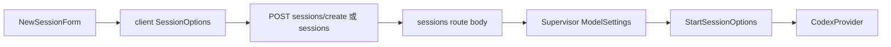
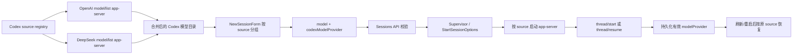

# Codex 多模型源选择能力开发设计

状态：Implemented

调研日期：2026-07-31

最近更新：2026-08-13

适用范围：Yep Anywhere 的 `codex` provider、新会话模型选择、Codex app-server 启动与恢复、Codex session 元数据读取

首期目标源：

- OpenAI 官方源，继续使用现有 ChatGPT / Codex 登录状态
- DeepSeek API，当前开放 `deepseek-v4-flash` 与 `deepseek-v4-pro`

相关文档：

- [Codex Advanced Configuration](https://learn.chatgpt.com/docs/config-file/config-advanced#custom-model-providers)
- [Codex Configuration Reference](https://learn.chatgpt.com/docs/config-file/config-reference)
- [Codex App Server](https://learn.chatgpt.com/docs/app-server)
- [DeepSeek 接入 Codex](https://api-docs.deepseek.com/zh-cn/quick_start/agent_integrations/codex)
- 仓内 Codex 参考源码：`references/codex/`
- 当前 Codex provider：`packages/server/src/sdk/providers/codex.ts`

---

## 1. 结论与核心决策

Codex CLI 和 Codex app-server 已经具备自定义模型提供方能力，但 Yep 当前只把“模型”作为会话参数，没有把 Codex 的 `model_provider` 作为独立、可持久化的会话属性。因此，当前 Yep 不能像 OpenCode 一样在新会话中选择不同模型渠道。

本设计采用以下核心决策：

| 维度 | 决策 | 原因 |
| --- | --- | --- |
| Yep 顶层 provider | 保持为 `codex` | DeepSeek 仍通过 Codex app-server 运行，工具、审批、事件和 session 格式都属于 Codex |
| 模型渠道 | 在 `codex` 内新增“模型源”维度 | 与 Codex 的 `modelProvider` 协议字段一致，也便于未来接入其他 Responses API provider |
| `codex-oss` | 不用于 DeepSeek 云 API | `codex-oss` 是 Ollama / LM Studio 等本地模型执行路径，生命周期和启动参数不同 |
| 默认行为 | 未指定源时继续使用 `openai` | 保持旧客户端、旧保存配置和现有官方登录流程兼容 |
| DeepSeek 密钥 | 只从 Yep 服务端环境变量读取 | 不把密钥写入浏览器、API body、session metadata、日志或仓库 |
| provider 配置 | 由服务端受控注册表生成 app-server `-c` 覆盖 | 不允许浏览器传入任意 URL、密钥或 catalog 路径 |
| 模型目录 | 每个模型源使用自己的 app-server 启动配置与缓存 | Codex `model/list` 没有 provider 过滤参数，模型管理器在进程启动时绑定 provider/catalog |
| 会话恢复 | 始终恢复到会话原有模型源 | 不允许普通 resume/edit 请求把既有 Codex thread 静默迁移到另一个 provider |
| DeepSeek 开放模型 | 展示 `deepseek-v4-flash` 与 `deepseek-v4-pro` | 2026-08-13 起两者都通过 Codex Responses API 开放，共用同一 Base URL 与 Key，原生思考档位为 `low/high/max` |

这不是单纯的 UI 下拉框改动。要形成可靠能力，需要同时扩展模型发现、共享类型、API、Supervisor、Codex app-server 启动、session metadata、恢复逻辑和 Codex reader。

---

## 2. 背景、目标与非目标

### 2.1 背景

OpenCode 的模型 ID 已经采用 `provider/model` 形式，Yep 的新会话模型下拉框会按 `/` 前缀分组，因此用户可以在同一个 OpenCode provider 内区分不同上游渠道。

Codex 当前不同：

- 顶层只选择 `codex`。
- Yep 从一个默认启动的 Codex app-server 调用一次 `model/list`。
- 用户选择的只有模型 slug，例如 `gpt-5.6-sol`。
- Yep 在 `thread/start` 和 `thread/resume` 中固定发送 `modelProvider: "openai"`。

这导致即使用户已经在 Codex 配置中声明了第三方 provider，Yep 也无法在新会话中选择它。

### 2.2 目标

1. 在 Yep“开始新会话”的 Codex 模型选择器中同时展示 OpenAI 和 DeepSeek 模型。
2. 每个新会话明确记录 `model + modelProvider`。
3. OpenAI 会话继续使用现有官方登录，不要求迁移或重写认证配置。
4. DeepSeek 会话使用独立 API Key 和模型目录，不污染 OpenAI 默认模型列表。
5. 服务重启、页面刷新、历史恢复、rollback/edit 后仍使用原模型源。
6. 设计成可扩展能力，未来可以增加其他 Codex Responses API provider，而不是只写一个 DeepSeek 特判。
7. 旧客户端和旧 session 在没有新字段时继续按 `openai` 运行。

### 2.3 非目标

首期不包含：

- 把任意用户输入的 Base URL 直接变成可用模型源。
- 在浏览器中输入、存储或展示第三方 API Key。
- 把 DeepSeek 云 API 接到 `codex-oss`。
- 在一个已运行的 Codex thread 中热切换模型提供方。
- 自动执行 DeepSeek 官方一键脚本或重写 `~/.codex/config.toml`。
- 自动从互联网更新 DeepSeek 模型目录。
- 扩展 OpenCode、Claude、Gemini、Kimi 的现有模型选择协议。
- 默认执行浏览器自动化或重启现有 Yep 服务。

### 2.4 术语

| 术语 | 本文含义 |
| --- | --- |
| Yep provider | `claude`、`codex`、`codex-oss`、`opencode` 等顶层执行后端 |
| Codex model provider | Codex 配置和 app-server 协议里的 `model_provider` / `modelProvider`，例如 `openai`、`deepseek` |
| 模型源 / source | Yep 对 Codex model provider 的产品层命名 |
| 模型 slug | 真正发送给 Codex 的模型 ID，例如 `deepseek-v4-flash` |
| picker ID | Yep 模型选择器中的唯一 ID，建议为 `source/model` |
| model catalog | Codex 的 `model_catalog_json`，包含上下文窗口、reasoning、工具支持等模型元数据 |

---

## 3. Codex 上游能力与约束

### 3.1 Codex 支持自定义模型提供方

Codex 用户级配置支持：

```toml
[model_providers.deepseek]
name = "DeepSeek"
base_url = "https://api.deepseek.com/"
wire_api = "responses"
env_key = "DEEPSEEK_API_KEY"
request_max_retries = 8
stream_max_retries = 8
stream_idle_timeout_ms = 600000
requires_openai_auth = false
supports_websockets = false
```

相关关键字段：

| 字段 | 作用 |
| --- | --- |
| `model_provider` | 选择 `model_providers.<id>` 中的 provider |
| `model_providers.<id>.base_url` | 上游 API 地址 |
| `model_providers.<id>.wire_api` | 当前 DeepSeek 集成使用 `responses` |
| `model_providers.<id>.env_key` | 从环境变量读取 API Key |
| `model_providers.<id>.request_max_retries` | DeepSeek 5xx/503 的 HTTP 请求重试上限；Yep 固定为 8 |
| `model_providers.<id>.stream_max_retries` | Responses SSE 中断后的恢复上限；Yep 固定为 8 |
| `model_providers.<id>.stream_idle_timeout_ms` | SSE 静默等待上限；Yep 按 DeepSeek 最长排队窗口固定为 600000 ms |
| `model_providers.<id>.requires_openai_auth` | 自定义 DeepSeek provider 固定为 `false`，避免继承 ChatGPT 认证 |
| `model_providers.<id>.supports_websockets` | DeepSeek 使用 HTTP Responses/SSE，固定为 `false` |
| `model_providers.<id>.experimental_bearer_token` | 直接写 token；官方参考中不推荐，Yep 不采用 |
| `model_catalog_json` | 指定模型元数据目录，启动时加载 |

Codex 不允许项目级 `.codex/config.toml` 覆盖 `model_provider` 和 `model_providers`。这些键必须来自用户级配置、受管配置或 CLI/session 覆盖。因此，Yep 不能通过给项目仓库写入 `.codex/config.toml` 来实现第三方源。

### 3.2 app-server 已支持每个 thread 指定 provider

仓内 Codex reference 与 Yep 已生成的 app-server 协议类型都包含：

```ts
type ThreadStartParams = {
  model?: string | null;
  modelProvider?: string | null;
  // ...
};
```

`thread/resume` 和 `thread/fork` 也支持 `modelProvider`。`ThreadStartResponse` / `ThreadResumeResponse` 会返回最终生效的 `modelProvider`。

因此不需要修改 Codex CLI 或自己实现 DeepSeek 协议。Yep 需要做的是正确选择、传递、校验和持久化这个字段。

### 3.3 `model/list` 不是多 provider 聚合接口

Codex `model/list` 的参数只有：

- `cursor`
- `limit`
- `includeHidden`

没有 `modelProvider` 过滤或切换参数。

仓内 reference 的 `ThreadManager` 会在 app-server 启动时，使用当前进程配置的 `model_provider` 和 `model_catalog_json` 构造共享 models manager。换言之：

- 默认启动的 app-server 只能可靠列出当前默认 provider 的模型。
- 在同一进程里给 `thread/start` 改 `modelProvider`，不等于 `model/list` 会自动变成多源列表。
- `model_catalog_json` 会替换当前进程的模型目录，不能把 DeepSeek catalog 全局设上后仍假设 OpenAI 列表不受影响。

所以 Yep 应按模型源分别启动短生命周期 app-server 做 `model/list`，并按源缓存结果；实际会话进程也应以与会话源匹配的 startup config 启动。

这里还有一个配置隔离限制：CLI 的 `-c` 可以覆盖 `model_provider` 和一个新的 `model_catalog_json` 路径，但 TOML override 没有可靠的“删除下层已有 key”语义。如果用户已经在 `~/.codex/config.toml` 顶层设置了 DeepSeek 专用 `model_catalog_json`，仅把 provider 覆盖回 `openai` 仍可能让 OpenAI app-server 继承错误 catalog。首期应检测这个冲突并给出明确提示，要求把 source-specific catalog 交给 Yep 管理，而不是假装已经完全隔离。

### 3.4 不依赖 profile 作为 app-server 路由机制

Codex 交互 CLI 支持 `--profile`，profile 也可以覆盖 `model_catalog_json`。但当前仓内 Codex CLI reference 的命令分派不会把 `--profile` 应用于 `app-server` 路径。

Yep 当前直接运行：

```text
codex app-server ... -c key=value
```

因此本设计继续使用 app-server `-c` 覆盖，不把正确性建立在 profile 是否被 app-server 消费之上。用户仍可为自己直接使用的 Codex CLI 配置 profile，但它不是 Yep 新会话选择的协议基础。

### 3.5 DeepSeek 当前接入要求

DeepSeek 官方资料与当前实测包含：

- 通过 Responses API 与 Codex 通信。
- provider ID 为 `deepseek`。
- Base URL 为 `https://api.deepseek.com/`。
- 需要独立的 `models.json` 向 Codex 声明模型能力。
- 2026-07-31 页面提示只有 `deepseek-v4-flash` 已支持 Codex；2026-08-13 模型表加入 `deepseek-v4-pro`，并确认两个稳定别名共用 Base URL 与 Key、具备 1M 上下文和最大 384K 输出。
- 官方 catalog 中模型的 `minimal_client_version` 为 `0.144.0`。
- 503 表示上游暂时过载，应短暂等待并重试；Yep 因此为该受管 provider 使用独立于 OpenAI 默认值的重试窗口。

本机调研时安装的版本是 `codex-cli 0.144.5`，满足该最低版本。产品实现仍需要显式做版本/能力错误提示，不能假设所有部署机器版本相同。

DeepSeek 官方示例会设置全局的 `model`、`model_provider` 和 `model_catalog_json`，并展示把 Key 写入 `experimental_bearer_token` 的方式。这适合把整个 Codex 默认切换为 DeepSeek，但不适合 Yep 中 OpenAI 与 DeepSeek 并存。

---

## 4. Yep 当前实现现状

### 4.1 新会话表单只有顶层 provider 和 model

主要入口：`packages/client/src/components/NewSessionForm.tsx`

当前状态包括：

- `selectedProvider`
- `selectedModel`
- `selectedReasoningEffort`
- `selectedCodexMcpMode`
- OpenCode 专用的 `opencodeConfig`

模型列表来自：

```ts
const availableModels = selectedProviderInfo?.models ?? [];
```

提交的 `sessionOptions` 包含：

```ts
{
  mode,
  model,
  thinking,
  reasoningEffort,
  provider,
  codexMcpMode,
  opencodeConfig,
  executor,
}
```

没有 Codex `modelProvider` 字段。

现有模型下拉框已经会把带 `/` 的 model ID 按前缀分组。注释把它描述为 OpenCode 行为，但实现本身可以复用于 Codex。

### 4.2 共享类型没有 Codex 模型源

`packages/shared/src/types.ts` 中：

- `ModelInfo` 只有 model ID、名称、reasoning effort、上下文窗口等模型能力。
- `ProviderInfo.models` 是一个扁平模型数组。
- `NewSessionProviderDefaults` 保存 `model`、thinking、reasoning、permission、MCP profile 和 OpenCode config。
- 没有 `codexModelProvider` 或 Codex source 状态。

`packages/server/src/sdk/providers/types.ts` 的 `StartSessionOptions` 也只有 `model`，没有 `modelProvider`。

### 4.3 API 和 Supervisor 调用链会丢失 source

当前调用链：



涉及的主要文件：

| 层 | 文件 | 当前缺口 |
| --- | --- | --- |
| Client API | `packages/client/src/api/client.ts` | `SessionOptions` 和 body 没有 source |
| Server route | `packages/server/src/routes/sessions.ts` | start/create body、解析和 resume 都没有 source |
| Supervisor | `packages/server/src/supervisor/Supervisor.ts` | `ModelSettings` 不携带 source |
| Provider interface | `packages/server/src/sdk/providers/types.ts` | `StartSessionOptions` 不携带 source |

### 4.4 Codex 模型发现只查询一个默认 app-server

`packages/server/src/sdk/providers/codex.ts` 当前：

1. 启动一个默认 `codex app-server`。
2. 调用一次 `model/list`。
3. 把结果作为整个 `codex` provider 的模型列表。
4. 查询失败时使用一组静态 OpenAI fallback models。
5. 使用单一 5 分钟缓存。

当前缓存没有 source 维度，也没有 per-source 认证状态。

另外，`getAuthStatus()` 目前只要发现 Codex CLI 已安装，就把 `authenticated` 和 `enabled` 视为 `true`。这不足以表达“OpenAI 官方登录可用，但 DeepSeek Key 缺失”或相反的状态。

### 4.5 Codex 会话执行把 provider 写死为 `openai`

`packages/server/src/sdk/providers/codex.ts` 当前存在：

```ts
const CODEX_CLOUD_MODEL_PROVIDER = "openai";
```

随后在两个路径里固定使用：

```ts
const threadResumeParams = {
  model: requestedModel,
  modelProvider: CODEX_CLOUD_MODEL_PROVIDER,
  // ...
};

const threadStartParams = {
  model: requestedModel,
  modelProvider: CODEX_CLOUD_MODEL_PROVIDER,
  // ...
};
```

这就是 Yep 当前不能切换 Codex 渠道的直接原因。

app-server 返回值已经包含最终的 `threadResult.modelProvider`，但 Yep 生成 init message 时只暴露了 model、reasoning effort 和 service tier，没有利用该字段做持久化或诊断。

### 4.6 Session metadata 没有保存 Codex provider

`packages/server/src/metadata/SessionMetadataService.ts` 当前保存：

- 顶层 Yep `provider`
- `model`
- `codexMcpMode`
- `opencodeConfig`
- executor 等

没有 `codexModelProvider`。因此，即使创建阶段临时选择了 DeepSeek，下一次恢复前也没有一个快速、可靠的来源告诉 Yep 应以哪个模型源启动 app-server。

Codex 自己的 JSONL `session_meta.payload.model_provider` 已经存在，`packages/shared/src/codex-schema/session.ts` 也已经解析该字段。这可以作为外部 session 和旧 metadata 的恢复兜底，但不应取代 Yep 自己对所创建会话的显式 metadata。

### 4.7 Codex reader 会误判 DeepSeek 云会话

`packages/server/src/sessions/codex-reader.ts` 当前规则：

- 显式 `ollama` / `lmstudio` / `local` -> `codex-oss`
- 显式 `openai` / `azure` -> `codex`
- 其他 provider 继续进入模型名启发式判断
- 模型名包含 `deepseek` -> `codex-oss`

如果 JSONL 明确记录 `model_provider = "deepseek"`，当前代码仍可能因为模型名包含 `deepseek` 而把云 API session 归入 `codex-oss`。结果可能是：

- 历史列表显示错误 provider。
- resume 走本地 OSS provider。
- 生成与恢复路径不一致。

正确规则应是：只把已知本地 provider ID 映射为 `codex-oss`；任何显式的非本地自定义 provider 都属于 `codex`。只有完全缺少 `model_provider` 时才允许用模型名做有限兜底。

### 4.8 `codex-oss` 的边界

`packages/server/src/sdk/providers/codex-oss.ts` 是本地 Ollama / LM Studio 路径，使用 `codex exec --oss` 和本地 provider 参数。

DeepSeek 的云 API 虽然模型名含 `deepseek`，但它：

- 使用远端 HTTPS API。
- 通过 Codex Responses API provider 运行。
- 使用 `codex app-server` 的云 provider 路径。

所以 DeepSeek 必须归入顶层 `codex`，不能因为模型品牌名而归入 `codex-oss`。

---

## 5. 能力缺口汇总

| 能力 | 当前状态 | 目标状态 |
| --- | --- | --- |
| 模型源发现 | 只发现默认 OpenAI app-server | 按 source 分别发现并聚合 |
| 新会话选择 | 只能选择 model | 同时确定 model + modelProvider |
| API 传递 | 没有 source 字段 | 全链路传递 `codexModelProvider` |
| app-server 启动 | 默认 provider/catalog | 按 source 启动并加载匹配 catalog |
| thread 参数 | 固定 `openai` | 使用已校验的 session source |
| 认证状态 | 只有 Codex 整体 installed/authenticated | 增加 per-source availability |
| 默认保存 | 只保存 model | 同时保存 source |
| resume | 强制覆盖成 OpenAI | 恢复 session 原 source |
| JSONL 读取 | DeepSeek 可能判为 OSS | 显式非本地 provider 归入 `codex` |
| 模型缓存 | `codex:model` | 至少区分 `codex:source/model` |
| 安全边界 | 没有第三方 source 输入 | source ID allowlist；URL/Key/path 不来自 client |

---

## 6. 目标架构

### 6.1 总体流程



### 6.2 设计原则

1. **执行协议与品牌解耦**：DeepSeek 是 Codex model provider，不是新的 Yep execution provider。
2. **服务端定义信任边界**：client 只选择 source ID，不定义如何连接 source。
3. **模型源与模型成对校验**：不能把 DeepSeek 模型 slug 发送给 OpenAI source，反之亦然。
4. **进程启动配置与 thread 参数一致**：app-server models manager、catalog、auth 和 thread `modelProvider` 必须指向同一 source。
5. **生效值优先**：持久化 app-server response 返回的有效 `modelProvider`，而不是只信任请求值。
6. **恢复优先于新请求默认值**：既有 session 的 source 属于 session identity 的一部分。
7. **旧数据安全回退**：缺少 source 的旧 Codex session 默认按 `openai`，但如果 JSONL 有显式 provider 则使用 JSONL。
8. **单源故障隔离**：DeepSeek model/list 或 Key 缺失不能让 OpenAI 模型列表消失。

---

## 7. 数据模型与 API 设计

### 7.1 服务端内部 source 定义

建议新增 `packages/server/src/sdk/providers/codex-model-sources.ts`：

```ts
interface CodexModelSourceDefinition {
  /** Codex model_provider id. */
  id: string;
  displayName: string;
  kind: "builtin" | "custom";

  /** Provider connection config; never returned to the browser. */
  providerConfig?: {
    baseUrl: string;
    wireApi: "responses";
    envKey: string;
  };

  /** Optional versioned Codex model catalog. */
  catalog?: {
    managedId: string;
    allowedModelIds?: readonly string[];
  };

  /** Used to decide whether the source is selectable. */
  requiredEnv?: string;
}
```

首期注册：

```ts
openai: {
  id: "openai",
  displayName: "OpenAI",
  kind: "builtin",
}

deepseek: {
  id: "deepseek",
  displayName: "DeepSeek",
  kind: "custom",
  providerConfig: {
    baseUrl: "https://api.deepseek.com/",
    wireApi: "responses",
    envKey: "DEEPSEEK_API_KEY",
  },
  catalog: {
    managedId: "deepseek-codex-2026-07-31",
    allowedModelIds: ["deepseek-v4-flash"],
  },
  requiredEnv: "DEEPSEEK_API_KEY",
}
```

内部定义中可以包含连接信息和环境变量名，但不能包含真实 token。

### 7.2 返回给客户端的 source 信息

建议在 shared 增加：

```ts
export interface CodexModelSourceInfo {
  id: string;
  displayName: string;
  available: boolean;
  unavailableReason?: string;
}
```

在 `ProviderInfo` 增加可选字段：

```ts
codexModelSources?: CodexModelSourceInfo[];
```

这个公开结构不包含：

- `baseUrl`
- API Key 或 token
- `envKey` 的实际值
- 本地 catalog 绝对路径
- 任意 HTTP headers

如果希望 UI 给出配置提示，可以返回稳定的错误 code，例如 `missing_api_key`，由 `en` / `zh-CN` 本地化成文案，而不是把服务端环境详情直接返回。

### 7.3 扩展 `ModelInfo`

建议增加：

```ts
export interface ModelInfo {
  /** Picker 中使用的全局唯一 ID，例如 deepseek/deepseek-v4-flash。 */
  id: string;

  /** Codex app-server modelProvider。只对 Codex 模型有值。 */
  modelProvider?: string;

  /** 真正发给 app-server 的 model slug。 */
  providerModelId?: string;

  // Existing fields...
}
```

ID 规则：

| 字段 | OpenAI 示例 | DeepSeek 示例 |
| --- | --- | --- |
| `id` | `openai/gpt-5.6-sol` | `deepseek/deepseek-v4-flash` |
| `modelProvider` | `openai` | `deepseek` |
| `providerModelId` | `gpt-5.6-sol` | `deepseek-v4-flash` |

这样可以：

- 直接复用现有 `/` 分组 UI。
- 避免两个 source 出现同名模型时冲突。
- 保持发送给 Codex 的 model slug 不带 Yep 前缀。

不应把 `openai/gpt-...` 整串直接发送给 Codex。

### 7.4 会话请求字段

为了保持现有通用 `model` 字段，建议新增一个扁平字段，而不是复制一份完整 Codex config：

```ts
codexModelProvider?: string;
```

需要加入：

- `NewSessionProviderDefaults`
- Client `SessionOptions`
- `StartSessionBody`
- `CreateSessionBody`
- Supervisor `ModelSettings`
- Provider `StartSessionOptions`
- Session metadata

请求示例：

```json
{
  "provider": "codex",
  "model": "deepseek-v4-flash",
  "codexModelProvider": "deepseek",
  "reasoningEffort": "high",
  "codexMcpMode": "standard"
}
```

### 7.5 服务端校验规则

新建 Codex session 时：

1. `codexModelProvider` 缺失 -> `openai`。
2. source 不在服务端 allowlist -> `400 invalid_codex_model_provider`。
3. source 当前不可用 -> `400 codex_model_provider_unavailable`，附稳定错误 code。
4. model 不属于该 source -> `400 invalid_codex_model_for_provider`。
5. client 不能提交 source 的 URL、Key、header 或 catalog path。

“model 必须属于 source”的严格 picker allowlist 只用于新建 session。恢复既有 session 时，模型可能已经从当前可选列表隐藏、下线或改名；只要持久化 source 仍已注册，Yep 应优先尝试按原 source/model 恢复，并把真正的不兼容错误交给 app-server 转成明确诊断，而不是因为它不在今天的 picker 中就提前拒绝。

当顶层 provider 不是 `codex` 时：

- client 应清除 `codexModelProvider`。
- server 归一化为 `undefined`，不把它传给其他 provider。
- 如果未来需要更严格协议，可以在 API 版本升级后改为拒绝无效组合；首期以兼容旧表单状态为先。

### 7.6 向后兼容

| 场景 | 行为 |
| --- | --- |
| 旧 client 未发送 source | 新 Codex session 使用 `openai` |
| 旧 saved defaults 只有 model | 读取为 `openai + model` |
| 旧 metadata 无 source，JSONL 有 `model_provider` | 使用 JSONL 值并回填 metadata |
| metadata 和 JSONL 都无 source | 使用 `openai` |
| metadata 与 JSONL 冲突 | 优先 JSONL/app-server 生效值，记录 warning 并修复 metadata |
| 未注册的外部自定义 provider session | 可以读取历史；resume 返回明确的 source 未配置错误，不静默切 OpenAI |

旧 saved defaults 中的模型通常是 raw slug，例如 `gpt-5.6-sol`，而新 picker 使用 `openai/gpt-5.6-sol`。表单初始化时需要做一次兼容映射：如果找不到 raw ID，但能找到 `openai/<raw ID>`，就选择后者；写回 defaults 时再保存明确的 raw model 和 source。现有默认模型、fallback model 和最近选择模型的比较逻辑也要使用同一转换函数，不能在组件中分散拼接字符串。

---

## 8. 服务端实现设计

### 8.1 Source registry

source registry 负责：

- 保存受信任 source 定义。
- 计算 per-source availability。
- 校验 model/source 组合。
- 生成 app-server CLI config overrides。
- 定位受管 model catalog。
- 生成可安全返回给 client 的 source 摘要。

不应让 `codex.ts` 到处出现：

```ts
if (source === "deepseek") { ... }
```

DeepSeek 特有数据应集中在 registry definition 和 catalog 中；Codex provider 只处理“选中的 source definition”。

### 8.2 app-server 参数构造

当前 MCP profile 参数由 `packages/server/src/codex/mcp-profile.ts` 生成。建议新增独立 helper，再与 MCP 参数合并，避免把模型源逻辑塞进 MCP 文件：

```ts
function getCodexModelSourceAppServerArgs(
  source: CodexModelSourceDefinition,
  catalogPath?: string,
): string[];
```

DeepSeek 目标参数等价于：

```text
-c model_provider="deepseek"
-c model_providers.deepseek.name="DeepSeek"
-c model_providers.deepseek.base_url="https://api.deepseek.com/"
-c model_providers.deepseek.wire_api="responses"
-c model_providers.deepseek.env_key="DEEPSEEK_API_KEY"
-c model_catalog_json="/absolute/yep-managed/path/deepseek-models.json"
```

实现时必须使用 `spawn` 参数数组和确定的内部值，不拼接来自浏览器的 shell 字符串。

OpenAI source 不需要自定义 provider definition，也不应改写现有 ChatGPT auth，但应显式选择 built-in provider：

```text
codex app-server -c model_provider="openai" <existing MCP args> --listen stdio://
```

如果有效用户配置包含 source-specific 的全局 `model_catalog_json`，source registry 应把它识别为配置冲突。首期不尝试用空字符串或伪路径“清除”该值，也不为此复制/接管用户的 Codex home。

### 8.3 模型目录管理

DeepSeek 官方 `models.json` 较长，而且 Codex 要求通过文件路径加载。建议：

1. 在仓库中保存带来源日期的受管 catalog snapshot。
2. 构建时把 catalog 内容打包进 server artifact。
3. 运行时把它原子化 materialize 到 Yep data dir，例如：

```text
~/.yep-anywhere/codex-model-catalogs/deepseek-codex-2026-07-31.json
```

4. 校验 JSON 结构和非空 models。
5. 将绝对路径传给 app-server。

不建议直接依赖仓库源码路径，因为 npm package、部署目录和开发目录不同；也不建议覆盖 `~/.codex/models.json`，因为那会影响用户直接使用的 Codex CLI 和其他 Codex 客户端。

catalog 更新需要代码审查，至少记录：

- 上游 URL
- 获取日期
- 支持的 Codex 最低版本
- UI allowlist
- 内容 hash 或版本 ID

catalog 与 UI allowlist（`allowedModelIds`）解耦：即使 catalog 含有更多模型，也只有 allowlist 内的模型会出现在 picker。当前 allowlist 为 `deepseek-v4-flash` + `deepseek-v4-pro`。

### 8.4 按 source 查询模型

把当前单一缓存：

```ts
private modelCache: { models: ModelInfo[]; expiresAt: number } | null;
```

改为：

```ts
private modelCacheBySource = new Map<
  string,
  { models: ModelInfo[]; expiresAt: number }
>();
```

每个 source：

1. 计算 availability。
2. 使用该 source 的 app-server args 启动短生命周期进程。
3. `initialize`。
4. 调用 `model/list`。
5. 只保留 source allowlist 允许的模型。
6. 转成带 `modelProvider` / `providerModelId` 的 `ModelInfo`。
7. 按 source 单独缓存。

失败策略：

| source | 失败行为 |
| --- | --- |
| OpenAI live list 失败 | 使用现有 OpenAI fallback models |
| DeepSeek Key 缺失 | source 标记 unavailable，不启动查询 |
| DeepSeek model/list 失败 | 不影响 OpenAI；source 标记 unavailable/error |
| 单个 catalog 无效 | 禁用该 source 并记录结构化错误 |

不能因为 DeepSeek 查询失败，把整个 Codex provider 的 `models` 置空。

### 8.5 创建会话

`CodexProvider.runSession()` 应先解析：

```ts
const source = sourceRegistry.require(options.codexModelProvider ?? "openai");
const requestedModel = normalizeCodexModelOption(options.model);
sourceRegistry.assertModelSelectable(source.id, requestedModel);
```

随后：

- 使用 source-specific args 创建 `CodexAppServerClient`。
- `threadStartParams.modelProvider = source.id`。
- `threadStartParams.model = requestedModel`。
- response 返回后校验 `threadResult.modelProvider`。
- 使用 response 的有效值写日志、init message 和 metadata。

应删除或收窄：

```ts
const CODEX_CLOUD_MODEL_PROVIDER = "openai";
```

默认值可以保留为：

```ts
const DEFAULT_CODEX_MODEL_PROVIDER = "openai";
```

但不能再覆盖显式选择。

上面的 `assertModelSelectable` 是新 session 路径。`resumeSessionId` 存在时应改用持久化 source/model，并只校验 source 是否已配置和可连接，不套用当前新会话 picker allowlist。

### 8.6 恢复、编辑和 rollback

恢复现有 session 时，source 解析优先级建议为：

1. Codex JSONL `session_meta.payload.model_provider`。
2. Yep `SessionMetadataService.codexModelProvider`。
3. 已解析的 session summary source。
4. 仅对没有任何 source 信息的旧 session 回退 `openai`。

之所以把 JSONL 放在 metadata 前，是因为它是 Codex 对 thread 实际 provider 的持久化事实；Yep metadata 是索引和快速查找层。

普通 resume body 中即使带了另一个 `codexModelProvider`，也不应迁移既有 thread。建议：

- 与持久化 source 相同：继续。
- 不同：返回冲突错误，或者忽略 body 并记录 warning；首选明确报错，避免用户误以为已切换渠道。

rollback/edit 仍使用同一个 thread ID，因此必须沿用原 source。未来如果要支持“从历史位置迁移到另一个 provider”，应设计成显式 fork/import 能力，而不是复用 resume。

### 8.7 Metadata 和运行态

`SessionMetadata` 增加：

```ts
/** Effective Codex model_provider used by this session. */
codexModelProvider?: string;
```

`SessionMetadataService` 增加对应的：

- `getCodexModelProvider(sessionId)`
- `setCodexModelProvider(sessionId, value)`
- alias/remap 时保持字段
- session 创建、ID 替换和 resume 回填路径

建议同时在以下诊断面暴露有效值：

- Codex init SDK message
- provider startup structured log
- process/runtime snapshot 的可选字段
- session summary 的可选 `modelProvider`

日志只记录 source ID 和 model slug，不记录 API Key、Authorization header 或完整环境。

### 8.8 Codex reader 修正

`determineProvider()` 应改成：

```text
if explicit model_provider exists:
  if provider in known local provider ids:
    return codex-oss
  return codex

if model_provider is absent:
  apply limited legacy model-name heuristic
```

已知本地 provider 集合至少包括当前实现真正支持的：

- `ollama`
- `lmstudio`
- `local`

不要把 `deepseek`、`mistral`、`qwen` 等品牌名天然视为本地执行。一个品牌既可能通过本地模型运行，也可能是云 API；显式 `model_provider` 才是更可靠的信号。

reader 还应把解析到的 `model_provider` 放入 session summary 或内部解析结果，供 metadata 回填和 resume source 解析使用。

### 8.9 ModelInfoService 缓存键

`ModelInfoService` 当前用：

```text
providerName:modelId
```

缓存 context window。多源后应使用稳定的 source-aware key：

```text
codex:openai/gpt-5.6-sol
codex:deepseek/deepseek-v4-flash
```

模型列表 ingest 可以直接使用 composite picker ID。运行时从 raw model slug 记录 context window 时，需要同时携带 `codexModelProvider`，或者先转换成同一 composite key。

session-specific context window 已按 session ID 缓存，不存在模型同名冲突，但 model-level fallback 仍必须 source-aware。

---

## 9. 客户端设计

### 9.1 模型选择体验

首期继续使用一个模型下拉框，按 source 分组：

```text
OpenAI
  GPT-5.6 Sol
  GPT-5.6 Terra

DeepSeek
  DeepSeek V4 Flash
```

原因：

- 当前 FilterDropdown 已支持 group。
- 模型选择天然可以同时确定 source 和 model。
- 移动端比增加第二个级联下拉更紧凑。
- 与当前 OpenCode 体验一致。

选择某一项后：

```ts
const selectedModelInfo = availableModels.find(
  (model) => model.id === selectedModel,
);

const modelForRequest =
  selectedModelInfo?.providerModelId ?? selectedModelInfo?.id;

const codexModelProvider = selectedModelInfo?.modelProvider;
```

### 9.2 默认值

`NewSessionProviderDefaults` 应保存：

```ts
{
  model: "deepseek-v4-flash",
  codexModelProvider: "deepseek",
  reasoningEffort: "high",
  codexMcpMode: "standard"
}
```

注意：picker state 可能使用 composite ID，而保存到 API 的 model 是 raw slug。实现时要明确区分：

- UI selection key
- persisted provider default
- API model slug

不能只保存 composite ID 后把它原样发送给 Codex。

### 9.3 Source 不可用状态

当 `DEEPSEEK_API_KEY` 缺失时，推荐 UI：

- OpenAI 模型仍正常可选。
- DeepSeek 显示为未配置或不展示可点击模型。
- 显示本地化提示：“在 Yep 服务端配置 `DEEPSEEK_API_KEY` 后可用”。

如果复用 `FilterDropdown` 展示禁用项，需要给 `FilterOption` 增加通用的 `disabled` / `disabledReason` 能力；否则可以在模型列表下方单独渲染 source setup hint。首期优先选择改动更小且无歧义的方案。

### 9.4 Reasoning effort

Reasoning effort 继续由选中模型的 `supportedReasoningEfforts` 和 `defaultReasoningEffort` 驱动。DeepSeek catalog 是这里的事实来源，不应在 UI 里根据模型名字硬编码 effort。

### 9.5 国际化

新增或修改的 UI 文案必须同步更新：

- `packages/client/src/i18n/en.json`
- `packages/client/src/i18n/zh-CN.json`

不新增其他 locale。

建议文案项：

- Codex model source/group display
- source unavailable
- missing server API key
- source/model mismatch
- existing session source conflict

---

## 10. DeepSeek 首期落地

### 10.1 配置原则

Yep 不自动运行 DeepSeek 官方脚本，也不自动改写：

- `~/.codex/config.toml`
- `~/.codex/models.json`
- Codex 全局 `model`
- Codex 全局 `model_provider`

Yep 自己启动的 app-server 使用 source-specific `-c` 参数。这样：

- OpenAI 继续读取现有 ChatGPT/Codex 登录状态。
- DeepSeek 使用 `DEEPSEEK_API_KEY`。
- 两者的 model catalog 不互相覆盖。
- 用户直接使用 Codex CLI 时的默认配置不被 Yep 修改。

并存模式要求用户级配置不要保留某个第三方 source 专用的顶层 `model_catalog_json`。如果用户此前运行过 DeepSeek 一键脚本，实施后的 setup diagnostics 应检测并提示移除或迁移顶层的 `model`、`model_provider`、`model_catalog_json`；`[model_providers.deepseek]` 定义本身可以保留，但 Yep 不依赖它，因为会使用受控 startup overrides。

### 10.2 API Key

部署环境需要让 Yep server 进程拥有：

```bash
DEEPSEEK_API_KEY=<your-key>
```

具体如何注入取决于运行方式：

- 交互式开发：启动 Yep 的 shell 环境。
- launchd / 类生产服务：对应服务定义或安全的环境注入机制。
- 容器：secret/env 配置。

实施和部署时不得把真实 Key 写入文档、仓库、命令日志或前端设置。

### 10.3 模型开放策略

当前开放（2026-08-13 更新，`deepseek-codex-2026-08-13` catalog）：

```text
deepseek-v4-flash
deepseek-v4-pro
```

> 首期（2026-07-31）只开放 `deepseek-v4-flash`；`deepseek-v4-pro` 在 DeepSeek 官方确认 Codex 支持并完成 tool-call / reasoning / resume 回归后于 2026-08-13 放开。

2026-08-13 更新：DeepSeek 官方模型表已确认 `deepseek-v4-pro` 的稳定版本为
`DeepSeek-V4-Pro-0813`，支持 Responses API、1M 上下文和最大 384K 输出；
`deepseek-v4-flash` 当前对应 `DeepSeek-V4-Flash-0731`。

两者继续归属同一个 `deepseek` model source，并复用 `DEEPSEEK_API_KEY`；不新增
单独的 Pro provider 或密钥配置。两个模型都对外声明官方 Responses API 支持的
`low/high/max` 思考档位，默认 `high`。Codex 会话的 reasoning effort 在发送给
app-server 前按模型源解析：兼容请求 `medium` / `xhigh` 依照 DeepSeek 官方映射收敛到
`high`，`minimal` 收敛到 `low`，未知的更高档位收敛到 `max`，其他未知值回退到模型
默认 `high`。见 `CodexModelSourceRegistry.resolveReasoningEffort`。

DeepSeek 的 503 是可恢复的瞬时过载，不应触发模型静默降级。受管 provider 将
`request_max_retries` 与 `stream_max_retries` 都固定为 8，并把
`stream_idle_timeout_ms` 固定为 600000；重试中的会话明确显示“正在自动重试，请保持
当前 turn 运行”。用户仍可主动 Stop，Stop 会按 Codex 协议立即结束后续重试。

### 10.4 Codex 版本

DeepSeek catalog 当前声明最低 Codex CLI `0.144.0`。实现可选择：

- 在 source availability 中解析 `codex --version`，版本不足时禁用 DeepSeek；或
- 允许启动，但把 catalog/app-server 返回的版本错误转换为明确 setup error。

推荐前者，避免用户在发出首条消息后才收到难以理解的协议错误。

---

## 11. 安全设计

### 11.1 不允许浏览器定义连接目标

禁止在 session API 中加入以下 client-controlled 字段：

- `baseUrl`
- `apiKey`
- `bearerToken`
- `headers`
- `envKey`
- `modelCatalogPath`
- 原始 `-c` 参数

否则会引入：

- SSRF。
- 把已有认证信息转发到恶意 endpoint。
- 任意本地文件读取或 catalog path 探测。
- shell/参数注入。
- session metadata 和日志中的密钥泄漏。

client 只能发送服务端已注册的 source ID。

### 11.2 密钥处理

- DeepSeek 使用 `env_key = "DEEPSEEK_API_KEY"`。
- 不使用 `experimental_bearer_token` 保存真实 Key。
- 不把环境变量值写入 app-server args。
- 不在 error response 中回显环境变量值。
- 日志只记录 `credentialPresent: true/false`，不记录长度、前缀或内容。

### 11.3 Catalog 路径

- 路径由 Yep 的 data dir 和受管 catalog ID 解析。
- 传给 app-server 前确认绝对路径位于预期目录。
- 不接受 glob、`..`、用户输入的绝对路径或未解析环境变量。
- materialize 使用临时文件 + rename，避免读取半写入 JSON。

### 11.4 Source/model 校验

source 和 model 必须做成对校验。不能仅检查 source 存在，也不能仅检查模型 slug 看起来合理。

### 11.5 日志与诊断

建议结构化字段：

```text
providerName=codex
codexModelProvider=deepseek
model=deepseek-v4-flash
catalogId=deepseek-codex-2026-07-31
credentialPresent=true
```

禁止字段：

```text
apiKey
authorization
experimentalBearerToken
完整 providerConfig
完整 process.env
```

---

## 12. 预计文件改动范围

以下是实施阶段的预计范围，不表示本文已经修改这些文件。

### 12.1 Shared

| 文件 | 预计改动 |
| --- | --- |
| `packages/shared/src/types.ts` | `ModelInfo` source 字段、`CodexModelSourceInfo`、`ProviderInfo.codexModelSources`、`NewSessionProviderDefaults.codexModelProvider` |
| 相关 shared export | 导出新增类型，保持旧字段可选 |

### 12.2 Client

| 文件 | 预计改动 |
| --- | --- |
| `packages/client/src/components/NewSessionForm.tsx` | composite picker ID、按 source 分组、请求 raw model + source、保存 defaults |
| `packages/client/src/api/client.ts` | `SessionOptions.codexModelProvider`，start/create body 传递 |
| `packages/client/src/components/FilterDropdown.tsx` | 仅当采用禁用选项方案时增加 disabled 支持 |
| `packages/client/src/i18n/en.json` | 英文 source/setup/error 文案 |
| `packages/client/src/i18n/zh-CN.json` | 简体中文 source/setup/error 文案 |

### 12.3 Server API / Supervisor

| 文件 | 预计改动 |
| --- | --- |
| `packages/server/src/routes/sessions.ts` | start/create body、校验、model settings、resume source resolution |
| `packages/server/src/supervisor/Supervisor.ts` | `ModelSettings` 和 provider 启动参数传递 |
| `packages/server/src/sdk/providers/types.ts` | `StartSessionOptions.codexModelProvider` |
| `packages/server/src/routes/providers.ts` | 返回 Codex source availability（若不由 provider info 自动带出） |

### 12.4 Codex runtime

| 文件 | 预计改动 |
| --- | --- |
| `packages/server/src/sdk/providers/codex-model-sources.ts` | 新增 source registry、校验与 args 生成 |
| `packages/server/src/sdk/providers/codex.ts` | per-source model list/cache、app-server args、动态 thread modelProvider、effective value |
| `packages/server/src/codex/` 下的新 helper | 受管 model catalog materialize / source args，具体边界实施时确定 |
| DeepSeek catalog asset | 上游 snapshot、版本和来源记录 |

### 12.5 Persistence / reader

| 文件 | 预计改动 |
| --- | --- |
| `packages/server/src/metadata/SessionMetadataService.ts` | 保存、读取和 remap `codexModelProvider` |
| `packages/server/src/sessions/codex-reader.ts` | 修正 cloud custom provider 分类，暴露 model provider |
| `packages/server/src/services/ModelInfoService.ts` | source-aware model cache key |
| Session summary / runtime types | 按需要增加可选 `modelProvider` 诊断字段 |

### 12.6 Tests

| 文件 | 预计改动 |
| --- | --- |
| `packages/server/test/sdk/providers/codex.test.ts` | app-server args、model/list、thread/start/resume provider |
| `packages/server/test/routes/session-model.test.ts` | API 传递、校验、默认 openai |
| `packages/server/test/routes/sessions-metadata.test.ts` | source 持久化和恢复 |
| `packages/server/test/sessions/codex-reader-oss.test.ts` | DeepSeek cloud 不归类为 OSS |
| `packages/client/src/components/__tests__/NewSessionForm.test.ts` | 分组、默认值、请求 payload、不可用状态 |

---

## 13. 测试与验证计划

### 13.1 Source registry 单测

- `openai` 默认存在。
- `deepseek` 在 Key 存在时 available。
- Key 缺失时 unavailable，且不泄露环境变量值。
- 未知 source 被拒绝。
- source/model 不匹配被拒绝。
- 生成的 `-c` 参数与定义一致。
- client 无法覆盖 base URL 或 catalog path。

### 13.2 Codex provider 单测

使用 fake/spawn seam 捕获：

- OpenAI model/list 启动参数没有 DeepSeek overrides。
- DeepSeek model/list 带 provider 和 catalog startup overrides。
- 每个 source 使用独立 cache。
- DeepSeek 查询失败不影响 OpenAI 模型。
- `thread/start.modelProvider === "deepseek"`。
- `thread/resume.modelProvider === persistedSource`。
- init/log 使用 response 返回的 effective modelProvider。
- 缺失 source 时保持 `openai` 回归行为。

### 13.3 API / Supervisor 测试

- start/create 能完整传递 `codexModelProvider`。
- 非 Codex provider 不收到该字段。
- 未知 source 返回稳定 400 code。
- source unavailable 返回 setup error。
- 旧 client 不传字段时使用 OpenAI。
- resume body 与持久化 source 冲突时失败，不静默切换。
- rollback/edit 沿用原 source。

### 13.4 Metadata / reader 测试

- session ID 从临时值变成真实 Codex thread ID 时保留 source。
- server 重启后 metadata 能恢复 source。
- JSONL `model_provider=deepseek` -> 顶层 `codex`。
- JSONL `model_provider=ollama` -> `codex-oss`。
- 显式未知非本地 provider -> `codex`。
- 无 provider 的旧本地模型 fixture 继续走兼容启发式。

### 13.5 Client 测试

- OpenAI / DeepSeek 按 group 展示。
- 选择 DeepSeek 后 API body 是 raw model + `deepseek` source。
- 切换顶层 provider 后不会残留 Codex source。
- saved defaults 能恢复 DeepSeek 选择。
- Key 缺失时不能选择 DeepSeek。
- reasoning effort 来自选中模型 catalog。
- `en` / `zh-CN` 文案均存在。

### 13.6 聚焦验证命令

实施后按改动范围运行：

```bash
pnpm lint
pnpm typecheck
pnpm test
```

优先运行相关单测文件，再运行全量检查。只有确实需要 UI E2E 时才运行 `pnpm test:e2e`；浏览器自动化和现有服务重启需要另行确认。

### 13.7 可选人工联调

在不影响现有服务的独立端口/profile 上验证：

1. 不配置 DeepSeek Key：OpenAI 正常，DeepSeek 显示未配置。
2. 配置 Key：新会话列表出现 DeepSeek V4 Flash 和 V4 Pro。
3. 创建 DeepSeek 会话并执行文本、读文件、shell 审批、工具结果。
4. 刷新页面后继续对话。
5. 重启测试实例后 resume。
6. 编辑历史 prompt / rollback，确认仍走 DeepSeek。
7. 新建 OpenAI 会话，确认官方登录和模型列表没有被 DeepSeek catalog 污染。

---

## 14. 实施阶段

### 阶段 0：固定当前行为与协议测试

- 给现有 hardcoded `openai` 路径补回归测试。
- 给 `codex-reader` 的 DeepSeek 云误分类补失败测试。
- 为 app-server spawn args 和 thread params 建立可测试 seam。

交付标准：测试能够证明当前缺口，且旧 OpenAI 行为有保护。

### 阶段 1：Source registry 与 catalog 管理

- 新增 source definition/validation。
- 新增 DeepSeek catalog snapshot 和 materialize。
- 实现 per-source availability 和 app-server args。
- 实现 per-source model/list 与 cache。

交付标准：服务端能返回聚合后的 OpenAI + DeepSeek 模型目录，Key 缺失时故障隔离。

### 阶段 2：共享类型、API 与新会话 UI

- 扩展 shared/client/server request types。
- 模型 picker 使用 composite ID 和 source group。
- 保存/恢复 per-provider new-session defaults。
- 同步 `en` / `zh-CN` 文案。

交付标准：用户可以在新会话表单选择 DeepSeek，服务端收到正确的 raw model 和 source。

### 阶段 3：Codex 运行时与恢复

- 去除 hardcoded OpenAI 覆盖。
- 按 source 启动会话 app-server。
- start/resume 传递 source。
- 保存 effective source。
- 修正 resume/edit/rollback source resolution。

交付标准：DeepSeek 多轮会话和恢复稳定，OpenAI 回归不变。

### 阶段 4：Reader、缓存与诊断收尾

- 修正 `codex-reader` provider 分类。
- source-aware context-window cache。
- session summary/runtime/log 增加 source 诊断。
- 完成错误码与 setup 提示。

交付标准：历史列表、恢复路由、上下文窗口和诊断信息一致。

### 阶段 5：灰度开放

- 默认仍选择 OpenAI。
- 只在 Key 和版本满足要求时开放 DeepSeek。
- 首期只开放 V4 Flash；2026-08-13 起同步开放正式版 V4 Pro。
- 观察 401、model-not-found、catalog parse、tool-call 和 resume 错误。

---

## 15. 验收标准

功能验收：

- [ ] Codex 新会话模型列表按 OpenAI / DeepSeek 分组。
- [ ] 选择 OpenAI 时继续使用现有官方登录。
- [ ] 选择 DeepSeek 时使用 `modelProvider=deepseek`，并可选择 `deepseek-v4-flash` 或 `deepseek-v4-pro`。
- [ ] DeepSeek catalog 不替换 OpenAI 模型目录。
- [ ] DeepSeek Key 缺失不会影响 OpenAI。
- [ ] 页面刷新、服务重启和 resume 后仍使用原 source。
- [ ] rollback/edit 不会把 DeepSeek thread 改成 OpenAI。
- [ ] DeepSeek 云 session 在历史读取中属于 `codex`，不是 `codex-oss`。
- [ ] 旧客户端和旧 OpenAI session 无需迁移即可继续工作。

安全验收：

- [ ] API body 不能提交 Base URL、Key、headers 或 catalog path。
- [ ] 未注册 source 被拒绝。
- [ ] API Key 不进入浏览器、metadata、JSONL 增量日志或结构化日志。
- [ ] catalog 路径只能由受管 ID 解析。
- [ ] source/model 组合经过 allowlist 校验。

质量验收：

- [ ] 相关单测覆盖 start/create/resume/reader/defaults。
- [ ] `pnpm lint` 通过。
- [ ] `pnpm typecheck` 通过。
- [ ] `pnpm test` 通过，或记录与本改动无关的既有失败。
- [ ] `en` 和 `zh-CN` 同步。

---

## 16. 风险与缓解

| 风险 | 影响 | 缓解 |
| --- | --- | --- |
| Codex app-server 协议版本差异 | 老版本不识别 catalog/model provider 能力 | 检查 CLI 版本；使用生成协议类型；返回明确 setup error |
| DeepSeek 官方 catalog 变化 | 模型能力、最低版本或 tool 格式漂移 | 版本化 snapshot；代码审查更新；保留来源日期和 allowlist |
| `model/list` cache 串源 | 显示错误模型或上下文窗口 | per-source app-server + cache key；不可复用默认进程结果 |
| 全局 Codex config 已被用户切到 DeepSeek | OpenAI model/list 仍可能继承 DeepSeek 的顶层 catalog | 显式设置 OpenAI provider；检测全局 `model_catalog_json` 冲突并给出迁移提示，首期不宣称能可靠 unset |
| launchd 不继承 shell env | UI 显示 DeepSeek 不可用或运行时报 401 | per-source availability 检查；部署文档说明服务级环境注入 |
| source/model ID 重名 | cache 和 picker 冲突 | composite picker/cache ID，API 使用 raw slug |
| 外部自定义 provider session | 能读历史但 Yep 不知道如何安全恢复 | 历史可读；resume 明确提示 source 未注册；未来增加受控管理入口 |
| response provider 与请求不一致 | session metadata 错误或实际路由异常 | 校验 app-server effective `modelProvider`，优先持久化 response 值并告警 |
| DeepSeek Pro 提前出现在 catalog | 用户选择尚不支持的模型 | UI/source allowlist 独立于 catalog 内容 |

---

## 17. 不采用的方案

### 17.1 直接运行 DeepSeek 官方一键脚本

不采用，原因：

- 会改变 Codex 全局默认 model/provider/catalog。
- 目标是“替换默认”，不是 Yep 中“并存选择”。
- 可能影响 Codex CLI、桌面端和 IDE extension。
- 官方示例中的直接 token 配置不符合 Yep 服务端密钥边界。

### 17.2 新增顶层 `codex-deepseek` provider

不采用，原因：

- 执行引擎仍是同一个 Codex app-server。
- 会复制审批、消息 normalization、reader、rollback 和 capability 逻辑。
- 每增加一个第三方源都要扩大 `ProviderName`，扩展性差。

### 17.3 把 DeepSeek 放进 `codex-oss`

不采用，原因：

- `codex-oss` 当前明确表示本地 Ollama / LM Studio 路径。
- DeepSeek 云 API 的启动、认证和网络语义不同。
- 会导致历史归类和 resume provider 错误。

### 17.4 只在 `thread/start` 改 `modelProvider`

不采用，原因：

- `model/list` 和 models manager 仍绑定默认 app-server source。
- DeepSeek 模型元数据可能缺失或使用错误 fallback。
- resume 前的 app-server startup catalog 仍可能不匹配。

### 17.5 让 client 传任意 Base URL/API Key

不采用，原因：

- 安全边界不可接受。
- 认证、catalog、兼容性和错误诊断无法受控。
- 会把 Yep 的 session API 变成通用请求转发器。

### 17.6 依赖 Codex profile 选择 app-server source

不采用，原因：

- 当前仓内 reference 不把 `--profile` 应用于 app-server 命令。
- profile 是用户级默认层，不适合作为 Yep 每个 session 的显式协议字段。
- `modelProvider` 和 `-c` startup overrides 更直接、可验证。

---

## 18. 后续扩展方向

首期稳定后可以考虑：

1. 增加服务端管理的自定义 Codex source 配置文件，但仍需 schema、allowlist 和密钥引用，不允许 client 任意定义。
2. 支持 Azure、企业代理、数据驻留 endpoint 等其他 Responses API provider。
3. 在设置页展示 source health、CLI 版本、Key 是否存在、catalog 版本和最近 model/list 错误。
4. 为外部创建的 custom provider session 提供“注册同名 source 后恢复”的引导。
5. 把 OpenCode 的 channel grouping 和 Codex model source 抽象成 provider-neutral model routing metadata；只有出现第二个需要相同能力的 provider 时再泛化，首期不提前扩大公共协议。
6. 在 DeepSeek 官方确认后开放更多模型（`deepseek-v4-pro` 已于 2026-08-13 开放），保持 catalog 和 UI allowlist 分离。

---

## 19. 推荐实施顺序

建议按以下顺序开发，避免先做出一个只能新建、不能恢复的半成品：

1. 先补 hardcoded OpenAI、DeepSeek reader 误分类和 metadata 的特征测试。
2. 实现 server-side source registry、catalog materialize 和 per-source model/list。
3. 扩展 shared/API/Supervisor 类型，全链路携带 source。
4. 改 Codex runtime，保证 start/resume/app-server startup 三者一致。
5. 加 metadata、reader 和 ModelInfoService source-aware 行为。
6. 最后接入 NewSessionForm 分组 UI、defaults 和 i18n。
7. 完成聚焦单测、lint、typecheck、全量 test。
8. 在独立测试实例联调；部署或重启现有 `8022` / `4510` 服务前另行确认。

完成上述工作后，Yep 获得的将不是一个 DeepSeek 特例，而是一套稳定的 Codex 多模型源能力。

---

## 20. 调研证据索引

实施前如果上游 reference 或 Yep 代码已经演进，应从下列位置重新核对，不要只依赖本文快照：

| 主题 | 当前证据入口 |
| --- | --- |
| 新会话模型列表、分组和 payload | `packages/client/src/components/NewSessionForm.tsx` |
| Client session API | `packages/client/src/api/client.ts` |
| Shared `ModelInfo` / `ProviderInfo` / defaults | `packages/shared/src/types.ts` |
| Session start/create/resume route | `packages/server/src/routes/sessions.ts` |
| Supervisor model settings 传递 | `packages/server/src/supervisor/Supervisor.ts` |
| Codex 模型发现、app-server spawn、thread start/resume | `packages/server/src/sdk/providers/codex.ts` |
| Yep 生成的 `modelProvider` 协议字段 | `packages/server/src/sdk/providers/codex-protocol/generated/v2/ThreadStartParams.ts`、`ThreadResumeParams.ts` |
| Yep session metadata | `packages/server/src/metadata/SessionMetadataService.ts` |
| Codex JSONL `model_provider` schema | `packages/shared/src/codex-schema/session.ts` |
| Codex / Codex OSS 分类 | `packages/server/src/sessions/codex-reader.ts` |
| Codex OSS 本地执行边界 | `packages/server/src/sdk/providers/codex-oss.ts`、`docs/codex-oss.md` |
| 上游 thread `model_provider` 协议 | `references/codex/codex-rs/app-server-protocol/src/protocol/v2/thread.rs` |
| 上游 `model/list` 参数 | `references/codex/codex-rs/app-server-protocol/src/protocol/v2/model.rs` |
| 上游 models manager 启动绑定 | `references/codex/codex-rs/core/src/thread_manager.rs` |
| 上游 thread config override 应用 | `references/codex/codex-rs/app-server/src/request_processors/thread_processor.rs` |
| 上游 `model_catalog_json` 加载 | `references/codex/codex-rs/core/src/config/mod.rs` |
| 上游 app-server/profile CLI 分派 | `references/codex/codex-rs/cli/src/main.rs` |

本文是 2026-07-31 的开发设计基线。实施时应再次检查 Codex reference、DeepSeek 官方支持状态和本机/部署环境 Codex CLI 版本。
