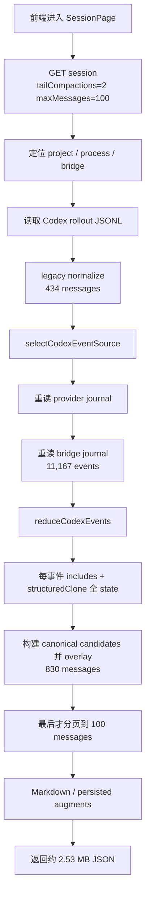

# Codex canonical overlay 长会话加载性能修复方案

> 状态：核心修复已实施（2026-08-11）。P0 默认 legacy / canonical 显式 opt-in、P1 线性 reducer、P2 有内存水位的 projection cache、JSONL 尾读、候选窗口与有界 fallback 已落地；worker 隔离和完整 metrics 留作后续增强。实施过程未重启服务或清理数据。
>
> 日期：2026-08-10
>
> 现场对象：项目 `yepanywhere`，Codex session `019feaeb-6e6c-7070-9e11-3a5213d4cbd3`，本地服务 `http://127.0.0.1:8022/yep`。

## 1. 结论

该会话每次从 Yep 前端打开需要约 50 秒，主因不是前端渲染、Codex rollout JSONL 读取、Markdown 增强，也不是项目列表扫描，而是普通 Session GET 在分页前对完整 canonical journal 做全量 overlay。

现场会话在 bridge canonical journal 中有 11,214 行原始事件，store 去重后仍有 11,167 条事件。`overlayCanonicalCodexSessionMessages()` 会先调用 `reduceCodexEvents()` 重建完整 projection；当前 reducer 每处理一条事件都会：

1. 在不断增长的数组上执行 `includes()` 做 event/dedupe 判重；
2. 对不断增长的整份 `CanonicalCodexSessionState` 执行 `structuredClone(current)`；
3. 再把本次事件写入 clone 后的新 state。

这使批量重放接近二次复杂度，并制造大量短命对象。现场离线计时中，journal 读取与 replay 总计约 314 ms，而 overlay 本身耗时 **47,842 ms**，进程 RSS 从约 85 MB 增长到约 1.02 GB。这个结果与实际 HTTP 请求的 **48–52 秒 TTFB**、约 125% CPU 和约 1 GB RSS 完全吻合。

当前前端恢复到了 pre-canonical 展示路径，客户端代码不再消费 `codexThreadItem`、`codexCanonicalRefresh`、`codexEventSequence` 或 `codexGeneratedArtifacts`。因此推荐方案不是只优化现有慢算法，而是分两层处理：

- **P0：普通 Session GET 默认不执行 canonical overlay**，继续返回 provider rollout 的 legacy normalization；canonical journal、transcript export、飞书实时投影仍保留。未来有明确消费者时，通过 capability/query 显式请求 canonical view。
- **P1：把 canonical reducer 改为线性批量构建器**，消除逐事件整树 clone 和数组判重，为 transcript、飞书、未来 canonical UI 保留可扩展能力。
- **P2：增加增量 projection cache、journal 尾读和有界 fallback**，避免每次请求从零读取、重放全部历史。

只做前端虚拟列表、缩小 `maxMessages`、提高 event 上限或清理 OpenCode 数据库，都不能解决这个会话的 48 秒服务端 TTFB。

## 2. 现场复现与数据

### 2.1 API 对照

所有请求都在同一台机器、同一个 8022 进程上执行，没有浏览器自动化，也没有重启服务。

| 检查项 | 现场结果 | 判断 |
| --- | ---: | --- |
| `/api/server-info` 空闲响应 | 1.85 ms | 服务空闲时健康 |
| project API | 0.18 s | 项目快照不是本次 50 秒主因 |
| session metadata API | 0.13 s | bridge 状态与 summary 读取正常 |
| session agents API | 0.03 s | provider 定位正常 |
| 完整 Session GET，第 1 次 | 48.36 s | 首字节与完成时间几乎一致 |
| 完整 Session GET，第 2 次 | 51.61 s | 可稳定复现，不是一次性冷启动 |
| 首屏响应体 | 2,525,155 bytes | 约 2.41 MiB，属于次要传输成本 |
| 请求结束时 8022 CPU | 约 125.6% | 明显 CPU 计算热点 |
| 8022 RSS | 约 447 MB → 1.06 GB | 大量临时 projection/clone 对象 |

前端初始请求来自 `packages/client/src/hooks/useSessionMessages.ts`，请求参数为：

```text
tailCompactions=2&maxMessages=100
```

虽然前端只需要最后 100 条消息，但服务端在 `packages/server/src/routes/sessions.ts` 中先完成全量 canonical overlay，之后才执行 `sliceAtCompactBoundaries()`。因此 `maxMessages=100` 不能减少 11k 事件的 projection 成本。

### 2.2 rollout JSONL 对照

目标 rollout 文件：

```text
~/.codex/sessions/2026/08/10/
  rollout-2026-08-10T17-05-25-019feaeb-6e6c-7070-9e11-3a5213d4cbd3.jsonl
```

| 检查项 | 现场值 |
| --- | ---: |
| 文件大小 | 9,750,924 bytes |
| JSONL 行数 | 1,637 |
| 最大单行 | 1,566,427 bytes |
| 最大行类型 | `item_completed / CommandExecution` |
| legacy normalization 后消息数 | 434 |
| rollout 读取与解析 | 78 ms |
| normalization | 9 ms |
| JSON stringify | 6 ms |
| 最后 100 条原始消息体积 | 约 1.23 MB |
| 最后 100 条 Markdown/augment | 64 ms |

rollout 的确偏大，且有大命令输出，但它只能解释响应体和前端渲染的次要成本，无法解释 48–52 秒的首字节等待。

### 2.3 canonical journal 对照

| journal | 文件大小 | 行数 | 目标 session 原始命中 |
| --- | ---: | ---: | ---: |
| provider `codex-events/events.jsonl` | 35,776,418 bytes | 21,871 | 0 |
| bridge `codex-bridge/codex-events.jsonl` | 30,176,739 bytes | 21,604 | 11,214 |

离线使用当前生产代码执行相同 replay 和 overlay：

| 阶段 | 耗时 | 事件/输出 | RSS 变化 |
| --- | ---: | ---: | ---: |
| provider journal replay | 139 ms | 0 events | 约 85 → 276 MB |
| bridge journal replay | 175 ms | 11,167 events | 约 276 → 600 MB |
| canonical overlay | **47,842 ms** | 434 legacy → 830 full messages | 约 600 MB → 1.02 GB |
| overlay 后消息 JSON | - | 约 3.55 MB | - |

因此读取两个 JSONL store 不是当前绝对热点；真正的热点是对 11,167 条事件执行 reducer 和后续 overlay。

### 2.4 OpenCode 全局抖动是独立问题

排查期间还观察到 8.2 GB `opencode.db`、后台扫描以及 worker structured-clone 带来的全局 API 抖动。该问题已经记录在：

```text
docs/project/2026-08-10-opencode-db-retention-and-scan-fix-plan.md
```

它会让所有请求偶发变慢，但不是本会话稳定 48–52 秒的 session 特异性根因。关键 A/B 证据是：同一时刻 project API 只需 0.18 秒，紧接着完整 Session GET 仍需 51.61 秒；离线 canonical overlay 又独立复现了 47.84 秒。

## 3. 当前请求链路



相关实现入口：

- `packages/client/src/hooks/useSessionMessages.ts`：初始 `getSession()` 与 `maxMessages=100`。
- `packages/server/src/routes/sessions.ts`：先 canonical overlay，后 compact-boundary pagination。
- `packages/server/src/codex-events/source.ts`：按 provider、bridge 顺序选择 journal。
- `packages/server/src/codex-events/store.ts`：新建 JSONL store 后整文件 hydrate，并在 replay 时 clone 目标事件。
- `packages/server/src/codex-events/session-projection.ts`：重建 projection、生成 candidates、匹配 legacy messages。
- `packages/server/src/codex-events/reducer.ts`：逐事件 clone 整份 state。

## 4. 根因分析

### 4.1 逐事件不可变 clone 导致近似二次复杂度

当前 `reduceCodexEvent()` 的不可变接口对单事件、短状态很直观，但不适合长 journal 的批量 replay：

```ts
const state = structuredClone(current);
```

如果第 `i` 条事件时 state 规模约为 `S(i)`，完整 replay 的 clone 成本接近：

```text
S(1) + S(2) + ... + S(N)
```

当 observations、applied event IDs、thread/turn/item、delta snapshot 随事件数增长时，总成本趋近 `O(N²)`，并产生相同量级的临时内存分配和 GC 压力。

### 4.2 判重结构使用增长数组

每条事件都会执行：

```ts
current.appliedEventIds.includes(event.eventId)
current.appliedDedupeKeys.includes(event.dedupeKey)
```

这两个操作本身也是线性扫描。在 11k 事件上，即使去掉 `structuredClone`，仍会累积明显的二次判重成本。

### 4.3 普通 Session GET 无条件支付 canonical 成本

当前 normal session refresh 只要 session provider 是 Codex、且配置了 journal source，就会运行 overlay。它没有判断：

- 当前客户端是否支持/消费 canonical native item；
- 当前请求是否只需要 legacy baseline；
- 是否只请求最后 100 条消息；
- journal 是否已经有可复用 projection；
- overlay 是否超过请求时延预算。

当前客户端搜索不到 `codexThreadItem`、`codexCanonicalRefresh`、`codexEventSequence` 或 `codexGeneratedArtifacts` 的消费点。相关字段仍由飞书投影和服务端 canonical transcript 使用，但这不等于网页 Session GET 必须无条件返回它们。

### 4.4 分页位置过晚

route 在 overlay 之后才运行 `sliceAtCompactBoundaries()`。这意味着：

- reducer 必须处理所有历史事件；
- projection 必须生成全部 canonical candidates；
- legacy/canonical 匹配面对完整消息集合；
- 最终大部分结果又被分页丢弃。

不能简单把 event 数组切到最后一段，因为 delta、turn/item lifecycle、server request 等状态可能依赖更早事件。正确的分页前移需要 projection checkpoint 或增量缓存，而不是直接丢掉历史。

### 4.5 store 生命周期不是主因，但仍不合理

`CodexEventStoreSource.createStore()` 每次请求创建新 store，以保证能看到启动后的追加事件。结果是每次 Session GET 都重新读取并解析两个完整 journal。

当前 65 MB journal 的 replay 只有约 314 ms，不是 48 秒主因，但随着 journal 增长会成为新的线性瓶颈，也会在进入 overlay 前先制造数百 MB 临时对象。长期方案仍需增量 tail 和复用索引。

## 5. 设计目标与非目标

### 5.1 目标

1. 普通网页 Session GET 不因 canonical journal 长度线性或二次增长。
2. 10k–20k canonical event 的会话仍能在可交互预算内打开。
3. API 主线程不出现数十秒 CPU/GC 阻塞。
4. transcript export、飞书 native item、generated artifact 和未来 canonical UI 的数据能力不丢失。
5. 新旧 reducer 在排序、判重、anomaly、turn/item lifecycle、server request、retry 等语义上完全一致。
6. 冷启动、journal append、truncate/rotate、corrupt tail 等情况都有明确 fallback。

### 5.2 非目标

1. 本方案不清理或截断 canonical journal。
2. 本方案不处理 OpenCode 数据库 retention；该问题使用独立方案。
3. P0 不重做前端消息虚拟列表或 Markdown renderer。
4. P0 不改变 transcript export 的 canonical 数据来源。
5. 不通过提高 `DEFAULT_MAX_REFRESH_EVENTS` 掩盖性能问题。

## 6. 推荐修改方式

### 6.1 P0：普通 Session GET 默认绕过 canonical overlay

这是当前产品形态下收益最大、风险最可控的止血方案。

建议：

1. `GET /api/projects/:projectId/sessions/:sessionId` 默认只返回 rollout reader 的 legacy normalization。
2. 只有调用方显式声明 capability/query 时才执行 canonical overlay，例如内部语义上的 `view=canonical`；具体 API 名称在实现评审时确定。
3. 当前 Web 客户端不声明 canonical capability，恢复与 pre-canonical baseline 一致的响应。
4. canonical transcript export route 继续直接读取 canonical journal，不受影响。
5. 飞书继续使用 provider live event / rich-card projection，不依赖网页 Session GET 的 overlay。
6. generated artifact 下载与 manifest 路径单独做回归验证；不要假设“客户端未搜索到字段”就等于所有外部 API 消费者都不存在。

为什么推荐 capability gate，而不是直接删除 overlay：

- 可以保持现有 canonical API 能力供调试、未来 UI 或外部客户端使用；
- 回滚只需切换默认 capability/feature flag；
- 可以在线比较 legacy 与 canonical 输出，不阻塞普通用户。

预期收益：普通 Session GET 直接跳过现场 47.84 秒热点，服务端核心计算应回到 rollout parse、normalize、pagination 和 augment 的百毫秒级范围。

### 6.2 P1：新增线性批量 reducer

即使 P0 绕过网页 overlay，canonical transcript、飞书和未来 canonical UI 仍需要可扩展 reducer。因此必须修正算法，而不是长期保留慢路径。

推荐结构：

```text
reduceCodexEvents(initial, events)
  ├─ clone initial 一次
  ├─ 创建 transient Set(eventId)
  ├─ 创建 transient Set(dedupeKey)
  ├─ stable sort events 一次
  ├─ applyCodexEventMutable(state, event, indexes) × N
  └─ 在边界输出不可变 snapshot
```

具体建议：

1. 抽出内部 `applyCodexEventMutable()`，只在 reducer 私有 state 上原地写入。
2. `reduceCodexEvents()` 只 clone `initial` 一次；批量 replay 不再逐事件 clone。
3. 用 `Set<string>` 做 event ID 与 dedupe key 判重；最终如 schema 仍要求数组，再在输出边界转换。
4. `reduceCodexEvent()` 保留纯函数外观，但只为单事件调用 clone 一次，再复用相同 mutable helper。
5. live ingress 如果长期持有增长 state，应使用带 Set 的 projector 实例，避免每次新事件重新从数组构建 Set。
6. 只在真正需要隔离外部引用的字段上 clone payload；已经过 redaction、不会再被修改的 event payload 不应被整树重复复制。
7. state snapshot 对外暴露时统一 clone/freeze，避免把内部可变对象泄漏给调用方。

必须保持的语义：

- event sequence stable ordering；
- eventId/dedupeKey 幂等；
- out-of-order、session mismatch、missing identity 等 anomaly；
- unknown notification 保留；
- thread/turn/item lifecycle；
- item delta、command output、file change、MCP progress；
- server request、client response、retry；
- generated artifact source identity。

### 6.3 P1：优化 overlay 的候选匹配

reducer 修复后，`session-projection.ts` 中仍存在随 candidates/messages 增长的重复扫描：

- `findLegacyItemMatch()` 多次遍历 messages；
- `hasSemanticDuplicate()` 多次 `.some()`；
- `insertByTimestamp()` 多次线性定位和 splice。

建议在一次 overlay 内预建：

- legacy message UUID index；
- canonical item ID / native type index；
- semantic duplicate key index；
- timestamp + stable order 的批量 merge 输入。

最终采用“两边各自有序、一次 merge”，不要每个 candidate 单独在 messages 中查找和插入。目标复杂度应接近：

```text
O(E log E + E + M + C)
```

其中 `E` 为 events，`M` 为 legacy messages，`C` 为 canonical candidates。

### 6.4 P2：projection cache 与增量 journal tail

推荐增加进程级 `CodexProjectionCache`，按 `(sourceId, sessionId)` 保存：

- 已应用的最后 sequence；
- journal identity（path、inode/等价 identity）；
- 已读取 byte offset、size、mtime；
- projection state；
- transient dedupe Sets；
- 最近访问时间与近似内存成本。

处理方式：

1. 首次访问做一次冷 replay。
2. 后续访问只读取 journal 新增尾部，并从 `lastSequence` 增量 apply。
3. provider/bridge writer append 时直接更新或 invalidation 对应 cache。
4. 外部 bridge journal 通过 file stat + byte offset 发现 append。
5. 文件变小、inode 改变、sequence 回退或 schema version 改变时丢弃 cache 并冷重建。
6. 使用 LRU + 总内存水位；不能无限缓存所有长会话 projection。
7. cold rebuild 可以在 worker 中执行，避免阻塞 API event loop。

不要只缓存最终 HTTP JSON。最终响应依赖 pagination、branch、generated artifacts、metadata 和 runtime 状态，整包缓存容易过期；复用 canonical projection 才是稳定边界。

### 6.5 P2：把分页推到 projection/candidate 层

当 projection cache 可用后，首屏请求不必为所有历史 item 重新生成可展示消息。

建议：

1. projection state 保留按 sequence/timestamp 排序的 item identity 与必要 checkpoint。
2. 根据 `tailCompactions`、`maxMessages` 或 cursor，先确定 legacy 可见窗口。
3. 只为窗口附近的 canonical item 构建 candidate。
4. 对窗口外只保留影响当前状态的聚合结果，不生成完整 Message 对象。
5. older/newer 分页使用稳定 cursor，而不是重新 overlay 全部历史。

不能直接对原始 events 做 `slice(-N)`，因为最后一个 item snapshot 可能依赖更早的 started/delta/progress 事件。必须以已完成的 projection 或 checkpoint 为前提。

### 6.6 P0/P1：增加有界 fallback

canonical overlay 是增强层，rollout normalization 是可用 baseline。任何增强层都不应让 Session 页面 50 秒无响应。

建议增加：

- cold projection 硬预算，例如 500 ms；
- 单 session 事件数、projection bytes 与 candidate 数水位；
- worker rebuild deadline；
- 超预算时返回 legacy normalization，并记录结构化 warning；
- 后台继续构建 cache，下一次刷新再尝试 canonical view；
- fallback 响应包含非敏感诊断字段或 server log outcome，但不暴露 journal 内容。

注意：当前 overlay 是同步函数，函数内部检查 `Date.now()` 不能真正避免主线程已经被占满。可靠 deadline 需要 worker、分块 async 构建或预先缓存。

## 7. 不推荐的方案

### 7.1 只做前端虚拟列表

TTFB 已经达到 48–52 秒，浏览器在收到第一个字节之前没有任何消息可虚拟化。虚拟列表只能优化收到响应后的 DOM 成本。

### 7.2 只把 `maxMessages` 从 100 调小

分页发生在 overlay 之后。即使改成 10，仍然先处理 11,167 条事件。

### 7.3 删除或截断旧 canonical event

会破坏 transcript、replay、turn/item lifecycle 和 dedupe 语义，也掩盖 reducer 不可扩展的问题。除非另有经过验证的 journal compaction/checkpoint 设计，不应把性能修复等同于删历史。

### 7.4 只复用 JSONL store

现场两个 journal replay 约 314 ms，而 overlay 约 47.84 秒。store 复用值得做，但单独完成它仍会留下 47 秒热点。

### 7.5 只把 overlay 搬到 worker

worker 能保护 event loop，但用户仍需等待 48 秒并消耗约 1 GB 内存。它适合作为 cold rebuild 隔离层，不是算法修复的替代品。

### 7.6 只增加超大事件上限

当前默认上限 100,000 events 只控制数量，不控制复杂度、时间和内存。提高上限会让最坏情况更严重。

## 8. 实施阶段

### 阶段 A：观测与回归基线

1. 增加 replay、reduce、candidate build、match、pagination、augment、JSON serialization 分段耗时。
2. 增加 event count、legacy/canonical/final message count、journal bytes、RSS delta 和 fallback outcome。
3. 加入合成 benchmark，不提交真实私有 journal。
4. 用当前现场会话做本地人工 benchmark，只记录计数与耗时，不复制内容到仓库。

### 阶段 B：P0 normal GET capability gate

1. 当前 Web Session GET 默认走 legacy normalization。
2. canonical view 通过明确 capability/query 开启。
3. transcript export 和飞书投影保持原路径。
4. 加 route 回归测试，确认 baseline message 序列、pagination 和 context metadata 不变。
5. 在 `[Unreleased]` 记录该运行时性能/兼容性变更。

### 阶段 C：P1 线性 reducer 与 overlay index

1. 抽取 mutable apply helper。
2. 批量 replay 使用 Set 和一次 clone。
3. 增加 old/new reducer parity 测试。
4. 优化 candidate match 与有序 merge。
5. 对 1k、2k、5k、10k、20k events 做时间和内存曲线。

### 阶段 D：P2 projection cache

1. 实现 journal append tail。
2. 实现 source/session projection LRU。
3. 支持 truncate/rotate/schema mismatch 自动重建。
4. cold rebuild 放入 worker 并有 deadline。
5. 接入 capability canonical view，再逐步扩大启用范围。

### 阶段 E：分页与响应体优化

1. candidate/window pushdown。
2. 避免 response 中重复携带客户端不消费的 canonical snapshot/HTML。
3. 评估初始响应压缩、字段裁剪和前端渲染成本。

## 9. 测试计划

### 9.1 reducer 正确性

old/new reducer 对同一输入必须得到确定性等价 projection。至少覆盖：

- 空事件与单事件；
- duplicate eventId / dedupeKey；
- out-of-order sequence；
- unknown notification；
- thread/turn started、completed、failed、interrupted；
- item started/completed；
- reasoning、command、file change、MCP progress delta；
- server request / resolved；
- client retry；
- 多 thread、多 turn、多 item；
- 大 command output；
- corrupt journal tail；
- journal append、truncate、rotate。

对比时应使用稳定序列化/hash，忽略仅用于内部加速的 Set/Map 实现细节。

### 9.2 route 正确性

1. legacy default 不包含无消费者的 canonical synthetic rows。
2. explicit canonical capability 返回与现有 overlay 语义一致的消息。
3. `tailCompactions`、`beforeMessageId`、`aroundMessageId`、`afterWindowMessageId`、`branchId` 正常。
4. normal GET、metadata、context status、agents 不相互回归。
5. canonical source precedence 仍是 provider 优先、bridge fallback，禁止拼接两个独立 sequence space。
6. generated artifact、transcript export、飞书 rich card 回归通过。

### 9.3 性能测试

建议新增独立 benchmark 脚本，例如：

```text
scripts/bench-codex-overlay.ts
```

输入由合成事件生成器构造，不包含真实 prompt、tool output 或路径。数据规模：

```text
100 / 1,000 / 2,000 / 5,000 / 10,000 / 20,000 events
```

每档至少记录：

- cold replay；
- warm incremental apply；
- reduce duration；
- candidate build/match；
- total overlay；
- RSS/heap delta；
- event loop delay；
- output messages/bytes；
- old/new projection hash parity。

CI 不宜只使用极窄的绝对毫秒阈值，以免机器抖动造成 flaky。CI 用正确性、复杂度倍率和宽松上限；本地发布前 benchmark 使用严格 SLO。

## 10. 衡量指标与验收标准

### 10.1 用户体验 SLO

| 指标 | 当前基线 | P0 目标 | P1/P2 目标 |
| --- | ---: | ---: | ---: |
| normal Session GET TTFB，目标会话 | 48–52 s | p95 ≤ 1.0 s | p95 ≤ 500 ms |
| normal Session GET server duration | 48–52 s | p95 ≤ 750 ms | p95 ≤ 300 ms |
| repeated warm open | 仍约 50 s | p95 ≤ 500 ms | p95 ≤ 200 ms |
| 首屏可见消息 | 约 50 s 后出现 | ≤ 1.5 s | ≤ 1.0 s |
| initial response bytes | 2.53 MB | 跟踪，不恶化 | ≤ 1.5 MB（P2） |

这里的 TTFB 指 8022 API 首字节，不包含浏览器网络代理；首屏可见消息在后续 UI 验证阶段测量。除非用户明确要求，方案实施阶段不默认运行浏览器自动化。

### 10.2 canonical 计算 SLO

| 指标 | 当前基线 | 目标 |
| --- | ---: | ---: |
| 约 11k events overlay total | 47,842 ms | p95 ≤ 500 ms |
| 约 11k events reduce | 未分段记录 | p95 ≤ 250 ms |
| 约 11k events RSS 增量 | 约 930 MB | ≤ 128 MB |
| 10k → 20k events 耗时倍率 | 预计接近二次 | ≤ 2.5× |
| warm incremental apply | 无 cache | p95 ≤ 50 ms |
| main-thread continuous block | 数十秒 | p99 ≤ 100 ms |
| projection parity | 无新旧对比 | 100% |

### 10.3 稳定性与缓存指标

建议记录以下 histogram/counter/gauge：

```text
codex_journal_replay_duration_ms
codex_journal_replay_bytes
codex_journal_event_count
codex_projection_reduce_duration_ms
codex_projection_candidate_duration_ms
codex_projection_match_duration_ms
codex_projection_total_duration_ms
codex_projection_rss_delta_bytes
codex_projection_cache_hit_total
codex_projection_cache_miss_total
codex_projection_cache_rebuild_total
codex_projection_fallback_total
session_get_duration_ms
session_get_response_bytes
event_loop_delay_ms
```

推荐标签仅使用低基数字段：

```text
source=provider|bridge
mode=legacy|canonical|cached
outcome=success|fallback|error|budget_exceeded
event_count_bucket=<100|<1k|<5k|<10k|<20k|20k+
cache=hit|miss|rebuild
```

不要把原始 session ID、project path、prompt 或 tool output 放进 metrics label。结构化日志可记录 session ID 供本地诊断，但不得记录事件 payload。

稳定运行目标：

- normal Web 请求 canonical fallback 率为 0；默认本就走 legacy。
- explicit canonical view warm cache hit rate ≥ 95%。
- cold rebuild budget exceeded < 0.1%，且不会拖慢 normal Web 请求。
- projection cache 因 truncate/rotate 正确重建，无 sequence 回退或跨 source 混用。
- 8022 RSS 在重复打开长会话后回到稳定水位，不随次数单调增长。

## 11. 发布与回滚

建议增加临时 feature flag 或内部配置：

```text
legacy      normal GET 不做 overlay
canonical   使用线性 reducer，每次冷 replay
cached      使用增量 projection cache
```

具体配置名在实现评审时确定，避免现在把临时名称变成永久公开契约。

发布顺序：

1. 先上线 instrumentation。
2. normal Web 默认切到 legacy，保留显式 canonical 能力。
3. 线性 reducer 先在测试/离线 shadow 中与旧 reducer 比较 hash。
4. 小范围启用 canonical linear。
5. 再启用 cached mode。
6. 观察至少一个完整工作日的 route duration、RSS、fallback 和 parity。

回滚原则：

- normal Web 出现消息缺失时，可立即恢复旧响应模式；
- cached mode 异常时退回 linear cold replay；
- linear reducer parity 异常时 explicit canonical view 暂时 fallback legacy；
- transcript export 保持独立，不应被 normal GET 回滚连带关闭。

正式代码变更属于会进入部署产物的性能/兼容性修复，实施时必须同步更新 `CHANGELOG.md` 的 `[Unreleased]`。发布前按仓库 CalVer 流程执行版本校验。

## 12. 推荐决策

推荐按以下顺序执行：

1. **立即做 P0 capability gate**：当前 Web 不消费 canonical 字段，先解除所有普通 Session GET 的无效 50 秒成本。
2. **同时补齐观测和 10k events benchmark**：把这次现场数据固化为无隐私的合成回归。
3. **完成 P1 线性 reducer**：这是 canonical 能力继续存在的基础，不应只靠绕过慢路径。
4. **再做 P2 projection cache 与分页前移**：解决 journal 持续增长和未来 canonical UI 的长期扩展性。
5. **OpenCode 数据库问题继续按独立方案推进**：共享 event loop/RSS 指标，但不要把两个根因合并成一个改动。

最终验收不是“目标会话偶尔能打开”，而是：normal Web 长会话稳定亚秒响应、canonical 10k–20k events 近线性处理、内存增量有界，并且所有 canonical projection 语义与旧实现 100% 等价。
