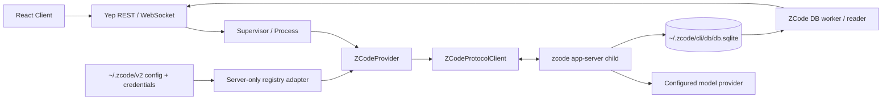

# Yep Anywhere ZCode Provider 调研报告与分阶段开发计划

> 文档状态：P0–P4 已完成；原 P5 中的 fork、mcp/list、bridge 已于 2026-08-13 以 v1 形态落地（详见 `2026-08-12-zcode-support-current-state.md` §15，含真实 CLI 探测证据与剩余差距清单）
>
> 调研基线日期：2026-08-11
>
> 本机基线：ZCode Desktop `3.7.5`（build `3.7.5.4641`），内置 CLI `0.16.1`
>
> 目标范围：把 ZCode Agent 作为 Yep Anywhere 的一等公民 provider 接入
>
> 核心完成边界：本文 P0–P4；P5 是核心上线后的增强路线

## 0. 结论摘要

Yep Anywhere **可以支持 ZCode**。推荐新增独立顶层 provider `zcode`，通过 ZCode Desktop 内置 CLI 的 `app-server` stdio 协议驱动实时会话，并通过只读 SQLite reader 展示非活动历史会话。

不应把 ZCode 当作 Codex 的另一个可执行文件，也不应把它建模为 Codex model source。虽然两者都使用换行分隔的 JSON 双向通信，但方法、事件、会话模型和持久化格式完全不同：

- Codex 使用 `thread/*`、`turn/*`、`item/*`；
- ZCode 使用 `workspace/*`、`session/*`、`interaction/*`，并以 `session/event` 投递统一事件；
- Codex 历史主要来自 rollout JSONL；
- ZCode 历史主要存储在 SQLite 的 `session`、`message`、`part` 表中。

核心架构决策如下：

| 维度 | 决策 | 理由 |
| --- | --- | --- |
| Yep 顶层 provider | 新增 `zcode` | ZCode 有独立协议、进程、权限模式和 session identity |
| 实时传输 | `zcode app-server` over stdio | 本机已验证请求、响应、通知和反向请求；无需常驻端口 |
| 进程模型 | 首期每个活动 Yep session 一个 app-server 子进程 | 生命周期、配置、回调和失败域清晰；后续再用数据决定是否池化 |
| 历史会话 | 只读 `~/.zcode/cli/db/db.sqlite` | inactive session 的 `session/read` / `session/messages` 在当前版本返回 `-32004` |
| 模型配置 | 服务端读取 ZCode 配置，白名单转换后仅在内存中注入 | app-server 单独启动时不会自动取得 Desktop 的完整 provider registry |
| 密钥处理 | 不复制、不持久化、不下发浏览器、不记录日志 | 本机配置包含 provider 认证材料，属于 server-only 信任边界 |
| 模型 ID | Yep 侧使用可反查的 `provider/model` 复合 ID | ZCode 支持多个上游 provider，裸 model ID 可能冲突 |
| 权限控制 | 映射 Yep 五种 canonical mode，并处理协议反向审批请求 | ZCode 的五种执行策略与 Yep 现有模式基本一一对应 |
| 协议稳定性 | 将 CLI `0.16.1` 视为首个 compatibility baseline | 公开官方文档尚未提供 app-server 协议规范 |
| 上线门禁 | 扩展 `ENABLED_PROVIDERS`，并做版本/能力探测 | 不兼容版本应显示 unavailable，而不是拖垮整个 Yep Server |

可行性评级：

- 实时核心链路：**高**；
- 权限审批与用户问题：**高**；
- 历史读取：**中高**，但依赖非公开 SQLite schema；
- 跨 ZCode 版本稳定性：**中**，需要 compatibility fixtures 和 fail-closed；
- ZCode 原生高级能力：**中高**，接口存在，但应在核心链路稳定后逐项接入。

## 1. 术语、目标与非目标

### 1.1 术语

本文使用以下边界，避免三个不同层级都被称为“渠道”：

| 术语 | 含义 |
| --- | --- |
| Yep provider | Yep 的顶层执行后端，例如 `codex`、`opencode`、`kimi`、计划新增的 `zcode` |
| ZCode Agent | ZCode 自研的 coding agent runtime，不是 Codex/OpenCode 的包装别名 |
| ZCode model provider | ZCode 内部的模型上游，例如 Z.AI、BigModel 或 OpenAI-compatible 自定义源 |
| ZCode Desktop | `/Applications/ZCode.app`，负责 UI、配置和内置 CLI 分发 |
| ZCode Protocol | 本机 CLI `app-server` 暴露的 stdio 双向协议；当前未见公开稳定规范 |
| Codex Goal mode | Codex thread 级持久目标，与 permission mode 和 ZCode 原生 `/goal` 都是不同实现；Yep 当前只有 RPC 控制和刷新展示，还没有新会话 Goal-first 与自动 continuation 的完整监督，见 [Codex Goal 适配计划](./2026-08-14-codex-goal-support-plan.md) |

### 1.2 核心目标

P0–P4 完成后，应满足：

1. Yep 能检测 PATH 中的 ZCode CLI，或 macOS ZCode.app 内置 CLI；
2. Yep 能显示 ZCode 的安装、可用性、当前模型和模型目录；
3. 用户能新建、恢复和连续发送 ZCode session；
4. 文本、reasoning、工具执行和结果能实时投射到 Yep transcript；
5. ZCode 发起的权限审批和用户问题能进入 Yep pending-input 控制面；
6. 中断、停止、模型切换和权限模式切换具备明确语义；
7. 项目列表、全局会话列表和历史 transcript 能读取 ZCode SQLite 数据；
8. Web client 提供完整的 provider 选择、徽标、模型与模式 UI；
9. 新增文案同时维护 `en` 与 `zh-CN`；
10. 协议升级、配置缺失、DB busy、子进程退出等情况不会影响其他 provider；
11. 日志、API 和测试快照中不出现 API Key、Authorization header 或 credentials 内容；
12. 实现变更写入 `CHANGELOG.md` 的 `[Unreleased]`。

### 1.3 首期非目标

以下能力不阻塞 `zcode` provider 核心可用，统一放入 P5：

- ZCode 原生 goal 的创建、暂停、恢复、预算和验证时间线 UI；
- fork、rewind、checkpoint 和 compact 控制；
- subagent / expert workflow 的树状展示；
- ZCode MCP 配置管理；
- Browser Use 代理；
- plugin、skill、command 的完整管理 UI；
- 多 app-server 共享进程池；
- Windows/Linux 自动发现；
- 在 Yep 内编辑 ZCode provider API Key 或任意 base URL；
- 自动部署、重启 Yep 服务或替换当前运行中的 ZCode Desktop 进程。

## 2. 调研方法与证据边界

### 2.1 证据层级

本文按以下优先级记录结论：

1. **官方公开事实**：ZCode 官方文档；
2. **本机动态实测**：CLI help、只读 app-server smoke、只读 SQLite schema；
3. **本机静态观察**：对已安装 CLI bundle 的方法名、事件名和 schema 字符串做检索；
4. **Yep 代码核对**：当前 provider、session reader、scanner、normalization 和 client registry；
5. **设计推断**：基于前四项提出的实现方案，必须由阶段验收继续证明。

### 2.2 已执行的调研动作

- 核对 ZCode.app 的 bundle metadata 和签名来源；
- 运行内置 CLI 的 `version`、`--help`、`doctor --json`；
- 启动并关闭由调研自行创建的临时 `app-server` 子进程；
- 发送 `workspace/readState`、`workspace/updateProviderRegistry`、`session/list` 等不调用模型的方法；
- 验证换行 JSON 请求/响应、通知和 server-to-client request 形态；
- 只读查询 ZCode SQLite 表结构与 JSON 字段类型；
- 核对 Yep 的 `AgentProvider`、`AgentSession`、provider registry、OpenCode SQLite reader、Kimi provider 与 client provider registry；
- 检索 ZCode 官方安装、Agent、权限、Goal、Command 和 MCP 文档。

调研没有：

- 发送真实模型 prompt；
- 消耗模型额度；
- 修改现有 ZCode session；
- 输出历史会话正文、标题、provider ID 或 secret；
- 停止、重启或接管当前运行中的 ZCode/Yep 服务；
- 使用浏览器自动化。

### 2.3 尚未被调研证明的事项

- 真实模型 turn 的端到端事件顺序；
- 大型工具输出、图片和附件的完整协议形态；
- provider runtime headers 的刷新周期及所有错误分支；
- app-server 在 ZCode 升级后的兼容承诺；
- Windows/Linux 包内 CLI 路径；
- 多个 app-server 长时间并发时的资源开销；
- SQLite schema migration 在未来版本中的兼容策略。

这些不是“默认可用”的假设，必须进入 P0/P1/P4 验收。

## 3. 官方公开信息与支持边界

ZCode 官方资料确认：

- ZCode 以 Desktop 应用交付，并在首次启动时连接模型；见 [Install](https://zcode.z.ai/en/docs/install)；
- ZCode Agent 是自研的一等公民框架，集成任务、模型、权限、文件与 Git 状态；见 [ZCode Agent](https://zcode.z.ai/en/docs/agent-framework)；
- 执行模式覆盖 Default、Confirm Before Changes、Auto Edit、Plan、Full Access；见 [Safety Confirmation](https://zcode.z.ai/en/docs/safety-confirm)；
- `/goal` 是 session-level 长任务控制能力；见 [Goal Mode](https://zcode.z.ai/en/docs/goal)；
- ZCode 支持 stdio、HTTP、SSE MCP server；见 [MCP Servers](https://zcode.z.ai/en/docs/mcp-services)；
- ZCode 的 multi-agent 页面明确区分 ZCode Agent、Claude Code、Codex、Gemini CLI 和 OpenCode；见 [Multi-Agent Framework](https://zcode.z.ai/en/newdocs/agent-framework)。

截至本次调研，在上述公开资料中没有找到以下内容：

- `zcode app-server` 的正式协议规范；
- method/event 的版本化 schema；
- 第三方客户端兼容承诺；
- SQLite session schema 的稳定性承诺；
- CLI bundle 路径的稳定性承诺。

因此，本文推荐的是“**基于本机已验证接口、带版本门禁和兼容降级的集成**”，不是宣称 ZCode 已公开承诺第三方 app-server API 永久稳定。

另一个值得记录的信号是：调研时官方安装页展示的下载版本落后于本机已安装版本。这不影响本机验证，但说明实现不能把网页版本号当成唯一兼容事实来源。

## 4. 本机安装与数据布局

### 4.1 安装基线

| 项目 | 本机实测 |
| --- | --- |
| Desktop 路径 | `/Applications/ZCode.app` |
| Bundle ID | `dev.zcode.app` |
| Desktop 版本 | `3.7.5` |
| Bundle build | `3.7.5.4641` |
| 内置 CLI | `/Applications/ZCode.app/Contents/Resources/glm/zcode.cjs` |
| CLI 版本 | `0.16.1` |
| PATH 状态 | 当前 interactive shell 中没有 `zcode` 命令 |
| CLI runtime | Node.js bundle；`doctor` 声明要求 Node `>=22.13` |

当前机器必须通过 Node 执行内置 `.cjs`：

```bash
node /Applications/ZCode.app/Contents/Resources/glm/zcode.cjs version
node /Applications/ZCode.app/Contents/Resources/glm/zcode.cjs app-server
```

实现不得只调用 `spawn("zcode")`，也不得把上述 macOS 路径写死为唯一入口。推荐发现顺序：

1. 显式配置 `YEP_ZCODE_CLI_PATH`；
2. PATH 中的 `zcode`；
3. macOS `/Applications/ZCode.app/Contents/Resources/glm/zcode.cjs`；
4. 用户级 `~/Applications/ZCode.app/.../zcode.cjs`；
5. 未来按平台补充 Windows/Linux discovery adapter。

如果结果是 `.cjs`，启动命令为 `process.execPath <path> app-server`；如果是原生 wrapper，则为 `<path> app-server`。探测结果应包含 CLI version、来源和稳定错误码，但 API 不应返回用户主目录绝对路径。

### 4.2 CLI 可见能力

内置 CLI `0.16.1` 暴露：

- `app-server`、`commands`、`doctor`、`login`、`logout`、`plugins`、`skills`、`tui`、`version`；
- headless `--prompt` / `--print`；
- `--cwd`、`--attach`、`--resume`、`--continue`；
- `--mode build|edit|plan|yolo`；
- `--target` 与 `--target-replace`；
- `/goal`、`/compact`、`/fork`、`/rewind`、`/model`、`/mode`、`/mcp`、`/skill` 等 slash command。

Help 中存在 `--settings <path>`，但本机 `0.16.1` 的实际参数解析会拒绝该参数。首期不得依赖它实现配置隔离；P0 compatibility test 应保留这一行为记录，未来版本修复后再评估切换。

### 4.3 本机数据布局

调研观察到：

```text
~/.zcode/
├── cli/
│   ├── db/db.sqlite             # session/message/part/permission/usage/workflow
│   ├── agents/
│   ├── artifacts/
│   ├── exec/
│   ├── log/
│   ├── plugins/
│   └── rollout/
├── v2/
│   ├── config.json              # Desktop/provider/model 配置
│   ├── credentials.json         # 认证材料
│   └── tasks-index.sqlite       # Desktop task 索引，不是 transcript 主数据源
└── workspace/
```

`config.json`、`credentials.json` 和主 DB 在本机当前权限为 `0644`。这是现有 ZCode 文件状态，不授权 Yep 自动 `chmod`。Yep 应做到：

- 只读取实现所需字段；
- 不复制文件；
- 不把原始 JSON 放入 debug log、error cause 或 API response；
- 使用 synthetic secret sentinel 测试日志脱敏；
- 如增加权限诊断，仅告警并给出建议，不擅自修改 ZCode 文件。

## 5. ZCode Protocol 调研结果

### 5.1 传输形态

`app-server` 使用 stdin/stdout 传输一行一个 JSON object。实测支持带 `id`、`method`、`params` 的 request/response；server 也会主动向 client 发带 `id` 的反向请求。

推荐客户端始终发送完整 JSON-RPC 风格 envelope，哪怕当前实现对部分字段宽容：

```json
{"jsonrpc":"2.0","id":1,"method":"session/list","params":{}}
```

客户端必须同时处理：

1. client request → server response；
2. server notification → client event queue；
3. server request → client handler → server response；
4. stderr diagnostics；
5. malformed/non-JSON stdout；
6. 子进程 error/exit；
7. abort、request timeout 与 pending request rejection。

这与 Yep 内部 `CodexAppServerClient` 的传输职责相似，但首期建议实现独立的 `ZCodeProtocolClient`，避免为了复用约 200–300 行通用逻辑而改动已经复杂且高风险的 Codex provider。等两个实现都有稳定测试后，再单独评估抽取通用 NDJSON RPC transport。

### 5.2 已观察到的方法

下表来自本机 CLI bundle 静态检索和只读 smoke。存在方法名不代表本文已验证所有参数与副作用。

| 领域 | 方法 | 首期用途 |
| --- | --- | --- |
| workspace | `workspace/readState` | 读取当前 workspace、模型和默认设置 |
| workspace | `workspace/updateProviderRegistry` | 注入 provider/model registry |
| workspace | `workspace/setDefaultMode` | 可选；首期优先使用 session 级设置 |
| workspace | `workspace/setDefaultModel` | 可选；不应改用户全局默认 |
| workspace | `workspace/setDefaultThoughtLevel` | 可选；不应改用户全局默认 |
| workspace | `workspace/updateInteractionPreferences` | 后续评估 |
| session | `session/create` | 新建 session |
| session | `session/resume` | 恢复 session |
| session | `session/list` | 只读列举 session |
| session | `session/read` | 活动 session snapshot；inactive 有限制 |
| session | `session/messages` | 活动 session message；inactive 有限制 |
| session | `session/events` | 获取事件 |
| session | `session/subscribe` | 订阅连续事件 |
| session | `session/send` | 发送用户输入 |
| session | `session/stop` | 停止当前 turn |
| session | `session/close` | 关闭 session runtime |
| session | `session/setModel` | 活动 session 切换模型 |
| session | `session/setMode` | 活动 session 切换执行模式 |
| session | `session/setThoughtLevel` | 活动 session 切换思考档位 |
| session | `session/updateRuntimeModelConfig` | 更新 runtime model config |
| session | `session/compact` | P5 |
| session | `session/fork` | P5 |
| session | `session/goal` | P5 |
| session | `session/subagents` | P5 |
| session | `session/cancelBackgroundTask` | P5 |
| interaction | `interaction/requestPermission` | server→client 权限请求 |
| interaction | `interaction/requestUserInput` | server→client 问题/选择请求 |
| interaction | `interaction/requestProviderRuntimeHeaders` | server→client 动态认证 header 请求 |
| interaction | `interaction/browserList` | P5 |
| interaction | `interaction/browserExecute` | P5，且需单独浏览器授权 |
| mcp | `mcp/list` | P5 |
| usage | `session/usage`、`usage/stats` | context/usage 展示与诊断 |

`session/subscribe` 的 delivery kind 至少包含：

- `desktop-continuous`；
- `web-remote-replayable`。

Yep 首选 `web-remote-replayable`，因为它的产品语义正是断线后继续保活、远端重连和 replay。P0 必须以 fixture 固化该参数，P1 再用本机协议 smoke 证明实际行为。

### 5.3 已观察到的事件

| 事件族 | 事件 | Yep 投射建议 |
| --- | --- | --- |
| session | `session.created`、`session.resumed`、`session.updated`、`session.titleUpdated`、`session.closed` | init、session ID、标题和生命周期 |
| turn | `turn.started`、`turn.steerQueued`、`turn.steerDrained`、`turn.completed`、`turn.failed` | turn 状态、队列、完成/错误 |
| message | `message.upserted`、`message.removed` | snapshot/replay 对账；保留原生 message ID |
| streaming | `model.streaming` | 文本、reasoning、tool input 增量 |
| tool | `tool.updated` | tool pending/running/completed/error |
| permission | `permission.requested`、`permission.resolved` | pending-input 诊断和生命周期 |
| checkpoint | `checkpoint.created` | P5 fork/rewind |
| rewind | `rewind.started`、`rewind.completed`、`rewind.failed`、`rewind.triggered` | P5 |
| recovery | `streamRecovery.updated` | replay/recovery 诊断 |

`model.streaming` 已观察到的 kind：

```text
start / finish / error
text_start / text_delta / text_end
reasoning_start / reasoning_delta / reasoning_end
tool_input_start / tool_input_delta / tool_input_end / tool_call
```

实现应按稳定 ID 聚合 delta，不能把每个 delta 生成独立 transcript message。`message.upserted` / session snapshot 是对账事实，streaming event 是低延迟视图；两者必须以 message/part/tool ID 去重。

### 5.4 server-to-client 反向请求

ZCode app-server 不是单向 event source。首期至少要实现：

| 请求 | 处理原则 |
| --- | --- |
| `session/requestRuntimePreferences` | 返回本 session 的 model、thought level、mode 和交互偏好；不修改用户全局默认 |
| `interaction/requestPermission` | 转成 Yep `onToolApproval`；携带原生 request ID；未知决策 fail-closed |
| `interaction/requestUserInput` | 转成 Yep question/choice pending input；保留 options 与 free-text 能力 |
| `interaction/requestProviderRuntimeHeaders` | 仅从 server-side ZCode 配置生成；不得向 client 暴露；不支持时返回明确错误，不伪造空认证 |

Browser 相关反向请求在 P5 之前应明确返回 unsupported，而不是让 app-server 永久等待。

### 5.5 snapshot 与 message part

本机 protocol snapshot 中可见：

- protocol/session/settings/projection/runtime；
- messages；
- goalStats/todos/groups/slashCommands；
- text、reasoning、file、tool；
- step-start、step-finish、snapshot、patch、compaction、timeline；
- subagent、agent、retry。

首期 normalizer 只承诺：

- user/assistant text；
- reasoning；
- tool call/input/result/status；
- turn/result/error；
- permission/question lifecycle；
- usage/model/session metadata。

未知 part 必须保留诊断计数并安全忽略，不能导致整条 session 无法展示。

## 6. 模型、认证与配置注入

### 6.1 已确认的问题

直接启动裸 `app-server` 后，`workspace/readState` 在当前 workspace 返回缺失模型状态，available models 为空。ZCode Desktop 会把 provider registry 注入其 runtime；单独由 Yep spawn 的 app-server 不会自动拥有相同上下文。

本次调研已把本机 `~/.zcode/v2/config.json` 中允许的 provider/model 字段在内存中转换为 protocol registry，并成功通过 `workspace/updateProviderRegistry` 得到非空模型目录。过程未发起模型调用，也未输出 secret。

### 6.2 推荐配置流

```text
~/.zcode/v2/config.json + credentials.json
                  │ server-only read
                  ▼
        Zod/strict whitelist parser
                  │ discard UI-only/unknown fields
                  ▼
       ZCodeProviderRegistryAdapter
                  │ redact logs; never persist raw config
                  ▼
 workspace/updateProviderRegistry
                  │
                  ▼
 session/create|resume(runtimeModel)
```

关键规则：

1. 浏览器只能选择服务端已经公布的 model composite ID；
2. 浏览器不能提交任意 base URL、API Key、header 或 provider registry JSON；
3. `ModelInfo.id` 建议使用 `providerId/modelId`，并由服务端 catalog map 反查，避免直接按第一个 `/` 猜测；
4. provider label 可以返回 client，provider ID 可以作为 opaque routing value；secret 永远不返回；
5. session metadata 只保存 composite model ID、thought level 和 ZCode CLI version，不保存 registry 或 header；
6. `session/create` / `session/resume` 应传显式 runtime model，避免依赖 mutable workspace default；
7. config 文件变化首期只影响新 app-server；活动 session 不热更新，除非 P4 证明安全；
8. auth 状态以“能解析出至少一个可用 provider/model”为准，不通过发送计费 prompt 探测；
9. `interaction/requestProviderRuntimeHeaders` 的返回内容必须经过独立 redactor；
10. 错误对象只返回稳定 code，例如 `zcode_registry_invalid`、`zcode_model_unavailable`，不附原始配置片段。

### 6.3 需要继续验证的 provider 类型

本机 bundle schema 暗示 registry 支持：

- `anthropic`；
- `openai`；
- `openai-compatible`；
- 不同 API format；
- inline/env 等 API Key source；
- provider runtime headers。

P0 使用 synthetic fixtures 覆盖每种结构。P1 只承诺本机当前已配置、能通过 capability probe 的类型；未知 provider kind 必须标为 unavailable，不得擅自近似映射。

## 7. SQLite 持久化调研

### 7.1 主数据库

主 transcript 数据库：

```text
~/.zcode/cli/db/db.sqlite
```

当前表包括：

```text
session / message / part / permission / todo
turn_usage / model_usage / tool_usage
session_entry / session_input / session_target / session_task_link
workflow_definition / workflow_run / workflow_event / workflow_activity
schema_migration / local_setting / input_history
```

核心关系：

```text
session.id
  └── message.session_id
        └── part.message_id
```

`session` 提供：

- project/workspace/parent；
- directory/path/title/version；
- created/updated/archived/compacting 时间；
- permission、summary 和 task type。

`message.data` 和 `part.data` 是 JSON text。调研中只观察类型而没有记录正文：

- message role：`user`、`assistant`；
- part type：`reasoning`、`step-start`、`step-finish`、`text`、`timeline`、`tool`；
- tool state：`pending`、`running`、`completed`、`error`，并包含 input、metadata、output、time、title 等字段。

### 7.2 为什么历史不能只走 protocol

当前 CLI `0.16.1` 上，对未激活 session 调用 `session/read` 和 `session/messages` 会返回 `-32004 Session is not active`。为了查看历史而 resume 每个 session 会：

- 创建不必要的 runtime；
- 触发模型/provider materialization；
- 增加进程与认证耦合；
- 可能改变 session 的 active/updated 状态；
- 无法高效扫描多个项目。

因此：

- 活动 session 的实时事实来源是 protocol snapshot/event；
- 非活动 session 的 transcript 事实来源是只读 SQLite；
- Yep metadata 只保存 Yep 自己的 UI/ownership 信息，不复制 ZCode transcript。

### 7.3 reader 实现原则

推荐复用 OpenCode DB 基建的设计，而不是复用其业务 schema：

1. 使用 `node:sqlite` 的 `DatabaseSync(path, { readOnly: true })`；
2. 查询放入 worker，避免大 session 阻塞主 event loop；
3. 启动时检查 `sqlite_master`、`PRAGMA table_info` 和 `schema_migration`；
4. 只选择所需列，不使用 `SELECT *` 绑定内部列顺序；
5. JSON 字段用宽松 Zod schema，未知字段保留/忽略；
6. 以 DB `sequence` 为主排序，时间和 ID 只作 fallback；
7. archived session 默认遵循 Yep 现有隐藏规则；
8. busy/missing/schema mismatch 返回可诊断空结果，不让全局 session route 失败；
9. 禁止执行 INSERT/UPDATE/DELETE、migration、VACUUM、checkpoint；
10. 单元测试只使用 synthetic SQLite fixture，不复制用户真实数据库到仓库或测试快照。

## 8. 与 Yep 架构的映射

### 8.1 当前可复用抽象

Yep 已具备：

- `packages/server/src/sdk/providers/types.ts`：`AgentProvider` / `AgentSession`；
- `packages/server/src/sdk/messageQueue.ts`：连续用户消息队列；
- `packages/server/src/sdk/providers/codex.ts`：双向 stdio JSON RPC 的参考实现；
- `packages/server/src/sdk/providers/kimi.ts`：外部 agent 自行执行工具、Yep 接管审批的参考实现；
- `packages/server/src/sessions/opencode-db.ts` 与 worker：只读 SQLite 参考实现；
- `packages/server/src/sessions/provider-resolution.ts`：多 provider session source；
- `packages/server/src/projects/scanner.ts`：项目/session 聚合；
- `packages/shared/src/session/UnifiedSession.ts`：provider-specific persisted content；
- `packages/client/src/providers/registry.ts`：client provider metadata/capability registry。

ZCode 与 Yep 的核心映射：

| Yep 能力 | ZCode 来源 | 设计 |
| --- | --- | --- |
| `startSession` | `session/create` / `session/resume` | 注入 registry 后创建/恢复 |
| `iterator` | `session/subscribe` + `session/event` | event/snapshot → `SDKMessage` |
| `MessageQueue` | `session/send` | 顺序消费，保留 user temp ID 关联 |
| `abort` | `session/stop` + 关闭本次创建的 child | 只处理 Yep 自己 spawn 的进程 |
| `interrupt` | `session/stop` | 不把 interrupt 等同 session delete |
| `setModel` | `session/setModel` | 复合 ID 先经服务端 catalog 反查 |
| `setPermissionMode` | `session/setMode` | 使用下表映射 |
| `supportedModels` | `workspace/readState` / registry result | 不硬编码用户模型 |
| tool approval | `interaction/requestPermission` | → `onToolApproval` |
| question/choice | `interaction/requestUserInput` | → Yep pending input |
| history | SQLite session/message/part | `ZCodeSessionReader` |
| project scan | `session.directory` / project relation | `ZCodeSessionScanner` |

### 8.2 权限模式映射

推荐初始映射：

| Yep `PermissionMode` | ZCode native mode | 产品语义 |
| --- | --- | --- |
| `auto` | `auto` | ZCode Default / 自主分类确认策略 |
| `default` | `build` | Confirm Before Changes |
| `acceptEdits` | `edit` | Auto Edit；文件编辑自动，其他敏感操作继续确认 |
| `plan` | `plan` | 只规划，不执行有副作用的变更 |
| `bypassPermissions` | `yolo` | Full Access |

这个映射来自官方 UI 语义、CLI mode 和本机 protocol 字符串的对照，仍必须由 P0 schema fixture 和 P1 真实审批 smoke 验证。若 `auto` 在目标 CLI 版本不可设置，应从 ZCode 可选模式中隐藏 Yep `auto`，不能静默改成 `build`。

审批决策必须遵循：

- native allow → Yep allow once/session scope；
- native deny → Yep deny；
- native modify → 使用 `updatedInput`，且 UI 必须明确展示变化；
- native escalate/未知选项 → 不自动批准，保留诊断并 fail-closed；
- abort signal → 返回 cancelled/deny-compatible response，结束 pending request；
- ZCode 已经执行原生策略后仍发出的请求设置 `respectProviderDecision: true`，避免 Yep 再次用 mode 自动放行。

### 8.3 实时消息投射

| ZCode | Yep `SDKMessage` / content block |
| --- | --- |
| session created/resumed | `system` init，携带 `session_id`、model、CLI version |
| user message | `type: user`，保留原生 message ID |
| text start/delta/end | 聚合为 assistant `text` block |
| reasoning start/delta/end | 聚合为 assistant `thinking` block |
| tool input/call | `tool_use` block，保留 tool ID/name/input/status |
| tool completed | 同一 tool ID 的 `tool_result` |
| tool error | error `tool_result`，同时保留 tool lifecycle |
| turn completed | `result`，附 usage/duration（存在时） |
| turn failed | `result`/error，不能伪装正常完成 |
| user input request | `input_request` question/choice |

实时流和 SQLite normalizer 应共用一套“ZCode part → Yep content block”纯函数，避免活动 session 与刷新后的历史 session 呈现不一致。

## 9. 推荐模块边界

### 9.1 总体数据流



### 9.2 推荐新增文件

名称可在实现时微调，但职责不要混合：

```text
packages/shared/src/zcode-schema/
├── protocol.ts                 # 只保留 Yep 使用的 request/response/event schema
├── session.ts                  # SQLite session/message/part data schema
├── content.ts                  # part/tool/streaming schema
├── types.ts
└── index.ts

packages/server/src/sdk/providers/
├── zcode.ts                    # AgentProvider adapter
└── zcode-protocol/
    ├── client.ts               # stdio transport、pending request、server request
    ├── discovery.ts            # PATH/App bundle/version capability
    ├── config.ts               # server-only registry adapter与脱敏
    ├── events.ts               # protocol event → SDKMessage
    └── types.ts

packages/server/src/sessions/
├── zcode-db.ts                 # 只读 SQLite capability/open helper
├── zcode-db-worker.ts          # 大查询隔离
├── zcode-reader.ts             # ISessionReader
└── zcode-normalization.ts      # persisted data → Message

packages/server/src/projects/
└── zcode-scanner.ts

packages/client/src/providers/implementations/
└── ZCodeProvider.ts
```

### 9.3 需要接线的现有文件

至少包括：

- `packages/shared/src/types.ts`；
- `packages/shared/src/index.ts`；
- `packages/shared/src/session/UnifiedSession.ts`；
- `packages/server/src/sdk/providers/types.ts`；
- `packages/server/src/sdk/providers/index.ts`；
- `packages/server/src/sessions/provider-resolution.ts`；
- `packages/server/src/sessions/provider-groups.ts`；
- `packages/server/src/sessions/normalization.ts`；
- `packages/server/src/projects/scanner.ts`；
- `packages/server/src/app.ts`；
- `packages/client/src/providers/registry.ts`；
- `packages/client/src/components/NewSessionForm.tsx`；
- `packages/client/src/components/ProviderBadge.tsx`；
- provider filter/accent/session list 相关 client 文件；
- `packages/client/src/i18n/en.json`；
- `packages/client/src/i18n/zh-CN.json`；
- `docs/project/multi-provider-integration.md`；
- 根 `package.json`（只增加 ZCode smoke script，不改版本）；
- `CHANGELOG.md`。

不要机械复制所有 `kimi` 分支。先用 `rg` 找到 provider exhaustiveness/type error，再判断每个位置是否属于 ZCode 的真实能力。

### 9.4 进程生命周期

每个活动 ZCode session 的推荐顺序：

1. discovery 解析 executable、Node wrapper、CLI version；
2. spawn 本 session 专属 `app-server`；
3. 安装 stdout/stderr/exit handler；
4. 读取并白名单转换 server-side provider registry；
5. `workspace/updateProviderRegistry`；
6. `session/create` 或 `session/resume`，传 runtime model/mode/thought level；
7. `session/subscribe(deliveryKind=web-remote-replayable)`；
8. 启动 event iterator 与 MessageQueue consumer；
9. 处理 permission、user input、runtime headers 等反向请求；
10. interrupt 时先 `session/stop`；
11. abort/shutdown 时只关闭本次 spawn 的 child，并 reject 所有 pending request；
12. 不停止 ZCode Desktop，不查杀其他 app-server，不接管用户已有 PID。

## 10. 安全、可靠性与兼容性要求

### 10.1 Secret 边界

必须满足：

- raw config/credentials 只存在于短生命周期 server memory；
- log fields 使用 allowlist，不对对象做整包序列化；
- stderr 最多保存有界 tail，并经过 API key、Bearer、Authorization、query token redaction；
- client API 只返回 provider label、model metadata 和 stable unavailable reason；
- 测试 secret 使用唯一 sentinel，并断言 log/error/snapshot 不包含 sentinel；
- core dump、诊断 bundle、test fixture 不复制用户真实配置；
- `interaction/requestProviderRuntimeHeaders` 不进入 transcript。

### 10.2 Fail-closed 条件

以下情况不得自动降级为更高权限或另一个模型：

- mode 不受目标 CLI 支持；
- provider/model ID 不在本次 server catalog；
- runtime headers 无法解析；
- approval decision 未知；
- protocol major/capability 不满足；
- resume session 属于另一个 workspace/provider 配置；
- DB schema 已改变且 reader 无法证明字段语义。

### 10.3 稳定错误码建议

```text
zcode_cli_not_found
zcode_cli_unsupported_version
zcode_node_runtime_unsupported
zcode_config_unavailable
zcode_registry_invalid
zcode_model_unavailable
zcode_protocol_start_failed
zcode_protocol_timeout
zcode_protocol_closed
zcode_server_request_unsupported
zcode_session_not_found
zcode_session_inactive
zcode_db_unavailable
zcode_db_schema_unsupported
```

### 10.4 Compatibility baseline

首个支持矩阵至少记录：

| Desktop | CLI | 状态 |
| --- | --- | --- |
| `3.7.5` | `0.16.1` | 本机调研基线；P0/P1 建立 fixtures 后可标 supported |
| 其他 | 未知 | capability probe；默认 experimental/unavailable，而不是假设兼容 |

版本判断不能只做字符串 `>=0.16.1`。应组合：

- CLI version；
- app-server 能否启动；
- 必需 method/schema capability；
- delivery kind；
- mode 列表；
- registry 注入；
- session event 最小字段。

## 11. 分阶段开发计划

所有阶段遵守以下共同门禁：

1. 开始前运行 `git status --short`，记录并保护既有 dirty changes；
2. 只编辑当前阶段需要的文件，不回滚或覆盖无关改动；
3. 当前阶段验收全部通过后才能进入下一阶段；
4. 失败测试必须修复或明确记录为经用户确认的外部 blocker；
5. 不使用浏览器自动化，不重启/停止现有服务；若某项验证确实需要，先取得用户明确授权；
6. 自己启动的 fake/temporary app-server 可以正常关闭，但不得 `pkill zcode`；
7. 实现代码进入正式产物，必须同步更新 `CHANGELOG.md` `[Unreleased]`；
8. 开发期间不提升 CalVer，不部署，不 commit/push，除非用户另外要求；
9. 每阶段结束更新本文 §13 执行记录，写明命令、结果、遗留风险；
10. P0–P4 Definition of Done 全部成立前，不得把 goal 标记 complete。

### P0：兼容契约、CLI discovery 与安全配置适配

#### 目标

在不注册用户可见 provider、不发送模型 prompt 的前提下，把易变化的 ZCode 外部边界固化成可测试 contract。

#### 实现内容

- `ZCodeProtocolClient`：request/response、notification、server request、timeout、close、stderr；
- discovery：显式路径、PATH、macOS system/user Applications、`.cjs` Node wrapper；
- version/capability probe；
- 最小 protocol Zod schema；
- provider registry/config 白名单 adapter；
- model composite ID catalog map；
- 全局 secret redactor 的复用或 ZCode 专用 allowlist logging；
- fake app-server fixture；
- 只读 smoke script，例如 `scripts/smoke-zcode-app-server.ts --read-only`；
- compatibility fixture 标注 Desktop `3.7.5` / CLI `0.16.1`。

#### 必测场景

- request 正常响应、RPC error、超时；
- notification 与反向 request 交错；
- stdout 半行/多行/malformed JSON；
- stderr 有界与脱敏；
- child spawn error/exit/abort；
- unsupported server request 返回错误且不挂起；
- PATH/native wrapper/`.cjs` discovery；
- 找不到 Node、版本不兼容；
- registry 中多个 provider、重复 model ID、未知 kind、缺 secret；
- inline/env/runtime header secret 不出现在日志；
- `web-remote-replayable` capability；
- 五种 mode 的 schema/mapping；
- 当前 `--settings` 不可用行为被记录，但不作为核心依赖。

#### 自动化验收

计划新增并运行：

```bash
corepack pnpm --filter @yep-anywhere/server test -- \
  test/sdk/providers/zcode-protocol.test.ts \
  test/sdk/providers/zcode-discovery.test.ts \
  test/sdk/providers/zcode-config.test.ts

corepack pnpm typecheck
corepack pnpm exec biome check \
  packages/server/src/sdk/providers/zcode-protocol \
  packages/server/test/sdk/providers/zcode-*.test.ts
```

本机只读 contract smoke：

```bash
corepack pnpm test:zcode-app-server-smoke -- --read-only
```

`--read-only` 只允许 version/capability、`workspace/readState`、`session/list` 等操作，不允许 `session/create`、`session/resume`、`session/send`、模型调用或 DB 写入。

#### P0 通过标准

- 所有测试通过；
- read-only smoke 能启动并正常关闭本次创建的 app-server；
- 输出不含 session 正文、标题和 secret；
- 不支持的版本得到稳定 unavailable reason；
- 尚未向普通用户暴露 `zcode` provider。

### P1：实时会话 MVP

#### 目标

让 Yep 能通过 ZCode Protocol 新建/恢复 session，完成文本、reasoning、工具、审批、问题、停止、模型和 mode 的实时闭环。

#### 实现内容

- 新增 `ZCodeProvider implements AgentProvider`；
- shared/server `ProviderName` 与 provider registry 接线；
- 每活动 session 一个 app-server；
- registry 注入与显式 runtime model；
- `session/create` / `session/resume` / `session/subscribe`；
- MessageQueue → `session/send`；
- `session/stop`、`session/close`、abort；
- streaming/message/tool event 聚合与去重；
- `interaction/requestPermission` → `onToolApproval`；
- `interaction/requestUserInput` → pending input；
- runtime preferences/headers 回调；
- `supportedModels`、`setModel`、`setPermissionMode`；
- init/result/error/usage SDKMessage；
- `ENABLED_PROVIDERS` 接受 `zcode`；
- provider route 不返回 secret/path。

#### 必测场景

- create、resume、连续两轮 send；
- resume 不存在、workspace 不匹配；
- text/reasoning delta 跨 chunk 聚合；
- tool pending→running→completed/error；
- 同一 message/tool 的 stream 与 upsert 去重；
- allow once、allow session、deny、modify、abort；
- choice/free-text question；
- stop 在 turn 中生效，session 后续仍可继续；
- child exit 后 pending request 和 iterator 正确结束；
- mode/model 活动切换；
- unsupported browser request 不挂起 runtime；
- provider disabled/uninstalled/unauthenticated 状态；
- 任何 API/log 不暴露 secret。

#### 自动化验收

```bash
corepack pnpm --filter @yep-anywhere/server test -- \
  test/sdk/providers/zcode.test.ts \
  test/sdk/providers/zcode-events.test.ts \
  test/sdk/providers/zcode-approval.test.ts \
  test/routes/providers.test.ts \
  test/routes/session-model.test.ts

corepack pnpm typecheck
corepack pnpm lint
```

上述测试使用 fake app-server，不调用真实模型。

#### 真实环境验收

真实模型 smoke 是 P1 集成证据，但会调用本机已配置模型并在 ZCode 数据库留下一个诊断 session。执行前必须在新 session 中向用户说明这一副作用并取得明确授权。

获准后：

1. 使用 `mktemp -d` 创建独立临时 Git workspace；
2. 使用最保守的非写入 mode；
3. 发送一条最多一轮的 prompt，要求只返回固定文本且不得调用工具；
4. 验证 Yep 收到 init、assistant text、turn completed、usage；
5. 再运行一个 synthetic permission fixture 验证审批，不让真实模型执行有副作用工具；
6. 只关闭本次创建的 app-server；
7. 不删除诊断 session，除非用户另行明确授权。

#### P1 通过标准

- fake app-server 全链路测试全部通过；
- provider 能被服务端按 allowlist 正确发现；
- create/resume/send/stop/model/mode/approval/question 均有确定行为；
- 获得用户授权后，真实固定回复 smoke 通过；若用户暂不授权，P1 标为“代码门禁通过、真实集成门禁待验”，不得宣称 production-ready。

### P2：历史 reader、项目 scanner 与 normalization

#### 目标

让 ZCode Desktop/CLI 已有的活动和非活动 session 出现在 Yep 项目、全局 session、搜索与 transcript 中，并与实时视图一致。

#### 实现内容

- shared `zcode-schema` 的 SQLite data schema；
- `ZCodeDb` read-only capability helper；
- DB worker；
- `ZCodeSessionReader`；
- `ZCodeSessionScanner`；
- `ZCodeSessionContent` 与 `UnifiedSession` 分支；
- persisted part → Yep Message normalization；
- provider resolution、provider group、project scanner/app wiring；
- session title、时间、model、permission、usage、archived；
- active protocol overlay 与 persisted history 去重策略；
- schema mismatch diagnostics。

#### Synthetic fixture 覆盖

- 两个 project、多 session；
- user/assistant text 和 reasoning；
- tool completed/error；
- message/part sequence 缺失时的 fallback；
- archived session；
- parent/child session；
- malformed JSON data；
- unknown part type；
- DB missing、busy、schema 缺列、future extra column；
- 大 transcript 在 worker 中执行；
- 日志不包含正文；
- reader 执行前后 fixture hash 不变，证明无写操作。

#### 自动化验收

```bash
corepack pnpm --filter @yep-anywhere/shared test -- \
  test/zcode-schema/session.test.ts

corepack pnpm --filter @yep-anywhere/server test -- \
  test/sessions/zcode-db-worker.test.ts \
  test/sessions/zcode-reader.test.ts \
  test/sessions/zcode-normalization.test.ts \
  test/projects/zcode-scanner.test.ts \
  test/sessions/provider-resolution-zcode.test.ts \
  test/routes/global-sessions.test.ts

corepack pnpm typecheck
corepack pnpm lint
```

本机只读验收只输出数量、provider、时间范围和 schema capability，不输出标题、prompt、tool input/output：

```bash
corepack pnpm test:zcode-app-server-smoke -- --history-read-only --summary
```

#### P2 通过标准

- synthetic DB fixture 无任何写入；
- inactive session 无需 resume 即可读取；
- 活动流刷新为历史后，message/tool ID 和显示顺序稳定；
- DB schema 不兼容时只禁用 ZCode history 并给出诊断，其他 provider 正常；
- 本机 summary smoke 不泄露私人 transcript。

### P3：完整产品 UI 与配置体验

#### 目标

让 ZCode 在 Yep client 中具备与其他 provider 一致的发现、选择、筛选和状态呈现。

#### 实现内容

- client `ZCodeProvider` 与 registry；
- ProviderBadge/icon/accent；
- NewSessionForm provider/model/mode/thought level；
- provider filter、Global Sessions、Search、session header；
- saved defaults 与 unknown/removed model 回退；
- installed/authenticated/enabled/unavailable reason；
- `en` 与 `zh-CN` 文案；
- capability flags：首期 `supportsDag=false`、`supportsCloning=false`；
- 不显示 P5 尚未实现的 goal/fork/rewind 控件；
- 设置页只显示 discovery/config 诊断，不允许浏览器编辑原始 credentials。

#### 自动化验收

```bash
corepack pnpm --filter @yep-anywhere/client test -- \
  src/components/__tests__/NewSessionForm.test.ts \
  src/lib/__tests__/providerPermissionModes.test.ts \
  src/lib/__tests__/sessionBranching.test.ts

corepack pnpm --filter @yep-anywhere/server test -- \
  test/routes/providers.test.ts \
  test/session-filtering.test.ts

corepack pnpm --filter @yep-anywhere/client build
corepack pnpm typecheck
corepack pnpm lint
```

测试必须断言：

- `zcode` 在 installed + enabled 时可选；
- disabled/unavailable 时不可启动且原因可读；
- provider/model 复合 ID 正确往返；
- 五种 mode 只显示目标 CLI 实际支持的选项；
- `en`/`zh-CN` key 完整；
- ZCode 不显示 clone/DAG 控件；
- provider filter、badge 和 saved defaults 正常；
- client bundle 不包含 API Key、base URL config object 或 credentials path。

#### 非浏览器验收边界

上述 component/jsdom test、build、typecheck 是 P3 必须门禁。依据本仓库规则，自动化浏览器或截图检查不是默认验证路径。若用户另外授权 UI/browser 验证，再增加一次移动端和桌面宽度 smoke；没有授权时，记录“自动化视觉验收未执行”，但不得偷偷启动浏览器。

#### P3 通过标准

- client build 与测试通过；
- UI 不承诺未实现能力；
- 两个 locale 同步；
- 无需重启现有服务即可完成所有自动化验收。

### P4：可靠性、安全、升级兼容与发布准备

#### 目标

把 happy-path 实现提升到可合并、可灰度、出现外部变化时能安全降级的核心版本。

#### 实现内容

- protocol fixture/version matrix；
- request timeout、overload/backoff、crash recovery；
- replay/dedupe/stream recovery；
- DB busy/schema mismatch/corrupt row 隔离；
- config change 与 model removal 行为；
- bounded stderr 和结构化诊断；
- secret sentinel regression tests；
- 进程所有权测试，证明只终止本次 child；
- context/usage、turn duration 和 error projection；
- 文档更新和 `CHANGELOG.md [Unreleased]`；
- 对 P0–P3 所有验收做最终回归。

#### 故障注入矩阵

| 故障 | 预期 |
| --- | --- |
| CLI path 消失 | provider unavailable，其他 provider 不受影响 |
| CLI version/schema 改变 | capability gate 失败并给 stable reason |
| app-server 启动即退出 | 当前 startSession 失败，无悬挂 pending request |
| turn 中 child exit | iterator 输出 terminal error，Supervisor 可收敛 |
| server request 未处理 | 及时返回 explicit unsupported，不永久等待 |
| registry provider 被删除 | 新 session 禁止选择；既有 session 给明确 resume 错误 |
| secret 出现在 stderr/error | redactor 清除 sentinel |
| DB busy/corrupt row | 跳过或降级 ZCode history，不拖垮全局 API |
| duplicate/replayed event | transcript 不重复 message/tool result |
| interrupt 与 completion 竞态 | 只产生一个 terminal turn state |
| Yep shutdown | 只关闭 Yep 自己创建的 app-server child |

#### 最终自动化验收

```bash
corepack pnpm lint
corepack pnpm typecheck
corepack pnpm test
git diff --check
```

不默认运行 `pnpm test:e2e`，因为核心 provider 可由 server integration、component test 和 build 覆盖；只有新增确实依赖浏览器的 E2E 用例且用户授权时才运行。

真实模型 release smoke 使用 P1 的受限流程，必须明确记录：

- ZCode Desktop/CLI version；
- workspace 为临时目录；
- session ID 只记录脱敏后缀；
- model 只记录公开 display label；
- 没有 tool side effect；
- init/text/completion/usage 结果；
- app-server child 正常退出。

#### P4 / 核心 Definition of Done

- P0–P3 的自动化与阶段门禁全部通过；
- 获得授权后的真实固定回复 smoke 通过；
- secret sentinel 全链路不可见；
- full lint/typecheck/test 通过，或仅存在用户确认的既有无关失败并有证据；
- 其他 provider 回归通过；
- `CHANGELOG.md [Unreleased]` 已更新；
- 本文执行记录、版本矩阵、已知限制与后续路线已更新；
- 没有部署、重启、commit 或 push 等未授权动作；
- 没有必需工作或未解释失败时，才可把开发 goal 标为 complete。

### P5：核心上线后的原生增强路线

P5 不属于本次核心 Goal 的完成条件。每个子阶段应单独创建 goal，避免把未经验证的 native control 一次性暴露给用户。

#### P5-A：附件、commands 与 skills

范围：file/image attachment、slashCommands snapshot、commands/skills 列表与发送。

验收：

- synthetic fixture 覆盖 text + file + image + missing file；
- 临时 workspace 真实 smoke 验证附件可读且不越过 workspace；
- unsupported media 有明确提示，不静默丢失；
- commands/skills 使用 stable identity，不把本地绝对路径返回 client。

#### P5-B：ZCode 原生 Goal

范围：`session/goal` 的 set/read/pause/resume/complete、预算、验证时间线和 Yep UI。

验收：

- goal 状态在断线/replay/resume 后一致；
- pause 后不再自动推进，resume 继续；
- complete 只能来自 protocol terminal state；
- budget-limited 不误显示 complete；
- 不与用于开发本功能的 Codex Goal 状态混淆。

#### P5-C：checkpoint、fork、rewind、compact

验收：

- fork 产生新 session identity，来源 session 不变；
- rewind 在临时 Git workspace 中只修改预期文件；
- source/target transcript 和 checkpoint ID 可追踪；
- compact 前后核心上下文与消息边界符合协议；
- 所有真实文件恢复测试均需用户预先授权，且只能在临时 workspace 执行。

#### P5-D：subagent / expert workflow

验收：

- `session/subagents` 与事件能稳定映射父子关系；
- 并行 child 状态、usage、失败和取消独立显示；
- parent terminal 不吞掉仍运行 child；
- DB/history 刷新后树结构稳定。

#### P5-E：MCP 与 Browser Use

验收：

- MCP list/status 不泄露 env/header；
- Browser request 必须能力门控和独立授权；
- 只有用户明确要求 UI/browser/vibe test 时才执行浏览器验证；
- browser unavailable 时不阻塞普通 coding session。

## 12. 工作量估计与风险台账

### 12.1 单人工程量

| 阶段 | 估计 | 说明 |
| --- | --- | --- |
| P0 | 0.5–1.5 天 | transport、discovery、schema、config/secret contract |
| P1 | 2–3 天 | 实时 provider、事件、审批、问题、model/mode |
| P2 | 1.5–2.5 天 | SQLite worker/reader/scanner/normalization |
| P3 | 1–2 天 | client、i18n、状态和筛选 |
| P4 | 1–2 天 | 故障注入、全量回归、文档和 release smoke |
| 核心合计 | 约 6–10 个工程日 | P0–P3 的可用版本约 4–7 天；P4 后才称 production-ready |
| P5 | 额外 4–8 天以上 | 取决于 goal/fork/subagent/browser 的产品深度 |

### 12.2 风险台账

| 风险 | 级别 | 触发信号 | 缓解/退出条件 |
| --- | --- | --- | --- |
| app-server 未公开稳定协议 | 高 | ZCode 升级后 method/schema 变化 | capability probe、version fixtures、graceful unavailable |
| Desktop bundle 路径变化 | 中 | discovery 找不到 `.cjs` | 显式路径 + 多候选 discovery，不写死唯一位置 |
| provider registry/secret schema 变化 | 高 | model catalog 为空或 header 请求失败 | strict adapter、未知 kind unavailable、secret test |
| SQLite schema 演进 | 中高 | 缺表/缺列/migration 变化 | capability check、read-only、unknown field tolerance |
| active/history 展示不一致 | 中 | 刷新后重复/丢失 tool | 共用 normalizer、stable ID、replay tests |
| 真实审批语义误映射 | 高 | mode 自动放行不符合预期 | fail-closed、respectProviderDecision、真实 synthetic approval smoke |
| 多 app-server 资源开销 | 中 | 内存/CPU 随 session 线性增长 | 首期测量；达到阈值后另开 pooling 设计 |
| 用户隐私进入日志/fixture | 高 | title/prompt/secret 出现在 test output | summary-only smoke、sentinel redaction、禁止真实 DB fixture |
| Windows/Linux 未覆盖 | 中 | 非 macOS 安装不可发现 | 首期明确 macOS supported；后续平台 adapter |

## 13. 阶段执行记录模板

新开发 session 应在每阶段通过后更新此表。不要预先把未执行阶段标为完成。

| 阶段 | 状态 | 关键变更 | 验收命令与结果 | 真实环境证据 | 遗留风险 |
| --- | --- | --- | --- | --- | --- |
| P0 | ✅ 通过（2026-08-12 真实契约修复） | shared `zcode-schema/protocol.ts`（移除 `jsonrpc` 要求，新增 workspace identity/model ref/runtime model/session params/snapshot/event envelope schema）；server `zcode-protocol/`（types、client、discovery、config）；test `setup-env.ts` 添加 `ZCODE` scrub prefix；3 个测试文件（protocol/discovery/config）；`scripts/smoke-zcode-app-server.ts` + 根 `package.json` script；`CHANGELOG.md [Unreleased]` | `corepack pnpm --filter @yep-anywhere/server test -- test/sdk/providers/zcode-protocol.test.ts test/sdk/providers/zcode-discovery.test.ts test/sdk/providers/zcode-config.test.ts` → 59/59 passed, exit 0；`corepack pnpm typecheck` → exit 0；`corepack pnpm exec biome check` zcode files → no errors；`corepack pnpm test:zcode-app-server-smoke -- --read-only --summary` → `ZCode CLI found: version=0.16.1` / `smoke passed: models=0, sessions=9` | 真实 CLI read-only smoke 通过（workspace/readState + session/list 不超时） | 真实模型 smoke 待授权；Windows/Linux discovery adapter 未覆盖 |
| P1 | ✅ 代码门禁通过，真实集成门禁待验（2026-08-12 真实契约修复） | shared `zcode-schema/session.ts`（`ZCodeSessionContent`/`ZCodeStoredMessage`）；server `zcode-protocol/events.ts`（event → SDKMessage 纯函数转换器：真实 type/payload envelope、text/reasoning/tool delta 聚合、message.upserted 去重、unknown event 安全忽略）；server `zcode.ts`（`ZCodeProvider implements AgentProvider`：真实 workspace identity、session/create 发送 workspace 非 cwd、snapshot 解析 result.session.sessionId、session/resume 用 sessionId、session/send 用 content 字符串、setModel 用 model:{providerId,modelId}、workspace/updateProviderRegistry 用真实 registry 结构）；类型系统接线；client UI；i18n；2 个测试文件（provider 14 tests / events 21 tests） | `corepack pnpm --filter @yep-anywhere/server test -- test/sdk/providers/zcode.test.ts test/sdk/providers/zcode-events.test.ts` → 35/35 passed；P0 回归 59/59 passed（总 94/94）；`corepack pnpm typecheck` → exit 0；`corepack pnpm exec biome check` → no errors | 真实模型 smoke 未运行——需用户明确授权后才能运行（固定 prompt、临时 workspace、会在 ZCode 数据库留下诊断 session） | 真实模型 smoke 待授权；真实审批语义未验证 |
| P2 | ✅ 通过 | server `zcode-db.ts`（`ZCODE_DB_PATH` 常量）；server `zcode-reader.ts`（`ZCodeSessionReader implements ISessionReader`：只读查询 session/message/part 表、change detection、listSessionFiles、indexScopeKey）；server `zcode-scanner.ts`（`ZCodeSessionScanner`：`listProjects`/`getSessionsForProject`/cache）；扩充 `normalization.ts` `convertZCodeMessages`（text/reasoning/tool/step）；扩充 `zcode-schema/session.ts`（匹配实际 SQLite schema）；接线 `provider-resolution.ts`（`createZCodeSource`/`mayHaveZCodeSessions`/`buildCandidateGroups`）、`scanner.ts`（`enableZCode`/merge block/`getOrCreateProject`）、`app.ts`（`readerFactory`/`zcodeReaderFactory`/`processSessionSourceFactory`/route deps）、`provider-catalog.ts`（`zcodePaths`/`zcodeScanner`）、`supervisor/types.ts`（`hasZCodeSessions`）；3 个测试文件（reader 12 tests / scanner 9 tests / normalization 11 tests） | `corepack pnpm --filter @yep-anywhere/server test -- test/sessions/zcode-normalization.test.ts test/projects/zcode-scanner.test.ts test/sessions/zcode-reader.test.ts` → 32/32 passed；P0+P1 回归 87/87 passed（总 121/121）；`corepack pnpm typecheck` → exit 0；`corepack pnpm exec biome check` → no errors；`git diff --check` → exit 0 | 未运行真实 SQLite read-only smoke——本机 `~/.zcode/cli/db/db.sqlite` 存在但 smoke 留作 P4 真实环境门禁 | 增量 change detection（`scanSessionChanges`）未实现（P5）；`ZCodeSessionChangeMonitor` 未实现（P5）；`FocusedSessionWatchManager` zcodeScanner 接线未实现（P5） |
| P3 | pending | — | — | — | — |
| P4 | pending | — | — | — | — |

### P0 执行详情（2026-08-11，ZCode Desktop 3.7.5 / CLI 0.16.1）

**修改文件范围**：

新增文件：

- `packages/shared/src/zcode-schema/protocol.ts`（Zod schema + 版本比较 helper）
- `packages/shared/src/zcode-schema/index.ts`（barrel）
- `packages/server/src/sdk/providers/zcode-protocol/types.ts`（内部类型 + `ZCodeProtocolError` / `ZCodeServerError` 类）
- `packages/server/src/sdk/providers/zcode-protocol/client.ts`（`ZCodeProtocolClient` + 内联 `AsyncQueue`）
- `packages/server/src/sdk/providers/zcode-protocol/discovery.ts`（CLI 发现 + 版本探测 + 兼容性门禁）
- `packages/server/src/sdk/providers/zcode-protocol/config.ts`（白名单配置适配器 + 复合 ID catalog）
- `packages/server/test/sdk/providers/zcode-protocol.test.ts`（17 tests）
- `packages/server/test/sdk/providers/zcode-discovery.test.ts`（16 tests）
- `packages/server/test/sdk/providers/zcode-config.test.ts`（21 tests）
- `scripts/smoke-zcode-app-server.ts`（`--read-only` smoke 脚本）

修改文件：

- `packages/shared/src/index.ts`（ZCode schema 导出块）
- `packages/server/test/setup-env.ts`（`ZCODE` scrub prefix）
- `package.json`（`test:zcode-app-server-smoke` script）
- `CHANGELOG.md`（`[Unreleased] > Added`）

**实际运行的命令和 exit code**：

- `corepack pnpm --filter @yep-anywhere/server test -- test/sdk/providers/zcode-protocol.test.ts test/sdk/providers/zcode-discovery.test.ts test/sdk/providers/zcode-config.test.ts` → exit 0，54 tests passed
- `corepack pnpm --filter @yep-anywhere/shared build` → exit 0
- `corepack pnpm typecheck` → exit 0
- `corepack pnpm exec biome check`（zcode 文件范围）→ no errors
- `git diff --check` → exit 0

**测试数量/失败原因**：

- `zcode-protocol.test.ts`：17/17 passed（request/response、timeout、notifications、server requests、stdout edge cases、stderr redaction、process lifecycle、notify、early exit）
- `zcode-discovery.test.ts`：16/16 passed（isZCodeCjsBundle、resolveZCodeLaunchCommand、findZCodeCliPath、probeZCodeCliVersion、discoverZCodeCli 兼容性门禁）
- `zcode-config.test.ts`：21/21 passed（多 provider 解析、inline/env/runtime-headers secret source、unknown kind fail-closed、composite ID catalog、secret sentinel regression、重复 model ID 消歧）

**未运行项及原因**：

- `corepack pnpm test:zcode-app-server-smoke -- --read-only`：会启动真实 app-server 子进程。本机已安装 ZCode Desktop 3.7.5 / CLI 0.16.1，但该 smoke 属于真实环境门禁，留作 P1 阶段一并运行。
- `corepack pnpm test`（全量测试）：P0 不要求全量回归，聚焦测试 + typecheck + biome 已通过。P4 会做全量回归。
- `corepack pnpm test:e2e`：不适用 P0（无浏览器 E2E 用例）。

**dirty worktree 中与本阶段重叠的既有改动如何保护**：

会话开始时 `git status --short` 显示 clean。会话期间出现 Kimi 相关 dirty 改动（`kimi-schema/types.ts`、`kimi.test.ts`、`normalization.ts` 等），这些是并行的 Kimi 工作产出，不属于本 P0 任务。P0 只编辑 ZCode 相关文件，未回滚或覆盖任何 Kimi 改动。typecheck 在 Kimi dirty 改动存在时也通过（说明 Kimi 改动自洽）。

**是否需要用户授权的下一步**：

P1 需要用户明确授权后才能运行真实模型 smoke（固定 prompt、临时 workspace、预计在 ZCode 数据库留下诊断 session）。P1 的 fake app-server 测试不需要授权。

### P1 执行详情（2026-08-11，ZCode Desktop 3.7.5 / CLI 0.16.1）

**修改文件范围**：

新增文件：

- `packages/shared/src/zcode-schema/session.ts`（`ZCodeSessionContent`/`ZCodeStoredMessage` 最小定义）
- `packages/server/src/sdk/providers/zcode-protocol/events.ts`（event → SDKMessage 纯函数转换器）
- `packages/server/src/sdk/providers/zcode.ts`（`ZCodeProvider implements AgentProvider`）
- `packages/server/test/sdk/providers/zcode.test.ts`（14 tests）
- `packages/server/test/sdk/providers/zcode-events.test.ts`（19 tests）
- `packages/client/src/providers/implementations/ZCodeProvider.ts`（client provider metadata）

修改文件（类型系统接线）：

- `packages/shared/src/types.ts`（`ProviderName` + `ALL_PROVIDERS` 加 `"zcode"`）
- `packages/server/src/sdk/providers/types.ts`（server-local `ProviderName` 加 `"zcode"`)
- `packages/shared/src/session/UnifiedSession.ts`（加 `zcode` union member）
- `packages/server/src/sessions/normalization.ts`（`normalizeSession` switch 加 `case "zcode"` + `convertZCodeMessages`）
- `packages/server/src/sessions/provider-groups.ts`（`ProviderGroup` 加 `"zcode"` + `normalizeProviderGroup`）
- `packages/server/src/sessions/provider-resolution.ts`（`SessionSource.kind` 加 `"zcode"` + `getSourceForGroup` case）
- `packages/server/src/watcher/EventBus.ts`（`WatchProvider` 加 `"zcode"`）
- `packages/server/src/watcher/FileWatcher.ts`（`parseFileType` switch 加 `case "zcode"`）
- `packages/server/src/watcher/FocusedSessionWatchManager.ts`（`WatchProvider` 加 `"zcode"`）
- `packages/server/src/archive/SessionArchiveService.ts`（`ArchiveProvider` 加 `"zcode"`)
- `packages/shared/src/zcode-schema/index.ts`（barrel 加 `session.js`）
- `packages/shared/src/index.ts`（导出 `ZCodeSessionContent`/`ZCodeStoredMessage`）

修改文件（provider 注册）：

- `packages/server/src/sdk/providers/index.ts`（import + export `zcodeProvider`；`getAllProviders` + `getProvider`）

修改文件（client UI）：

- `packages/client/src/components/ProviderBadge.tsx`（`PROVIDER_COLORS` + `PROVIDER_LABELS`）
- `packages/client/src/components/NewSessionForm.tsx`（`NEW_SESSION_PROVIDER_ACCENTS`）
- `packages/client/src/pages/GlobalSessionsPage.tsx`（`PROVIDER_COLORS`）
- `packages/client/src/styles/index.css`（`--provider-zcode` + `.provider-option-dot.provider-zcode`）
- `packages/client/src/providers/registry.ts`（加 `zcode` entry）

修改文件（i18n）：

- `packages/client/src/i18n/en.json` + `zh-CN.json`（ZCode mode labels/descriptions）

**实际运行的命令和 exit code**：

- `corepack pnpm --filter @yep-anywhere/server test -- test/sdk/providers/zcode.test.ts test/sdk/providers/zcode-events.test.ts` → exit 0，33 tests passed
- P0 回归：`corepack pnpm --filter @yep-anywhere/server test -- test/sdk/providers/zcode-protocol.test.ts test/sdk/providers/zcode-discovery.test.ts test/sdk/providers/zcode-config.test.ts` → exit 0，54 tests passed
- 总计 5 个测试文件 87 tests passed
- `corepack pnpm typecheck` → exit 0
- `corepack pnpm exec biome check`（zcode 文件范围）→ no errors
- `git diff --check` → exit 0

**测试数量/失败原因**：

- `zcode.test.ts`：14/14 passed（create + send + text delta 聚合、resume、tool lifecycle、permission allow/deny、user input、unsupported browser request、secret safety、getAvailableModels）
- `zcode-events.test.ts`：19/19 passed（session lifecycle、turn lifecycle、text/reasoning/tool streaming 聚合、tool.updated、message.upserted 去重、unknown event 安全忽略、model.streaming error、permission events、direct method）
- P0 测试无回归（54/54 passed）

**未运行项及原因**：

- 真实模型 smoke：需用户明确授权（固定 prompt、临时 workspace、会在 ZCode 数据库留下诊断 session）。P1 标为"代码门禁通过、真实集成门禁待验"。
- `corepack pnpm test`（全量测试）：P1 不要求全量回归，聚焦测试 + typecheck + biome 已通过。P4 会做全量回归。
- `corepack pnpm test:e2e`：不适用 P1。
- `corepack pnpm test:zcode-app-server-smoke -- --read-only`：留作真实环境门禁运行。

**dirty worktree 保护**：

P1 继续只编辑 ZCode 相关文件。会话期间 Kimi 相关 dirty 改动仍然存在，未被回滚或覆盖。typecheck 在 Kimi dirty 改动存在时也通过。

**是否需要用户授权的下一步**：

- P2（历史 reader/scanner/normalization）不需要用户授权，可继续推进。
- 真实模型 smoke 是 P4 的门禁，需要用户明确授权后才能运行。

## 14. 历史：新 Codex session 的 Goal Prompt

> 2026-08-14 更正：本节保留的是当时的执行 prompt，不是当前 Yep New Session 的原生 Goal-first 使用说明。Yep 目前不会在新会话入口拦截 `/goal`；把下面文本作为第一条消息发送会走普通 `turn/start`，最多由模型决定是否调用 goal tool，不能作为原生 Goal 已建立的验收证据。完整现状和修复顺序见 [Codex Goal 模式适配现状与完整开发计划](./2026-08-14-codex-goal-support-plan.md)。

OpenAI 官方 Codex 指南建议：长任务用 `/goal` 创建持久目标，目标中写清 outcome、constraints 和 verification；复杂细节放在文件中并让 goal 引用该文件。参见 [OpenAI 官方 Goal 指南](https://learn.chatgpt.com/use-cases/follow-goals)。下面的 prompt 因此只定义完成边界，把详细阶段门禁留在本文。

下面内容只应在原生 Codex CLI 的 `/goal` 分派路径中使用；等 Yep 完成上述适配计划的 Goal-first checkpoint 后，也可以由专用 Goal 入口提交。不要在当前 Yep New Session 中把它作为普通第一条消息粘贴：

```text
/goal 在 Yep Anywhere 仓库中完成生产可用的 ZCode provider 核心接入，严格以 docs/project/2026-08-11-zcode-provider-integration-plan.md 的 P0–P4、共同门禁和 Definition of Done 为唯一实施与验收基线。

开始前完整阅读仓库 AGENTS.md、上述文档，以及文档直接指向的现有 provider/reader/scanner 参考实现；先运行 git status --short，识别并保护用户已有 dirty changes。按 P0→P1→P2→P3→P4 顺序工作，一次只推进一个阶段：先建立当前阶段计划，再实现，再运行该阶段列出的聚焦测试和静态检查；门禁未通过不得进入下一阶段。每阶段结束更新文档 §13，记录实际命令、exit code、证据、未执行项和风险。协议事实以本机实际安装版本和 capability probe 为准，不凭印象实现，也不要把 ZCode 当成 Codex 协议。

允许进行只读 ZCode CLI/app-server 探测，并启动、正常关闭由本任务自行创建的临时 app-server 子进程；禁止停止、重启、kill、pkill、替换或接管现有 Yep/ZCode 服务和其他进程。禁止部署、版本 bump、commit、push。不要使用浏览器自动化、截图或 Playwright，除非我之后明确授权。真实模型 smoke 会消耗额度并留下诊断 session：到该门禁时先说明固定 prompt、临时 workspace、预计副作用并等待我的明确授权；未授权前只运行 fake/synthetic 测试。

安全上必须 fail-closed：不得向浏览器、日志、错误、fixture 或 metadata 暴露 API Key、Authorization、runtime headers、credentials 内容或私人 session 正文；Yep 的 reader、scanner 和测试不得直接写入、迁移或修复 ZCode SQLite（获授权后的正常 app-server session 自有持久化除外）；不得从浏览器接受任意 provider URL/key。新增界面文案同步更新 en 和 zh-CN。实现代码进入正式产物时更新 CHANGELOG.md [Unreleased]，但开发阶段不提升版本。

持续工作直到 P0–P4 全部通过：聚焦测试、pnpm lint、pnpm typecheck、pnpm test、git diff --check 均有记录；真实 smoke 在获授权后通过；其他 provider 无回归；文档、兼容矩阵、已知限制和执行记录已更新。只有这些条件全部满足且没有必需工作或未解释失败时才把 goal 标记 complete；不要因为上下文、预算或单个阶段结束而提前完成。P5 不属于本 goal，完成核心后只总结后续建议，不直接实现。
```

历史使用约束是：如果 session 已经有普通对话上下文，应新建空 session；不要在一个已经承担其他代码修改的 session 上追加此 goal，以免 dirty ownership 和完成标准混在一起。当前 Yep 在 Goal-first 完成前不提供上述原生启动保证。

## 15. 最终交付清单

核心开发结束时，交付应至少包括：

- ZCode compatibility/version matrix；
- protocol/client/discovery/config adapter；
- ZCode AgentProvider；
- real-time event/approval/question mapping；
- SQLite worker/reader/scanner/normalizer；
- shared schema 和 provider types；
- client provider/UI/i18n；
- fake app-server 与 synthetic SQLite fixtures；
- read-only smoke 与经授权的真实 fixed-response smoke；
- secret、failure injection 和 regression tests；
- `CHANGELOG.md [Unreleased]`；
- 本文更新后的阶段执行记录、风险和已知限制。

只有“能在某一台机器上发出一条 ZCode 消息”不算完成。完成标准是：协议变化能被发现、权限不会被静默放宽、历史不会被写坏、secret 不泄漏、失败不会影响其他 provider，并且每项结论都有可重复验收证据。
