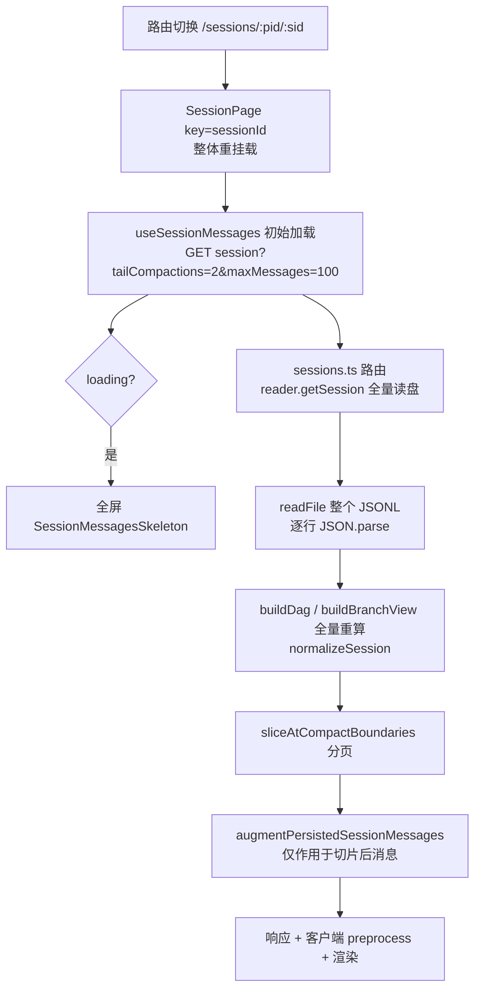

# Session 切换加载性能与内容缓存方案

> 历史说明：文中 OpenCode 消息处理与性能路径已随 2026-08-18 provider 退役而删除，其余 provider 分析仍可作参考。
>
> 状态：方案待评审（2026-08-13）。审查结论来自静态代码分析，性能数字需按「验证」节实测补齐。
>
> 日期：2026-08-13
>
> 关联文档：docs/plans/session-cache-strategy-2026-02-22.md、docs/project/2026-08-10-codex-canonical-overlay-performance-plan.md

## 1. 结论

用户在多个 session 之间来回切换时，每次切换都支付「全价」：客户端因 `key={sessionId}` 整体重挂载丢失全部 hook state，重新发起 REST 初始加载；服务端对该请求**每次**全量 `readFile` + 逐行 `JSON.parse` + 全量 branch view 重算，没有任何内容层缓存，分页只发生在全量解析之后，只省传输不省解析。浅 session 的主要体感是全屏 skeleton 闪烁（无 stale-while-revalidate），长 session（JSONL 数 MB ~ 数十 MB）则是每次切换数百 ms 级的服务端解析与首屏等待。

推荐方案分四层：

- **P0 服务端 session 内容缓存**：key 为 `projectId:sessionId`，用 mtime+size 校验，命中跳过 readFile+parse+branch view；双约束上界（session 数 + 源文件字节预算），FileWatcher 事件主动失效、mtime 校验兜底。
- **P0 旁观刷新 merge 保引用**：`refreshSessionMessages` 的替换路径改为按消息 id merge，内容未变的消息保留对象引用，消除 preprocess 全量重算与可见行 memo 击穿。
- **P1 客户端有界跨 session 缓存 + stale-while-revalidate**：模块级 LRU（3–5 个 session），切回时先展示缓存快照、后台 revalidate，消掉 skeleton。
- **P1/P2 小修**：`<task>` 正则扫描加 `includes` 短路或按 provider 门控；`getAgentSession` 改有界并行；`useProject` 加跨挂载缓存。

本文档是 2026-08-10 canonical overlay 方案（48 秒特例，已通过 `view=canonical` 显式 opt-in 解决）在**普通路径**上的后续：普通 Session GET 早已不执行 canonical overlay，但仍每次全量读解析 provider session 文件，这是本文档要补的缺口。

## 2. 背景与现状

### 2.1 与既有缓存文档的分层关系

`docs/plans/session-cache-strategy-2026-02-22.md` 覆盖的是**列表层**缓存：`SessionIndexService.getSessionsWithCache()`、`ProjectScanner` 快照、`/api/sessions` stats 缓存等，优化对象是 `/api/projects`、`/api/sessions`、`/api/inbox` 这类列表端点。它解决「列出有哪些 session」的成本，**不含**单个 session 消息内容的读取与解析。

本文档补的是**内容层**：`GET /api/projects/:pid/sessions/:sid` 返回消息体的链路。两层各自独立——列表层命中缓存后，点开任何一个 session 仍然全量解析其 JSONL。顺带说明，仓库里已存在两个「内容层附近」的先例，但都不服务渲染链路：

- `SessionContentIndexService`（packages/server/src/indexes/SessionContentIndexService.ts:1-15）缓存的是全文搜索用的**抽取文本**，惰性构建，不存渲染用 `Message[]`。
- reader 的 `getSessionSummaryIfChanged`（packages/server/src/sessions/reader.ts:1139-1166、codex-reader.ts:372-384）用 mtime+size 做校验，但只产出 summary，供 `SessionIndexService` 列表层使用。

这两个先例证明 mtime+size 校验 + EventBus 失效的模式在本仓库已落地，本文档的 P0 是同一模式向渲染内容层的延伸。

### 2.2 切入一个 session 的完整链路

关键节点（行号以 2026-08-13 工作树为准）：

- 重挂载：`packages/client/src/pages/SessionPage.tsx:93-101`，`key={sessionId}`（第 96 行），注释自述「remounts on session change, resetting all state」（第 91 行）。
- 初始加载：`packages/client/src/hooks/useSessionMessages.ts:690-695`，参数 `tailCompactions=2&maxMessages=100`；上限常量在 `useSessionMessages.ts:161`（`INITIAL_MESSAGE_LIMIT = 100`）。
- 加载期全屏 skeleton：`SessionPage.tsx:2053-2055`（`loading ? <SessionMessagesSkeleton />`）。
- 服务端路由每次都读盘：`packages/server/src/routes/sessions.ts:1282-1301`（注释「Always try to read from disk first」），无缓存检查。
- Claude reader 全量读解析：`packages/server/src/sessions/reader.ts:296-331`（`loadSessionEntriesFromDir`：`readFile` 整个文件后逐行 `JSON.parse`），随后 `reader.ts:425-485`（`getSession`）对全部 entries 跑 `buildClaudeBranchView`。无 mtime/大小校验、无内容缓存。
- Codex reader 同构：`packages/server/src/sessions/codex-reader.ts:318-329`（`getSession`）→ `codex-reader.ts:218-238`（`loadSessionEntries`：`readJsonlLines` 全量 + 逐行 `parseCodexSessionEntry`），注释自述此前在每次 open/翻页/branch switch 上重复读解析、现已合并为单次读取，但**每次请求仍全量**。
- 分页在解析之后：`sessions.ts:1592-1626`（`sliceAtCompactBoundaries` 等），注释明确「BEFORE expensive augmentation」；markdown augment（`sessions.ts:1628-1629`）只处理切片后消息。因此分页只省传输与 augment，不省 readFile/parse/branch view。
- 客户端无跨导航消息缓存：依赖里无 React Query/SWR（packages/client/package.json 仅 `@tanstack/react-virtual`）；模块级缓存是 WeakMap（`packages/client/src/lib/codexLinearMessages.ts:8`、`packages/client/src/lib/mergeMessages.ts:9`），以消息对象为 key，remount 后消息对象重建即失效，且随时可被 GC。

### 2.3 已有优化（本次不重改，如实肯定）

- 流式合批：`useStreamingContent` 50ms 节流（`packages/client/src/hooks/useStreamingContent.ts:8`，`STREAMING_THROTTLE_MS = 50`）。
- 流式增量 preprocess：`preprocessMessagesCached` 的 streaming-tail 路径（`packages/client/src/lib/preprocessMessagesCache.ts:55-112`）用前缀引用比较（`hasSameMessagePrefix`）只对尾部 1 条消息重算。
- 长列表虚拟化：`@tanstack/react-virtual`，行数 > 80 启用（`packages/client/src/components/MessageList.tsx:38` `VIRTUALIZE_ROW_THRESHOLD = 80`，`:296-310`）。
- 渲染 memo：`MessageList`（MessageList.tsx:107）、`RenderItemComponent`（RenderItemComponent.tsx:138）、`TextBlock`（blocks/TextBlock.tsx:142）、`ToolCallRow`（blocks/ToolCallRow.tsx:64）均为 `memo` 组件。
- 服务端 markdown augment 有字符串级 LRU：`packages/server/src/augments/markdown-augments.ts:209-215`，`memoizeAsyncByString` + charBudget 8M 字符（≈16MB UTF-16），首次进 session 的 `_html` 已在服务端内联，客户端不再跑 markdown。
- 列表层缓存与 canonical overlay 旁路：见 2.1；普通 GET 默认不执行 canonical overlay（`sessions.ts:1232` `viewParam === "canonical"` 才进入 `sessions.ts:1338-1430` 的 overlay 分支，预算 2s，`sessions.ts:1346`）。

## 3. 问题清单

### 3.1 【高】切回已访问 session 无任何缓存：remount + REST 重拉 + 服务端全量 parse

- **触发场景**：用户在两个以上 session 间来回切换（移动端监督多个 agent 的核心姿势）。
- **证据**：2.2 节链路每一环都无缓存——`SessionPage.tsx:96` 重挂载丢 state；`useSessionMessages.ts:690-695` 重新 REST；`sessions.ts:1289-1301` → `reader.ts:296-331` / `codex-reader.ts:218-238` 每次全量读解析；分页在 `sessions.ts:1612-1626` 才发生。客户端仅有的跨调用缓存是 WeakMap（mergeMessages.ts:9），remount 后必然失效。
- **影响**：长 session（JSONL 数 MB ~ 数十 MB）单次切换服务端数百 ms（参考 2026-08-10 文档实测：9.7MB rollout 读取+解析约 78ms、normalize 9ms、stringify 6ms，尚未计 branch view 与多次切换的叠加），来回切每次付全价；浅 session 则主要是 skeleton 闪烁（无 stale-while-revalidate）。
- **确信度**：高。代码路径直接可读；具体毫秒数需实测补齐（见第 8 节）。

### 3.2 【中】旁观活跃 external session 时每 ~500ms 全量重载 + memo 击穿

- **触发场景**：打开一个正被外部（终端/其他客户端）活跃写入的 session 旁观。
- **证据**：watch 事件 `handleSessionWatchChange` → `throttledFetch`（`packages/client/src/hooks/useSession.ts:1321-1327`），throttle 为 leading+trailing 500ms（`useSession.ts:163`，`THROTTLE_MS = 500`）。对 codex/codex-oss/opencode/kimi，`shouldRefreshFullPersistedSession` 为真（`useSession.ts:389-398`），走 `refreshSessionMessages` 全量 REST（`useSession.ts:1038-1041` → `useSessionMessages.ts:959-1014`）。（Claude 旁观走增量 `fetchNewMessages`，`useSessionMessages.ts:898-904`，不在此问题内。）
- **memo 击穿的机制**：`applySessionSnapshot`（`useSessionMessages.ts:599-658`）先把每条消息重打包为新对象（`:620-624`，`{...m, _source: "jsonl"}`），非 codex 或 branch 失效时直接 `setMessages(replaceMessages)`（`:653-657`）整体换引用；即便 codex 的 `mergeCodexMessages` 路径，`mergeMessage` 的 JSONL-authoritative 分支也无条件 `{...existing, ...}` 分配新对象（`packages/client/src/lib/mergeMessages.ts:390-407`，仅 SDK-onto-JSONL 分支在内容相同时返回原引用，`:415-417`）。结果是全部消息换引用 → streaming-tail 前缀比较失败 → preprocess 全量 + 可见行 memo 全击穿，每 500ms 一轮。
- **确信度**：高（引用替换路径逐行确认）；「每 500ms 一轮全量 REST」的实际频率取决于外部写入节奏，需实测确认。

### 3.3 【中】流式 flush 路径上的 O(全文) 正则扫描

- **触发场景**：任何 provider 的流式输出期间（与 provider 无关）。
- **证据**：`preprocessMessagesCached` 的两条增量路径在返回前都无条件调用 `reconcileOpenCodeBackgroundTaskStatuses`（`preprocessMessagesCache.ts:73-78`、`:103-108`）；该函数遍历**全部** render item 的文本跑 `extractOpenCodeTaskStateUpdates`（`packages/client/src/lib/preprocessMessages.ts:128-162`），内部对每个文本执行 `/<task\b([^>]*)>/gi` 全文扫描（`packages/client/src/lib/openCodeSubagents.ts:46-66`，正则在第 50 行）。流式期间每 50ms flush 触发一次，成本随 render item 总量线性增长，而非 opencode session 的文本几乎不可能含 `<task`。
- **确信度**：高。纯 CPU 浪费，修复无行为风险。

### 3.4 【低】打开后后台串行瀑布

- **触发场景**：session 含 K 个已完成的 Task/subagent 映射，或每次切换时项目元信息重拉。
- **证据**：`useSession.ts:961-995` 对 `mappedAgentIds` 逐个 `await api.getAgentSession`，K 个 pending Task = K 个串行请求，服务端每次 `getAgentSession` 全量读解析一个 subagent JSONL（`reader.ts:497-556`）。另 `useProject` 每次挂载都 `api.getProject`，无跨挂载缓存（`packages/client/src/hooks/useProjects.ts:9-49`）。
- **确信度**：中。串行属实；是否构成可感卡顿取决于 K 与 subagent 文件大小，需实测。

## 4. 目标与非目标

### 4.1 目标

- 切回最近访问过的 session：静态内容首屏不再等待全量 REST 往返（缓存命中时 <100ms 呈现），无全屏 skeleton。
- 服务端对未变化的 session 文件：重复 GET 不再 readFile/parse/branch view，单请求成本降到 stat + 序列化级别。
- 旁观活跃 session：内容未变的消息不再换引用，preprocess 保持增量路径，可见行 memo 不再每 500ms 击穿。
- 所有缓存有明确上界与失效路径；内存增长可估算、可观测。

### 4.2 非目标

- 不改 canonical overlay 路径（`sessions.ts:1338-1430`）及其 `codexProjectionCache`（`sessions.ts:707-708`）；本文档的缓存位于其下游的 rollout 读取层，两者正交。
- 不改列表层缓存（`SessionIndexService`/`ProjectScanner`，已有专门文档）。
- 不引入 React Query/SWR 等通用数据层依赖（见 6.3）。
- 不做跨进程/磁盘持久化的内容缓存（首版仅进程内）。
- 不改变分页协议、`tailCompactions`/`maxMessages` 语义或消息 normalize 结构。

## 5. 方案设计

### 5.1 P0：服务端 session 内容缓存（render-content cache)

**改动位置**：新增 `packages/server/src/sessions/session-content-cache.ts`；在 `sessions.ts:1289-1301` 的 `reader.getSession` 调用处包一层（或作为 `readerFactory` 的装饰器，覆盖 `:1319` 的 fallback reader 路径）。

**缓存内容**：以 session 文件为单位的「解析后中间态」——`{ entries, summary, defaultBranchView, filePath, mtimeMs, size }`。请求命中时跳过 readFile+parse+summary+默认 branch view；带 `branchId` 的请求复用 `entries`、仅重算该 branch 的 view（branch view 是 O(entries) 的纯计算，非默认 branch 是少数路径）。

**key 与校验**：

- key = `${projectId}:${sessionId}`（同一 sessionId 可能出现在多个 project 目录）。
- 命中前 `stat(filePath)`，比对 `mtimeMs` + `size`；一致才返回缓存。stat 成本微秒级，与全量 parse 相比可忽略。
- 主动失效：订阅 EventBus 的 `file-change` 事件（`packages/server/src/watcher/FileWatcher.ts:219` 发出，载荷含 provider/relativePath），命中即删对应条目；mtime 校验作为 watch 事件丢失的兜底（与 `SessionIndexService` 同款双保险，见 2.1）。

**上界**：双约束——最多 N 个 session + 源文件字节总预算，以 `size` 为代理值（与 `CharBudgetLruCache` 用 key 长度做代理同思路）。env 命名沿用列表层惯例（参照 `SESSION_INDEX_FULL_VALIDATION_MS`）：

- `SESSION_CONTENT_CACHE`：总开关，默认开，`false` 时直连 reader（兼作回滚开关，见第 9 节）。
- `SESSION_CONTENT_CACHE_MAX_SESSIONS`：建议默认 16。
- `SESSION_CONTENT_CACHE_MAX_SOURCE_BYTES`：建议默认 134217728（128MB）。

注意 `packages/server/src/utils/charBudgetLruCache.ts` 的 `CharBudgetLruCache`（:13）按 **key 字符数**计预算，session 缓存的 key 是短 id、值是大对象，不能直接复用该类，需写一个按值（源文件 size）计费的变体，LRU 逐出顺序与其一致。

**内存估算**：条目持有解析后对象，V8 堆占用约为源文件 1.5–2×；128MB 源预算对应约 200–260MB 堆上限。若该水位不可接受，先降到 64MB/8 session，用第 8 节的命中率实测再调。单个超过总预算的超大 session 直接不缓存（与 `CharBudgetLruCache.set` 的 skip 策略一致），避免为容纳它清空全部其他条目。

**与 canonical overlay 的关系**：overlay 分支（`sessions.ts:1378-1394`）消费的是 normalize 后的 `session.messages`，其 `codexProjectionCache` 缓存的是 canonical journal 的 projection，两者层次不同。本缓存命中时 overlay 仍按现状执行（仅 `view=canonical` 请求），不受影响的普通 GET 则完全受益。

**不做磁盘持久化**：进程内即可覆盖「来回切换」场景；重启后首个请求重新解析，成本与现状相同，无回归。

### 5.2 P0：旁观刷新的 merge 保引用

**改动位置**：`useSessionMessages.ts:599-658` `applySessionSnapshot` 与 `mergeMessages.ts:378-427` `mergeMessage`。

**设计**：

- 把非 codex 的 replace 路径（`useSessionMessages.ts:653-657`）改为统一走 `mergeJSONLMessages` 风格的按 id merge；branch 切换/失效等确需替换的场景保留 replace（由现有 `codexSnapshotDeactivatesCurrentBranch` 类判断扩展，或显式 `replaceMessages` 选项）。
- `mergeMessage` 的 JSONL-authoritative 分支（`mergeMessages.ts:390-407`）加「未变即返原引用」快路径：合并前比较，内容块与关键字段均无变化时 `return existing`（与 `:415-417` 已有的 SDK 分支同款写法）。比较需覆盖消息体与 `_html` 等 augment 字段，成本远低于全量 preprocess。
- 连带收益：`preprocessMessagesCache.ts:69-72` 的前缀引用比较在旁观刷新后继续命中，preprocess 维持增量；memo 行组件因 props 引用不变跳过渲染。

**注意**：`useSessionMessages.ts:620-624` 每条消息重打包 `_source` 标签本身就会换引用，需先判断来源已是 `jsonl` 则跳过重打包。

### 5.3 P1：客户端有界跨 session 缓存 + stale-while-revalidate

**改动位置**：新增 `packages/client/src/lib/sessionSnapshotCache.ts`（模块级，与 `mergeMessages.ts:9` 的 WeakMap 同层，但用强引用 Map + LRU）；在 `useSessionMessages.ts:667-695` 初始加载 effect 中接入。

**设计**：

- key = `${projectId}:${sessionId}`（branchId 不入 key，branch 切换维持现状全量重拉）。
- value = 上次成功初始加载的 `{ messages, pagination, session }` 快照（即 `applySessionSnapshot` 的入参形态）。
- 切入 session 时：命中 → 同步用缓存快照渲染（跳过 `setLoading(true)`，无 skeleton），同时照常发 REST revalidate，返回后走 5.2 的 merge 保引用路径应用增量；未命中 → 现状。
- 上界 LRU 3–5 个 session。取舍：移动端监督的典型模式是 2–3 个活跃 session 互切，3–5 已覆盖绝大多数命中；单个快照含 ≤100 条窗口消息（约 1–5MB，含大工具输出时更高），5 个约 5–25MB JS 堆，移动端 Safari 可承受；再大则命中率收益递减而内存压力（尤其在低端设备后台被杀阈值）线性上升。
- 与 `key={sessionId}` remount 共存：缓存放在模块级（或提升到 SessionPage 之上的 context），不随 `SessionPageContent` 重挂载销毁；remount 语义本身保留（继续用它重置流式/审批等易错状态），只让消息快照存活更久。这比去掉 `key` 的改造面小得多。

### 5.4 P1：`<task>` 正则扫描短路

**改动位置**：`preprocessMessages.ts:128-162` `reconcileOpenCodeBackgroundTaskStatuses`。

**设计**：两选一（或叠加）——

- 文本级短路：`getOpenCodeTaskStateText` 产出的每个文本先 `text.includes("<task")` 再进 `extractOpenCodeTaskStateUpdates`，非 opencode 内容零正则。
- provider 级门控：`preprocessMessagesCached` 已能拿到 provider 上下文时，非 opencode session 跳过整个 reconcile 调用。

短路版改动更小且与 provider 判定解耦，优先；门控版作为进一步保险。修复后该函数对非 opencode session 退化为一次数组遍历 + 字符串 `includes`。

### 5.5 P2：agent 加载并行化与 useProject 缓存

- `useSession.ts:961-995`：串行 `for` 改有界并行（并发 3–4，简单信号量即可）。服务端 `getAgentSession` 是全量文件读（`reader.ts:519-535`），并行会制造 IO/CPU 尖峰，故限并发而不一次性 `Promise.all`；后续如 5.1 的缓存覆盖 subagent 文件，可再放宽。
- `useProjects.ts:9-49`：加模块级短 TTL（如 30s）或 LRU 的 `projectId → Project` 缓存，切换 session 时同步命中；失效可由现有 session-updated/项目变更事件触发，或仅靠短 TTL（项目元信息变化频率低，可接受秒级滞后）。

### 5.6 风险评估

- **看旧内容的窗口**：5.1 的失效是「watch 事件 + 每次请求 stat 校验」，旧内容窗口 ≈ 0（stat 先于响应）；理论残余是 mtime 粒度与同尺寸写入同时发生的极端情况，与列表层缓存现状同级，可接受。5.3 的客户端 SWR 是有意的「先看旧再校正」，窗口 = 一次 REST 往返，由 merge 保引用保证校正不闪烁；与现状「skeleton 等待」相比是纯收益。
- **与 streaming 增量的交互**：自有 session 的流式更新走 WebSocket + `processStreamMessage`，不经过 5.1/5.3 的快照；缓存只影响初始加载与旁观刷新两条 REST 路径。5.2 的 merge 必须保持 stream 消息优先级的现有语义（`mergeMessage` 的 source 优先级不变），回滚预案见第 9 节。
- **内存上界**：服务端 ≤128MB 源字节预算（≈200–260MB 堆）+ 客户端 ≤5 session × 数 MB。两端均有 env/常量可调，上线前按第 8 节实测收缩。

## 6. 不推荐的方案

### 6.1 只做客户端缓存，不做服务端缓存

客户端 SWR 消除 skeleton 但省不掉服务端全量 parse；旁观刷新与多客户端场景仍每次付全价。两端缓存解决的是不同环节，互为补充而非替代。

### 6.2 服务端用 TTL-only 缓存（不做 mtime 校验）

活跃 session 文件秒级变化，TTL 缓存要么窗口内返回旧内容（正确性回归），要么 TTL 短到失去意义。mtime+size 校验成本接近零且语义严格，无理由退化为 TTL-only。

### 6.3 引入 React Query/SWR 重建客户端数据层

能系统性解决缓存、去重、失效，但引入新依赖并要求重写 `useSessionMessages`/`useSession` 的状态机（流式 buffer、generation 防竞态、active window 裁剪都与现状深度耦合）。本文档的有界 LRU 只覆盖「切回」一个场景，改动面小一个数量级。

### 6.4 去掉 `key={sessionId}` 改条件重置 state

可保留 hook state，但 `key` remount 是当前重置流式/审批/滚动等易错状态的兜底，移除后需要逐一审计所有 `useEffect` 的清理路径，回归风险远高于收益。缓存提升到模块级即可达到同样效果。

### 6.5 把 JSONL parse 搬进 worker

2026-08-10 文档已把 worker 隔离列为后续增强。对「来回切换」场景，缓存命中直接免除 parse，worker 只改善未命中时的主线程占用；且 worker 化有 structured-clone 成本先例（见该文档 2.4 节）。先缓存，后视实测决定 worker。

## 7. 实施顺序

1. **阶段 A（观测基线）**：按第 8 节实测普通 GET 的 p50/p95、RSS、客户端切换耗时，记录基线。
2. **阶段 B（P0 服务端缓存）**：5.1 + 单测；env 开关默认开。
3. **阶段 C（P0 merge 保引用）**：5.2 + 单测；与 B 独立可回滚。
4. **阶段 D（P1 客户端 SWR 缓存）**：5.3，依赖 C 的 merge 路径保证 revalidate 应用不闪烁。
5. **阶段 E（P1/P2 小修）**：5.4、5.5，各自独立。
6. **阶段 F（实测调参）**：按命中率与 RSS 调整 5.1/5.3 的上界常量。

## 8. 测试与验证

### 8.1 单元测试

- 服务端缓存：mtime/size 变化即 miss、watch 事件即失效、LRU 逐出顺序、超字节预算不缓存、branchId 请求复用 entries、fallback reader 路径同样走缓存。
- merge 保引用：内容相同的消息刷新后引用相等（`toBe`），变化消息换新引用；`_source` 已标注的消息不再重打包；codex/opencode/claude 三 provider 各覆盖。
- 正则短路：非 opencode 文本不触发 `matchAll`（可用 spy 断言）；含 `<task` 的 opencode 文本行为不变。
- 客户端 SWR：命中缓存时初始渲染不走 skeleton、revalidate 后增量应用、LRU 上界逐出。

运行 `pnpm lint`、`pnpm typecheck`、`pnpm test`。本改动不改 UI 结构，默认不跑 `pnpm test:e2e`。

### 8.2 实测方法（不重启服务、不浏览器自动化）

- 服务端基线与对照：对同一长 session 连续 `curl -w '%{time_starttransfer} %{time_total}'` 普通 GET（`?tailCompactions=2&maxMessages=100`），对比缓存开关两态；观察进程 RSS（`ps`）确认上界生效。阶段 A 需采集的基线：

  | 指标 | 现状（待补） | 目标 |
  | --- | --- | --- |
  | 长 session 普通 GET TTFB（未命中/命中） | 待实测 | 命中时降至 stat+序列化级别 |
  | 连续切换 5 次的平均耗时 | 待实测 | 显著低于单次全量 |
  | 进程 RSS 增量（缓存填满后） | 待实测 | 不超过 5.1 内存估算 |
  | 旁观刷新后 preprocess 是否走增量路径 | 全量 | 增量 |

- 缓存观测：复用维护服务的调试端点（`PORT+1`）暴露命中率/条目数/字节水位，或用现有 logger debug 字段，模式参照 2026-08-10 文档的 `cacheSize` 日志（`sessions.ts:1396-1409`）。
- 部署前后一致性按仓库惯例比较 `/api/version`、`/build-info.json` 与 `dist/npm-package/build-info.json`，确认实测对象与构建产物对应。
- 客户端：Developer Mode remote logging 落盘的 console 计时（`performance.now` 包裹初始加载与 revalidate），验证「命中缓存无 skeleton」与「revalidate 不闪烁」。
- 纪律：未经用户授权不重启/重载任何运行中服务，不调用维护服务 `POST /reload`，不做浏览器/Playwright 自动化；如需重启验证，先取得确认。

## 9. 回滚

- 5.1：env 开关（如 `SESSION_CONTENT_CACHE=false`）绕过缓存直连 reader，即时回滚，无数据迁移。
- 5.2：`mergeMessage` 快路径与 replace→merge 分别由常量/选项控制，回滚即恢复 `setMessages(replaceMessages)` 现状路径。
- 5.3：缓存读取处判空降级为现状加载；清空模块级 Map 即完全禁用。
- 5.4/5.5：均为单点小改，直接 revert。
- 全部改动无 schema、无持久化格式变化，回滚不影响列表层缓存与 canonical overlay。

## 10. 待确认问题

- 5.1 上界常量（16 session / 128MB 源字节）是否匹配 8022 常驻实例的 RSS 预算？需阶段 A 实测后定稿。
- 5.1 是否覆盖 subagent 文件（`getAgentSession`）？覆盖则 5.5 的并行化优先级下降。
- 5.2 的「内容未变」比较需枚举哪些字段（`_html`、augment、usage）？以 preprocess/memo 实际读取的字段为准。
- 5.3 快照是否需要连同 `agentContent`/`toolUseToAgent` 一起缓存？只缓存 messages 是否会在重进入时重复 5.5 的 agent 加载瀑布。
- 旁观刷新的实际频率分布（外部写入多快、500ms throttle 实际触发密度）需要线上日志佐证，以确认问题 3.2 的真实权重。
