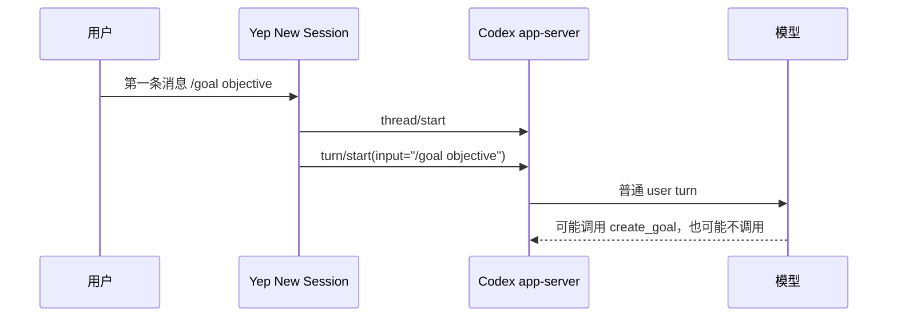
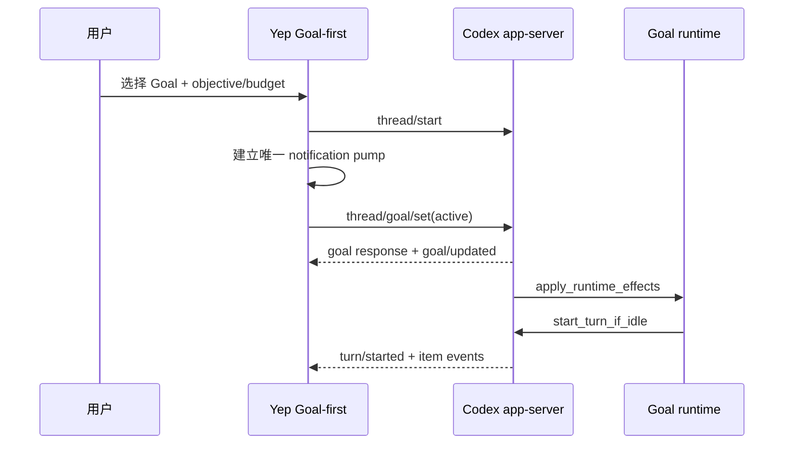
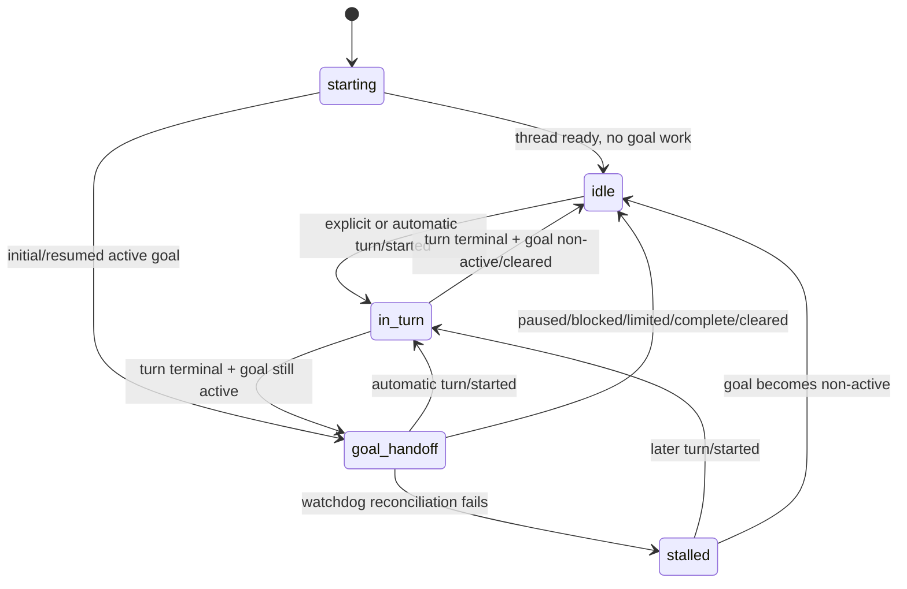

# Codex Goal 模式适配现状与完整开发计划

> 状态：实施前基线与方案评审稿；本文只记录现状、缺口和开发计划，不代表功能已经完成。
>
> 日期：2026-08-14
>
> Yep 协议基线：当前仓库固定的 Codex app-server `0.147.0` stable schema。
>
> Codex reference 基线：`references/codex` commit `c30a3e49c`（2026-08-13）。reference 可能领先于 Yep 固定版本，实施时必须对固定版本重新做 capability/contract 验证。
>
> 关联文档：
>
> - [Codex canonical overlay 性能方案](./2026-08-10-codex-canonical-overlay-performance-plan.md)
> - [Codex 事件 journal 内存索引有界化方案](./2026-08-13-codex-event-journal-memory-plan.md)
> - [Session 分支设计](./2026-01-05-session-forking.md)
> - [ZCode provider 集成计划](./2026-08-11-zcode-provider-integration-plan.md)
> - [ZCode 支持现状](./2026-08-12-zcode-support-current-state.md)
> - [OpenAI 官方 Goal 指南](https://learn.chatgpt.com/use-cases/follow-goals)

## 1. 结论

Yep Anywhere 对 Codex Goal 的适配目前应定义为：**原生 RPC 控制和 canonical 刷新展示已经接入，但还不是完整的 Goal mode**。

已经具备的能力：

- 能对一个正在由 Yep 托管的 Codex process 调用原生 `thread/goal/get`、`thread/goal/set`、`thread/goal/clear`；
- 能执行 set、replace、pause、resume、clear，并展示 provider 返回的目标摘要；
- canonical event journal 能归并 `thread/goal/updated` / `thread/goal/cleared`；
- Session Inspector 在 canonical 视图下能显示最新目标的 objective、六种 status、token usage/budget 和累计时间；
- 现有 reducer、projection 和 RPC shape 测试已经覆盖静态控制与刷新后的目标卡片。

关键缺口：

1. **新会话没有 Goal-first 入口。** New Session 表单、client API、server command、provider options 都没有 `initialGoal` 或等价字段。把 `/goal ...` 作为第一条消息发送，只会走普通 `turn/start`。
2. **自动 continuation 没有被 Yep 运行时接管。** Codex 在 idle thread 上把 goal 设为 `active` 后可以自动启动 turn；当前 Codex provider 只在 Yep 主动提交 turn 后消费通知，并只跟踪该 turn id。
3. **session 运行状态可能与真实 Codex 状态分裂。** 自动 turn 的事件会进入 durable journal，但不保证通过正常 provider iterator 实时流到 Process；Process 可能显示 idle，interrupt/steer 也可能拿不到真实 active turn id。
4. **resume 和 fork 语义不完整。** resume 会恢复 goal snapshot，并可能在 idle 后自动继续；当前运行时没有接管该 turn。编辑 fork 没有发送 `deferGoalContinuation`，因此不会按 Codex 原生语义继承 goal。
5. **界面只有 transcript 卡片和 process 级弹窗。** 没有像 Codex TUI 一样持续可见的 Goal 状态指示、动态 elapsed time、token budget 编辑和 offline/session 级读取。
6. **现有测试固化了一项错误假设。** Codex `thread/goal/set` handler 返回 `startedTurn: false`，相关注释和旧 CHANGELOG 曾把它解释成“只修改状态、不启动 turn”；reference 明确显示 active goal 会执行 `continue_if_idle()`。

因此，在下面的 Checkpoint 0–5 完成前，产品和文档都不应宣称“Yep 已支持 Codex Goal mode”。更准确的用户表述是：

> Yep 已支持托管 Codex session 的 Goal 状态控制和刷新展示；新会话 Goal-first、自动连续执行的实时监督、resume/fork 完整语义仍待实现。

## 2. 术语与范围

### 2.1 Goal 不是 permission mode

当前 New Session 中的 `auto`、`plan`、`bypassPermissions` 等选择控制工具审批、sandbox 或协作行为。Goal 则是持久化在 Codex thread 上的目标状态，包含：

- objective；
- status；
- token budget / tokens used；
- time used；
- 自动 continuation 生命周期。

Goal 可以与任意受支持的 permission mode 组合，不应被加入 `PermissionMode` 枚举，也不应作为一个 provider 或 collaboration mode 实现。目标 UI 应是独立的“以持久目标启动”开关或启动类型。

### 2.2 Goal-first、普通 prompt 与模型 goal tool

本文使用以下定义：

- **Goal-first**：创建 thread 后，客户端直接调用原生 `thread/goal/set(status=active)`，第一项工作由 Codex goal runtime 自动启动；不会先把 `/goal ...` 作为普通 user turn 交给模型。
- **普通 prompt**：Yep 调用 `turn/start`，输入就是用户文本。
- **模型 goal tool**：模型在普通 turn 内根据指令选择调用 `create_goal` / `update_goal`。这取决于模型决策，不能替代客户端对 `/goal` 的确定性分派。

### 2.3 本文目标

- 给出 Codex reference 与 Yep 当前实现的逐层事实对照；
- 确认新会话、运行时、展示、resume、fork 和测试的真实缺口；
- 指定可按 checkpoint 实施、验证和回滚的开发计划；
- 为后续开发提供唯一的 Goal 适配验收基线；
- 纠正仓库内把 Yep 首条 `/goal` 当成原生 Goal-first、或认为 active goal 不会启动 turn 的旧文档。

### 2.4 非目标

- 不在本文中直接实现功能；
- 不把 ZCode、Kimi 或其他 provider 的 goal 协议改造成 Codex 协议；
- 不新增第三种客户端 locale；界面仍只维护 `en` 和 `zh-CN`；
- 不要求在主 transcript 中保留每一次 goal accounting 更新的完整时间线；
- 不为了 fork 一个字段而无条件打开 Codex 全部 experimental API；
- 不在未获明确授权时运行真实模型 smoke、浏览器自动化或重启现有服务。

## 3. 事实来源与兼容边界

实施时按以下优先级判断事实：

1. Yep 实际固定的 app-server 版本和生成 schema；
2. 仓库内 `references/codex/` 对应版本源码；
3. OpenAI 官方 Goal 使用说明；
4. Yep fake server、测试或历史注释只能证明本项目当前假设，不能反向定义上游协议。

需要特别注意版本差异：

- 官方 Goal 指南仍提示：如果 `/goal` 不可用，可启用 `features.goals`；
- 当前 reference 中 `Feature::Goals` 已是 `Stage::Stable` 且 `default_enabled: true`；
- Yep 的 stable control capability 固定在 app-server `0.147.0`，不能只凭更新后的 reference 就假设 fixed binary 具备完全相同的 runtime/fork 行为。

所以 Goal-first UI 的展示条件必须来自 server capability，而不是只判断 `provider === "codex"`。

## 4. Codex reference 的原生行为

### 4.1 Goal 数据和 RPC

`references/codex/codex-rs/app-server-protocol/src/protocol/v2/thread.rs` 定义：

- `ThreadGoalStatus`：`active`、`paused`、`blocked`、`usageLimited`、`budgetLimited`、`complete`；
- `ThreadGoal`：thread id、objective、status、可选 token budget、tokens used、time used、created/updated time；
- `thread/goal/set`：objective、status、token budget 都是 patch 语义；
- `thread/goal/get`：返回 goal 或 `null`；
- `thread/goal/clear`：返回 `cleared: boolean`；
- app-server 通过 `thread/goal/updated` / `thread/goal/cleared` 推送最新状态。

`ThreadStartParams` 没有 `initialGoal` 字段。因此 Goal-first 不是一个原子的 `thread/start` 参数，而是客户端编排：

1. `thread/start`；
2. 确保 thread 已配置、notification listener 已就绪；
3. `thread/goal/set(status=active)`；
4. 接管随后由 goal runtime 自动创建的 turn。

### 4.2 active goal 会启动自动 turn

这是当前 Yep 最重要的语义误差。

`app-server/src/request_processors/thread_goal_processor.rs` 在写入 goal 后按顺序：

1. 返回 `ThreadGoalSetResponse`；
2. 发出 ordered `thread/goal/updated`；
3. 调用 `outcome.apply_runtime_effects(...)`。

`ext/goal/src/runtime.rs` 对 `active` 状态执行 `continue_if_idle()`；如果 thread idle 且没有 continuation deferral，会构造 continuation steering item 并调用 `start_turn_if_idle(...)`。

因此：

- pause/blocked/limited/complete 会清除 active accounting，不自动继续；
- set、replace 或 resume 到 `active` 时，idle thread **允许立即出现新的 `turn/started`**；
- `thread/goal/set` RPC response 自身不携带可靠的 `startedTurn`，真实 turn 是否开始必须以 notification 为准；
- Yep 不能以“action handler 没主动调用 `turn/start`”推导“没有模型 turn”。

### 4.3 原生 TUI 如何实现首条 `/goal`

`tui/src/chatwidget/slash_dispatch.rs` 的行为不是把 `/goal` 文本直接交给模型：

1. TUI 识别 `SlashCommand::Goal`；
2. 如果 thread 还不存在，把输入以 `QueuedInputAction::ParseSlash` 排队；
3. thread 配置完成后重新解析 slash command；
4. 将长文本、paste、local image 等 materialize 为 app-server 可读文件；
5. 必要时确认/清除旧 goal；
6. 调用原生 `thread/goal/set`；
7. app-server 启动 goal continuation。

`tui/src/goal_files.rs` 还处理了 Yep 未来必须考虑的边界：

- 超长 objective 写到 `$CODEX_HOME/attachments/<uuid>/goal-objective.md`；
- paste 与图片写成 app-server host 上的文件；
- objective 改成明确的文件读取指令；
- 编辑时只允许从受控的 attachment 路径反解内容；
- set 失败时清理本次 materialize 的文件。

对照当前 Yep，实际链路是：



目标链路应是：



两条链路不等价。现有 `packages/shared/src/session-kind.ts` 对 `/goal` 的识别只用于避免把长任务会话误分类成一次性 slash-command session，不会改变 turn 分派。

### 4.4 resume 行为

`app-server/src/request_processors/thread_lifecycle.rs` 在 resume 时会向 listener 补发 goal snapshot 或 cleared 状态。thread 恢复到 idle 后，active goal 可以继续触发 automatic continuation。

对 Yep 的要求是：

- notification pump 必须在 resume RPC 前或至少在任何 runtime effect 前可接收事件；
- goal snapshot 必须进入 session runtime snapshot 和 canonical projection；
- 如果 resume 后先收到自动 `turn/started`，不能再对下一条用户消息盲目调用 `turn/start`；
- interrupt、steer、审批和 Process activity 必须绑定真实 auto turn id。

### 4.5 fork 行为

`ThreadForkParams.deferGoalContinuation` 是 experimental field。reference 的语义是：

- `true` 时把 source thread 当前 goal snapshot 继承到 child；
- fork 后暂不立即自动 continuation；
- child 的下一次显式 turn 拥有 goal lifecycle；
- 显式 turn 结束后再恢复正常自动 continuation。

reference 的 TUI retry/edit 相关路径和 persistent exec fork 会使用该能力。当前 Yep `thread/fork` 请求没有发送这个字段，所以不能声称 edit fork 保留 Goal。

这个字段不能直接按新 reference 写进生产请求。P4 必须先对 Yep 固定 app-server 做 schema/capability probe，并明确 experimental API 的最小启用范围。

### 4.6 TUI 的持续状态展示

Codex TUI 不只在 transcript 放一张卡片：

- footer 持续显示 `Pursuing goal` 或 paused/stalled/limited 等状态；
- elapsed time 会按 tick 更新；
- goal menu 显示完整摘要和 pause/resume/edit/clear 动作；
- plan indicator 出现时会按明确优先级处理 footer 空间。

这说明 Goal 是 session 当前运行态，而不只是一个历史 message renderer。

## 5. Yep 当前实现

### 5.1 新会话启动链路：未适配

当前以下层级都没有 Goal-first 字段：

- `packages/client/src/components/NewSessionForm.tsx` 的 `sessionOptions`；
- `packages/client/src/api/client.ts` 的 `SessionOptions`、`startSession()`、`createSession()`；
- `packages/server/src/services/SessionCommandService.ts` 的 `StartSessionBody` / `CreateSessionBody`；
- `packages/server/src/sdk/providers/types.ts` 的 `StartSessionOptions`；
- `packages/server/src/sdk/providers/codex.ts` 的 thread 启动和 message loop。

Codex provider 对 queue 中的每条消息都构造 `TurnStartParams`。新 session 的第一条 `/goal ...` 也没有特殊分支。

结论：

- New Session 中没有可选择的 Goal mode；
- 没有 objective/token budget 专用输入；
- `/goal` 没有 client-side/server-side native dispatch；
- 现有流程不能保证建立原生 Goal。

### 5.2 Goal 控制：RPC 已接入，但动作结果语义不完整

现有入口：

- owned Codex/ZCode session 且有 `processId` 时，SessionMenu 显示 `Goal…`；
- `GoalModal` 打开时调用 `action: "show"`；
- set/replace/pause/resume/clear 通过 `POST /api/processes/:processId/goal`；
- Codex provider 把中性 action 映射到 `thread/goal/*`；
- objective 长度和 token budget 在 native control 层有校验。

当前限制：

- 只支持有活跃 Yep process 的 owned session；
- UI 没有 token budget 输入，虽然 provider control 已支持；
- modal 消费 provider 预格式化字符串，不是结构化 goal snapshot；
- replace 采用 clear + set，两次 RPC 之间失败时旧目标已经丢失；
- Codex action 固定返回 `startedTurn: false`，与真实 runtime side effect 不一致；
- 本次文档整理已修正 UI/API/provider 中“Codex 只修改 durable state”的过期注释，但运行时仍固定返回 `startedTurn: false`；
- `SessionPage.tsx` 中 “Goal lifecycle dialog (ZCode)” 的过期注释已同步清理。

P0/P1 必须把 `startedTurn` 改成“非权威提示”或移除 Codex 的固定值。是否启动、启动了哪个 turn，只能由 `turn/started` 驱动。

### 5.3 durable event 与刷新展示：已具备静态基础

现有 canonical 链路完整覆盖 goal mutation：

1. `classification.ts` 把 goal updated/cleared 归为 thread reduce event；
2. `reducer.ts` 保存每个 thread 最新 goal snapshot；
3. `session-projection.ts` 生成一个最新 `threadGoal` native state carrier；
4. 即使 goal mutation 已超出 recent item window，当前 snapshot 仍会保留；
5. clear 后删除当前 goal card；
6. `SessionInspector` 从该 carrier 读取权威 objective，并复用 `CodexNativeGoalBlock` 显示六种状态、token 和 time；
7. `useSessionMessages` 的普通 SessionPage 初始加载显式请求 `view=canonical`。

这部分适合继续作为“刷新后的当前 goal 状态”数据源，但不能替代 runtime event pump：

- journal observer 会立即持久化通知，不代表 Process iterator 已实时消费；
- owned session 的页面不会把 provider 文件变化自动等价为 live stream；
- current goal 仍通过 canonical message carrier 到达客户端，还没有提升为 REST/WebSocket 顶层的结构化 session snapshot；
- elapsed time 是 snapshot 值，不会像 TUI 一样动态增长；
- clear 会移除当前状态，不提供完整历史 timeline；
- legacy `codex-reader.ts` 没有解析 rollout 内的 goal markers，缺 journal 或非 canonical consumer 时无法恢复 goal。

### 5.4 runtime loop：完整适配的主要阻塞点

当前 `CodexAppServerClient` 已经具备：

- 长寿命 reader；
- notification observer；
- durable event ingress；
- notification queue。

但 provider 的消费方式仍是“用户消息驱动”：

1. 外层 `for await` 等待 Yep message queue；
2. Yep 发起 `turn/start` 或 `turn/steer`；
3. 把返回的 turn id 写入 `runtimeState.activeTurnId`；
4. 内层循环调用 `nextNotification()`，直到这个 turn terminal；
5. 清空 `activeTurnId`；
6. yield `type: "result"`；
7. `Process` 收到任意 result 后 `transitionToIdle()`。

自动 goal turn 不经过第 2 步，因此可能出现：

- 事件已写 journal，但没有实时 yield 给 session SSE；
- `runtimeState.activeTurnId === null`，interrupt 失败；
- Process 进入 idle，但 Codex 仍在运行；
- 下一条用户消息调用新的 `turn/start`，与真实 auto turn 冲突；
- notification 在 queue 中积压，随后被错误的 turn loop 延迟消费；
- resume 后自动 turn 发生同样问题。

这是 P0 级 correctness 问题，不只是 UI 缺口。

### 5.5 session display：部分适配

目前 session 展示的评价如下：

| 展示能力                              | 当前状态                | 结论                   |
| ------------------------------------- | ----------------------- | ---------------------- |
| Inspector 当前 goal 卡片              | 已有                    | canonical refresh 可见 |
| 六种状态本地化                        | 已有                    | `en` / `zh-CN` 已覆盖  |
| token usage/budget                    | 卡片已有，编辑无入口    | 部分                   |
| elapsed time                          | 静态 snapshot           | 部分                   |
| session header/footer 持续指示        | 无                      | 缺失                   |
| active goal 下的 Process running 状态 | 不可靠                  | 缺失                   |
| Goal action modal                     | 仅 owned active process | 部分                   |
| offline/external session goal 状态    | 无通用 session 级读取   | 缺失                   |
| clear 后的完整 goal 时间线            | 无                      | 非首期目标             |

### 5.6 resume、rollback、edit fork：部分或未适配

- resume：能恢复 thread，但没有可靠接管 resume 触发的 auto continuation；
- rollback：source thread 的 goal 状态与 rollback 后 runtime 如何对账尚无专项测试；
- edit fork：Yep 调用 `thread/fork` 时没有 `deferGoalContinuation`；
- first-prompt edit：走 fresh thread，更不会自动继承 source goal；
- clone/new child：没有明确的 goal 继承产品规则；
- current goal control 依赖 processId，浏览历史 child 时无法只读查看结构化 goal。

### 5.7 测试基线

调研期间已有以下静态/fake 测试通过：

```text
corepack pnpm --filter @yep-anywhere/server test -- \
  test/sdk/providers/codex.test.ts \
  test/codex-events/reducer.test.ts \
  test/codex-events/session-projection.test.ts

结果：3 files / 126 tests passed

corepack pnpm --filter @yep-anywhere/shared test -- \
  test/session-kind.test.ts

结果：18 tests passed
```

这些结果只证明：

- RPC 请求 shape；
- goal reducer/projection；
- `/goal` session 分类规则。

没有覆盖：

- goal set 后 app-server 自动发起 turn；
- 没有用户 message 时的 notification 消费；
- Process activity 在多轮 continuation 中保持正确；
- resume auto turn；
- new-session Goal-first；
- fork goal inheritance；
- Goal UI component 行为。

未运行真实模型 smoke，也没有使用浏览器自动化或重启服务。

## 6. 能力对照矩阵

| 能力                       | Codex reference                          | Yep 当前实现                          | 差距级别   |
| -------------------------- | ---------------------------------------- | ------------------------------------- | ---------- |
| Goal feature               | stable/default enabled（当前 reference） | stable RPC capability 固定版本        | 需版本复核 |
| 首条 `/goal`               | TUI 延迟重解析后原生 set                 | 普通 `turn/start` 文本                | P1 缺失    |
| 新会话 Goal 选择           | TUI slash/composer                       | New Session 无入口                    | P1 缺失    |
| get/set/clear              | 原生 RPC                                 | 已接入                                | 已有       |
| pause/resume               | status patch                             | 已接入                                | 静态已有   |
| active 后自动 continuation | `continue_if_idle()`                     | 未接管                                | P0 缺失    |
| auto turn 实时 stream      | TUI listener 持续消费                    | 用户 turn 内层循环才消费              | P0 缺失    |
| auto turn interrupt/steer  | 跟踪真实 turn                            | 只跟踪 Yep 发起的 turn                | P0 缺失    |
| goal notification 持久化   | rollout + listener                       | canonical journal 已接入              | 已有       |
| 当前 goal transcript 卡片  | TUI info/menu                            | canonical native block                | 部分       |
| 持续状态指示               | footer + tick                            | 无                                    | P2 缺失    |
| token budget 设置          | TUI editor/RPC                           | control 支持，UI 不支持               | P2 部分    |
| objective materialization  | paste/image/long text                    | 无                                    | P1 缺失    |
| resume snapshot + continue | 原生支持                                 | snapshot 可落 journal，runtime 不接管 | P0/P3 部分 |
| fork goal inheritance      | experimental defer field                 | 请求未发送                            | P3 缺失    |
| legacy rollout 读取        | goal marker 可持久化                     | `codex-reader.ts` 未解析              | P3 缺失    |
| 无 process 的只读展示      | TUI/resume state                         | modal 依赖 processId                  | P2/P3 缺失 |
| async continuation 测试    | upstream 有 runtime tests                | Yep fake server 未模拟                | P0 缺失    |

## 7. 目标架构

### 7.1 设计原则

1. **一个 app-server client 只能有一个 notification consumer。** durable observer 可在 reader 入口旁路记录，但业务层不能存在两个竞争的 `nextNotification()` loop。
2. **`turn/started` 是 active turn 的唯一权威事实。** RPC response、`startedTurn` 布尔值和本地提交意图都不是最终状态。
3. **runtime 和 transcript persistence 解耦。** journal 保证可恢复，runtime pump 保证实时监督，两者都必须存在。
4. **Goal chain 是一个连续的 Process 活动期。** 单个物理 Codex turn 完成后，如果 active goal 正在 handoff 到下一 turn，不应让 Process 错误变 idle。
5. **用户输入不能与 auto turn 竞争。** 有真实 active turn 时按既有策略 steer 或 defer；没有确认 idle 前禁止盲目 `turn/start`。
6. **Goal-first 必须是确定性 RPC 编排。** 不依赖模型解析 `/goal`。
7. **兼容能力由 server 公开。** client 不根据 provider 名称猜 app-server 版本或 experimental field。
8. **objective 视为用户正文。** 日志、metrics 和错误只记录长度、状态、id、预算等非正文信息。

### 7.2 Session-scoped event pump

建议把 `codex.ts` 当前嵌套的“message loop → per-turn notification loop”改为一个 session-scoped actor。actor 同时维护两个 pending source：

- Yep user message queue 的下一项；
- app-server notification queue 的下一项。

actor 使用单一 select/`Promise.race` 循环，但必须保留未胜出的 pending promise，不能在每轮创建多个对同一 async iterator 的 `.next()`。

建议内部状态：

```ts
interface CodexSessionRuntimeState {
  threadId: string | null;
  ready: boolean;
  goal: ThreadGoal | null;
  activeTurnIds: Set<string>;
  foregroundTurnId: string | null;
  phase: "starting" | "idle" | "in-turn" | "goal-handoff" | "stalled";
}
```

状态机：



关键处理规则：

- 收到任意本 thread 的 `turn/started`，都注册 active turn，不要求它来自 Yep request；
- item、usage、approval、error 和 terminal 事件按 notification 自带 turn id 路由；
- terminal 只结束对应的物理 turn；
- goal 仍 active 时进入 `goal-handoff`，等待下一 `turn/started` 或 goal 终态；
- goal 非 active/cleared 且没有 active turn 时才产生 provider-level `result`，让 Process idle；
- handoff 超过阈值时调用 `thread/goal/get` + `thread/read` 对账；仍是 active+idle 则进入可观测 `stalled`，发出可见诊断，不静默启动第二个 turn；
- Process 的 queued/deferred message 只在 provider-level result 后自动推进；active Goal 期间用户显式输入走 steer/defer 策略；
- notification observer 已附带的 canonical event 直接复用，不能重复 ingest。

是否需要扩展 `SDKMessage` 的 lifecycle 字段应在 P0 contract test 后确定。推荐方向是：

- 保留每个 Codex 物理 turn 的 `system/turn_complete`，用于 usage 和 transcript；
- 只在 Goal chain 进入真正静止状态时 yield provider-level `result`；
- 如果其他消费者必须收到每个物理 turn 的 result，则新增明确的 `continues: true`，并修改 `Process` 使其不在该 result 上 idle。不能复用含义不清的 `startedTurn`。

### 7.3 Goal-first 启动契约

推荐新增判别联合，而不是把 Goal 塞进 permission mode：

```ts
type SessionStartIntent =
  | { kind: "turn"; message: UserMessage }
  | {
      kind: "goal";
      goal: {
        objective: string;
        tokenBudget?: number | null;
        attachments?: UploadedFile[];
      };
    };
```

实际 wire contract 可以保持兼容：老 client 省略 `startKind` 时等价于 `turn`；新 client 发送 `startKind: "goal"` + `goal`，server 校验与普通 `message` 互斥。

启动顺序必须固定：

1. 校验 provider capability、objective 长度和正数 token budget；
2. 创建 Process 和 app-server client；
3. `thread/start`；
4. 安装 durable observer 和唯一 event pump；
5. materialize 长文本/paste/attachment；
6. `thread/goal/set(objective, active, tokenBudget)`；
7. 等待 `thread/goal/updated` 与真实 `turn/started`；
8. 返回 session/process id，页面进入 live supervision。

失败语义：

- `thread/start` 失败：按普通创建失败清理；
- materialize 失败：不 set goal，session 可保留为空或按现有 create-only 策略回收；
- goal set 失败：清理本次 materialize 文件，返回明确错误；
- response 成功但 notification/turn handoff 超时：保留 durable thread，返回可诊断的 partial-start 错误，禁止再自动发送 objective 普通 turn；
- app-server 不支持 Goal：server 返回 capability error，client 不展示 Goal-first 开关。

### 7.4 objective 与附件

首期不能简单把本机路径拼进 objective。应参照 reference `goal_files.rs`：

- 使用 app-server `fs/*` 在其报告的 `$CODEX_HOME/attachments/<uuid>/` 写受控文件；
- 长 objective 写成 `goal-objective.md`，RPC 只传短的读取指令；
- uploaded text/paste/image 使用固定命名和 manifest；
- 反解编辑内容时校验路径必须位于受控 attachment root；
- set/replace 失败清理新目录；成功后由 goal/thread 生命周期拥有该目录；
- remote executor/bridge 必须通过 app-server filesystem API，不能由 Yep server 假设两端共享本地路径；
- 任何日志不得记录 objective 或附件正文。

如果 P1 首版来不及完成安全 materialization，应明确只开放短纯文本 objective，并在 UI 禁用附件；不能悄悄退化成普通 user turn。

### 7.5 session 级 Goal snapshot

目标数据应从“modal 的 provider 字符串”提升为结构化 session 状态：

```ts
interface ProviderGoalSnapshot {
  objective: string;
  status:
    | "active"
    | "paused"
    | "blocked"
    | "usageLimited"
    | "budgetLimited"
    | "complete";
  tokenBudget?: number | null;
  tokensUsed: number;
  timeUsedSeconds: number;
  createdAt: number;
  updatedAt: number;
  runtime?: "running" | "handoff" | "stalled" | "idle";
}
```

数据优先级：

1. live runtime notification；
2. `thread/goal/get`；
3. canonical journal projection；
4. rollout reader 的 latest goal marker；
5. 都不存在才是 `null`。

`response: string` 可以继续作为 ZCode 兼容字段，但 Codex UI 不应再解析硬编码英文摘要。

### 7.6 目标 UI

New Session：

- provider 选择 Codex 且 capability 可用时，显示“以持久目标启动”开关；
- 选中后 textarea label 从 Prompt 改为 Goal objective；
- 可展开填写 token budget；
- permission mode/model/reasoning/MCP 选择继续独立生效；
- 不要求用户输入 `/goal` 前缀；如果输入了，client 可剥离一次并给出提示，不能作为普通 turn 发送；
- attachment 未支持时必须禁用并解释。

Session Page：

- header 或 composer footer 持续显示 Goal status chip；
- active/handoff/running 有明确状态，不依赖 transcript 滚动位置；
- elapsed time 在 active/running 时按本地 tick 展示，定期由 snapshot 校正；
- Session Inspector 持续展示来自当前 `ThreadGoal` snapshot 的 objective、status 和 usage，不从用户 prompt 推导；
- 点击 chip 打开结构化 GoalModal；
- modal 支持 objective、token budget、set/replace/pause/resume/clear；
- clear/replace 二次确认，特别是 active goal；
- `blocked` / `usageLimited` / `budgetLimited` 给出可理解但不臆测上游原因的说明；
- 所有新增文案同步更新 `en` 和 `zh-CN`。

Transcript：

- 不展示“当前 goal snapshot”卡片；它是 thread state，由 Session Inspector 承载，不占用时间线位置；
- 不把每个 accounting update 都渲染成新行；
- clear 后 Inspector 当前卡片消失；完整 mutation timeline 只在 debug 中按需查看，不作为 P0–P3 必需范围。

### 7.7 resume、fork 与 edit

resume：

- event pump 在 resume runtime effect 前就绪；
- snapshot 与 runtime active turn 都能收敛；
- resume 后 first user input 先检查真实 active turn，选择 steer/defer；
- Process activity 与 session chip 一致。

fork/edit：

- 固定 app-server 支持 `thread/fork.deferGoalContinuation` 时，edit fork 显式发送 `true`；
- capability 不可用时，不静默伪造等价语义；UI 提示 child 不继承 active goal，或禁用 active-goal edit fork；
- first-prompt fresh-thread edit 无法原样继承 usage/time accounting，应明确视为新 goal；
- clone 的产品默认建议“不继承 goal”，除非用户显式勾选；edit fork 才采用 defer inheritance；
- source goal id、child goal id、usage/time 是否保持由上游实际 probe 和 contract test 决定，不能凭当前 reference 推断固定版本。

## 8. 分阶段开发计划

### Checkpoint 0：冻结契约，先写会失败的 runtime 测试

目标：把当前最危险的错误假设变成可复现测试，不先改 UI。

工作项：

1. 记录固定 app-server 的 goals feature、stable methods、notification 和 fork experimental capability；
2. 扩展 Codex fake app-server：
   - goal set response；
   - ordered goal updated；
   - 自动 `turn/started`；
   - item delta/completed；
   - turn completed 后下一自动 turn；
   - pause/complete/clear 后停止；
3. 增加当前应失败的 provider tests：
   - 没有 user message 时仍消费 auto turn；
   - runtimeState 采用 auto turn id；
   - auto turn 消息实时 yield；
   - Process 不在 Goal chain 中间 idle；
   - 下一 user input 不发冲突的 `turn/start`；
4. 增加 resume active goal fixture；
5. 删除/改写测试里 `startedTurn: false` 等于“没有 turn”的断言；
6. 审查本次已纠正的代码注释，并用 contract test 防止再次把 `startedTurn` 当运行态事实；
7. 为 notification queue 增加 depth/high-watermark 测试观测。

预期文件：

- `packages/server/test/sdk/providers/codex.test.ts`
- `packages/server/src/sdk/providers/__mocks__/codex*`
- Codex fake app-server fixture/helper
- `packages/server/src/sdk/providers/codex.ts`（仅注释/观测）
- `packages/shared/src/types.ts`（若先冻结 lifecycle 类型）

门禁：新增测试能在旧实现上稳定失败，失败原因必须是 runtime 未接管，而不是 timeout 偶发性。

### Checkpoint 1：实现 session-scoped event pump 和 Goal chain 生命周期

目标：先让现有 GoalModal 的 set/resume 真正可监督，再开放 Goal-first。

工作项：

1. 重构 `codex.ts` 为单一 notification consumer；
2. 把 user input admission 与 app-server event consumption 放进一个 session actor；
3. 从任意 `turn/started` 更新 active turn registry；
4. 按 turn id 路由 item/usage/error/terminal；
5. 实现 `goal-handoff` 和 stalled reconciliation；
6. 只在整个 Goal chain 静止时产生 provider-level result，或实现明确的 continuing result contract；
7. 修改 `Process` 对 continuing lifecycle 的处理，保证 activity 不提前 idle；
8. interrupt/steer 使用真实 foreground turn id；
9. resume 时在 RPC/runtime effect 前建立 pump；
10. Goal action response 不再把 `startedTurn` 当权威事实；
11. 增加不含 objective 的结构化日志和 metrics：
    - `codex_goal_updated`
    - `codex_goal_auto_turn_adopted`
    - `codex_goal_handoff_started`
    - `codex_goal_handoff_stalled`
    - `codex_goal_runtime_reconciled`
    - notification queue depth/high-watermark。

门禁：

- fake app-server 连续自动运行至少 3 个 physical turns，所有消息按序实时出现；
- Process 全程保持 `in-turn`，goal complete 后只进入一次 idle；
- pause/clear 能终止后续 handoff；
- user input 在 auto turn 中按策略 steer/defer，不出现 second `turn/start`；
- interrupt 发送真实 auto turn id；
- observer/journal 事件没有重复 ingest；
- queue 在稳态不增长。

### Checkpoint 2：新增 New Session Goal-first

依赖：Checkpoint 1 必须完成。否则 UI 不得开放。

工作项：

1. 在 shared/client/server/provider options 中加入判别式 start intent；
2. 增加 provider capability `supportsGoalFirst` 和可选 `supportsGoalAttachments` / `supportsGoalForkDeferral`；
3. New Session 增加 Goal-first 开关与 token budget；
4. server 做 provider、objective、budget、mutual-exclusion 严格校验；
5. provider 按 `thread/start → pump → goal/set` 顺序启动；
6. 支持纯文本 objective；
7. 实现 reference 等价的安全 materialization，或在未完成前明确禁用附件；
8. 为首条 `/goal objective` 增加兼容解析：
   - 新 client 优先转成 `startKind: "goal"`；
   - server 仍做最终拦截，避免旧 client 把它当普通 turn；
   - `/goal pause|resume|clear` 在空 session 返回明确用法错误；
9. 保持普通 session API 向后兼容；
10. create-only + upload 的两阶段流程也必须走相同 Goal-first contract。

门禁：

- 首条 goal 不产生包含 `/goal` 的普通 `turn/start`；
- goal updated 发生在自动 turn started 之前；
- objective/budget 刷新后可恢复；
- capability 缺失时入口隐藏且 server fail closed；
- Goal-first 和 permission/model/reasoning/MCP 组合测试通过；
- attachment 若开放，local/remote app-server 和失败清理都通过测试。

### Checkpoint 3：结构化 Goal snapshot 与 session UI

工作项：

1. 扩展 `ProviderGoalState` 或新增结构化 `ProviderGoalSnapshot`；
2. Codex get/set action 返回结构化字段，不再只返回英文 preformatted text；
3. Session runtime/REST/WebSocket snapshot 携带 current goal；
4. Session header/composer 增加持续状态 chip；
5. active elapsed time 使用本地 tick，收到 notification 时校正；
6. GoalModal 增加 token budget、结构化状态和确认交互；
7. 没有 process 时允许从 session snapshot 只读展示；mutation 仍要求 hosted process；
8. 更新 `CodexNativeGoalBlock`，与 header 使用同一 formatter；
9. 同步 `en` / `zh-CN` 文案与可访问性 label；
10. 审查其他残留的 ZCode-only 注释（`SessionPage.tsx` 已在本次整理中修正）。

门禁：

- 六种 status、handoff/stalled runtime 提示都有清晰展示；
- transcript 滚动到任意位置仍能看到 current goal 状态；
- elapsed time 不因 React rerender 重置；
- refresh 后 snapshot 与 live 状态收敛；
- external/offline session 至少能只读展示可恢复的 goal；
- component tests 覆盖 set/replace/pause/resume/clear 和错误分支。

### Checkpoint 4：持久化 fallback、resume/fork/edit 完整语义

工作项：

1. `codex-reader.ts` 解析 rollout 中 latest goal updated/cleared marker；
2. 定义 live → RPC → journal → rollout 的读取优先级和 timestamp/sequence 冲突规则；
3. 缺 journal、journal rotation 或外部 session 时仍能恢复 current goal；
4. 增加 resume active/paused/complete 的 contract tests；
5. 对固定 app-server probe `deferGoalContinuation`；
6. 支持时在 edit fork 发送该字段，并验证 child 的 first explicit turn/auto continuation 顺序；
7. 不支持时实现明确的 UI/route 降级，不能静默丢 goal；
8. 为 first-prompt fresh fork 和 clone 定义“不继承/显式新 goal”的产品规则；
9. rollback 后通过 goal/get + rollout/journal 对账 current state；
10. Inspector 可选展示 goal mutation 诊断记录，不扩大主 transcript。

门禁：

- restart/resume 后 current goal 与上游一致；
- source/child goal 继承规则有 fixtures 和用户可见说明；
- active goal edit fork 不会在 edit turn 前抢跑 continuation；
- unsupported fixed version 明确 fail closed；
- rollout reader 全程只读，不修改 Codex session 文件。

### Checkpoint 5：全量验证、灰度和文档收口

建议验证命令：

```bash
corepack pnpm --filter @yep-anywhere/shared test -- test/session-kind.test.ts
corepack pnpm --filter @yep-anywhere/server test -- test/sdk/providers/codex.test.ts
corepack pnpm --filter @yep-anywhere/server test -- test/codex-events/reducer.test.ts test/codex-events/session-projection.test.ts
pnpm lint
pnpm typecheck
pnpm test
git diff --check
```

如果新增了对应 E2E contract，再运行聚焦的 `pnpm test:e2e`。浏览器/UI 自动化仍需用户明确要求或授权。

灰度建议：

1. 新 runtime 先以 server feature flag 开启 shadow observation，不改变 result/Process；
2. 对比旧 activeTurnId 与 event-pump registry，记录不含正文的 mismatch；
3. 在开发 profile 打开 lifecycle ownership；
4. 默认启用新 runtime 后，才让 client capability 展示 Goal-first；
5. 保留旧 app-server 的 controls-only 降级；
6. 稳定一个发布周期后移除错误的旧 per-turn consumer。

真实模型 smoke：

- 会产生模型调用、费用和 Codex session 写入，必须另行取得用户明确授权；
- 运行前说明 model/provider、最小 objective、临时 workspace、写入位置和清理策略；
- 最小覆盖：Goal-first → 两次 auto continuation → pause → resume → complete → refresh → resume；
- fork smoke 仅在固定 binary capability 已验证后执行；
- 不得停止、重启或接管现有 8022/4510 服务。

文档/发布收口：

- 更新本文 Checkpoint 执行记录；
- 更新 CHANGELOG `[Unreleased]`，准确说明自动 continuation 和限制；
- 更新 provider capability/compatibility 文档；
- 正式部署前按项目 CalVer 流程提升版本，开发验证阶段不 bump；
- 不再在其他计划里用“新 Yep session 第一条粘贴 `/goal`”作为原生 Goal 验收方法。

## 9. 预计修改范围

| 层                 | 主要文件                                                           | 目的                                              |
| ------------------ | ------------------------------------------------------------------ | ------------------------------------------------- |
| Shared             | `packages/shared/src/types.ts`、Goal schema/types                  | start intent、结构化 snapshot、lifecycle contract |
| Client API         | `packages/client/src/api/client.ts`                                | Goal-first wire contract、session snapshot        |
| New Session        | `packages/client/src/components/NewSessionForm.tsx`                | Goal-first、budget、capability gating             |
| Session UI         | `SessionPage.tsx`、`GoalModal.tsx`、Codex goal block、CSS、locales | 持续状态与控制                                    |
| Server command     | `SessionCommandService.ts`、routes                                 | 严格校验、create/start 编排                       |
| Provider interface | `packages/server/src/sdk/providers/types.ts`                       | initial goal/capability/lifecycle                 |
| Codex provider     | `packages/server/src/sdk/providers/codex.ts`                       | event pump、auto turn ownership、resume/fork      |
| App-server client  | Codex transport/queue helpers                                      | 唯一 consumer、queue metrics、fs materialization  |
| Process            | `packages/server/src/supervisor/Process.ts`                        | Goal chain 中不提前 idle                          |
| Persistence        | `packages/server/src/codex-events/*`、`sessions/codex-reader.ts`   | live/current snapshot 与 fallback                 |
| Protocol           | manifest/generated schema/capability registry                      | 固定版本和 fork experimental gate                 |
| Tests              | server/shared/client fixtures 与 component tests                   | 覆盖完整 lifecycle                                |
| Docs               | 本文、相关过期计划、CHANGELOG                                      | 事实和执行记录收口                                |

## 10. 风险与防护

### 10.1 双消费者丢事件

风险：保留旧 per-turn `nextNotification()` 的同时新增 background pump，会让两个 consumer 竞争同一个 queue。

防护：P1 必须一次性收敛到单一 actor；observer 只做旁路持久化，不消费业务 queue。

### 10.2 Goal chain 永不结束

风险：goal 状态仍 active，但 app-server 因内部错误没有启动下一 turn；如果 Yep 永远不 yield result，Process 会永久 in-turn。

防护：goal-handoff watchdog + `goal/get` / `thread/read` 对账；进入 `stalled` 并发出可见错误，禁止静默发起重复 turn。watchdog 不是把固定延迟当终态，而是触发权威对账。

### 10.3 Process 提前 idle

风险：每个物理 turn 都 yield 普通 result，Process 会在自动 chain 中间 idle 并推进 queued input。

防护：provider-level result 与 physical turn terminal 分离，或显式 `continues` contract；新增 Process 单元测试。

### 10.4 replace 非原子

风险：clear 成功、set 失败导致旧 goal 丢失。

防护：UI 明确确认；实施时验证上游是否支持在同一 goal 上直接替换 objective。若必须 clear+set，失败后不能伪造旧 goal 已恢复，应展示真实空状态和 retry 操作。

### 10.5 experimental fork 扩散

风险：为了一个字段开启整个 experimental API，造成其他请求/响应 shape 漂移。

防护：先 probe 固定版本；只声明/启用所需 capability；不支持时产品降级，不伪造继承。

### 10.6 remote attachment 路径错误

风险：Yep server 本地路径对 remote app-server 不可见，或把任意路径暴露给读取/编辑。

防护：只用 app-server `fs/*` 和其报告的 CODEX_HOME；路径反解必须验证受控 root 与 UUID；失败清理。

### 10.7 正文泄露

风险：objective、paste、附件内容进入日志、metrics、fixture 或错误。

防护：日志只记录 objective length、goal status、thread/turn id、budget 数字；测试使用固定无敏感 marker；错误不回显完整正文。

### 10.8 旧 app-server 行为差异

风险：reference 新行为被误认为 0.147.0 已支持。

防护：固定 binary contract tests/capability probe 是 Checkpoint 0 门禁；client 只消费 server capability。

## 11. 总体验收条件

只有以下全部满足，才可把“Codex Goal mode 适配”标记完成：

### 新会话

- New Session 可在 Codex provider 下选择 Goal-first；
- Goal 与 permission/model/reasoning/MCP 独立组合；
- 首条 objective 不会作为普通 `/goal ...` user turn 发送；
- token budget 和受支持附件按原生语义写入；
- 不支持的 app-server 不展示入口，server 也 fail closed。

### 运行时

- set/resume active goal 后的自动 turn 被实时接管；
- 连续多个 physical turns 都实时展示，顺序和 turn id 正确；
- Process 在 Goal chain 中保持 running，终态只 idle 一次；
- interrupt/steer/approval 绑定真实 auto turn；
- notification queue 不持续积压；
- stalled handoff 有对账、日志和用户可见状态。

### 展示

- session 任意滚动位置都能看到 current goal status；
- objective、六种状态、budget/usage、动态 elapsed time 正确；
- GoalModal 支持完整控制并使用结构化 snapshot；
- refresh、断线重连、server restart 后状态收敛；
- `en` 和 `zh-CN` 文案同步。

### resume/fork/persistence

- active/paused/complete resume 都有 contract tests；
- journal 缺失时 rollout reader 能只读恢复 latest goal；
- edit fork 在 capability 支持时使用原生 deferral；
- capability 不支持时有明确降级，不能静默丢 goal；
- rollback/clone/first-prompt edit 的继承规则有文档和测试。

### 验证与安全

- 聚焦 tests、lint、typecheck、full test、`git diff --check` 通过；
- 无 objective/credential 泄露；
- 无依赖浏览器自动化的必需门禁，除非用户明确授权；
- 真实模型 smoke 只在明确授权后执行并记录副作用；
- CHANGELOG、本文执行记录和实际 capability 一致。

## 12. Checkpoint 执行记录

| Checkpoint                | 状态   | 证据                               | 阻塞/备注                 |
| ------------------------- | ------ | ---------------------------------- | ------------------------- |
| 0 契约与失败测试          | 未开始 | 2026-08-14 已完成静态事实盘点      | 需对固定 app-server probe |
| 1 event pump/runtime      | 未开始 | 当前实现仍是 user-message 驱动     | P0 correctness            |
| 2 Goal-first              | 未开始 | New Session/API/provider 无字段    | 依赖 Checkpoint 1         |
| 3 session UI              | 未开始 | 仅 transcript 卡片 + process modal | 依赖结构化 snapshot       |
| 4 persistence/resume/fork | 未开始 | journal 部分已有，reader/fork 缺失 | fork 字段 experimental    |
| 5 验证与灰度              | 未开始 | 静态/fake 基线测试见 §5.7          | 真实模型需授权            |

### 2026-08-14 调研记录

已完成：

- 对照 `references/codex` 的 feature、app-server goal processor、goal runtime、TUI slash dispatch、goal materialization、status footer、resume 和 fork 实现；
- 对照 Yep New Session、client/server API、provider options、Codex runtime loop、Process result、GoalModal、canonical reducer/projection 和 Codex reader；
- 运行现有聚焦测试，server 126 tests、shared 18 tests 通过；
- 确认没有新会话 Goal-first，且 active goal 的自动 turn 没有被当前 runtime 可靠接管；
- 确认旧文档中两处 `/goal` 启动说明和一处 CHANGELOG 语义需要纠正。

未执行：

- 未修改功能代码；
- 未运行真实模型 smoke；
- 未使用浏览器自动化；
- 未启动、停止或重启现有服务；
- 未验证 fixed app-server 的 experimental fork capability。

下一步应从 Checkpoint 0 开始，不应直接先做 New Session 开关。
