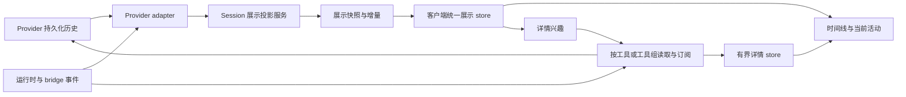
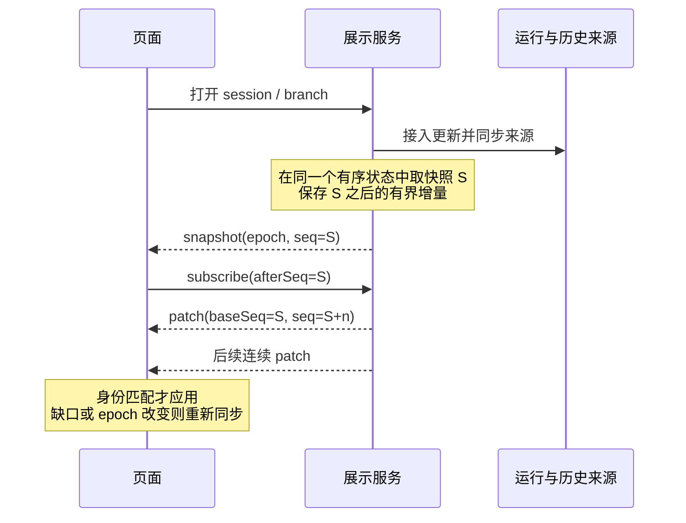

# Session 展示生命周期：产品流程、架构审计与重构方案

日期：2026-09-07。状态：用户已授权实施，默认展示主路径已接入；实现范围与验证见 §15。

本文以用户明确的产品定义及后续界面收敛为依据：**闭合历史工具组默认只传总体统计；展开工具组才加载工具名与单行命令摘要；点击具体工具才加载参数、结果和 diff 等完整详情。最新运行阶段的轻量步骤仍直接可见。** 首开、持续停留、刷新、重连和来回切换会话必须得到一致的体验。

审计对象是当前工作树，包含本轮之前已有的未提交改动。上轮针对 Codex `interrupted` 误判的修复是一个有证据的局部修复，不构成本文的架构方案。最初审计轮次只交付设计文档；用户随后授权实施，现已接入新展示路径。现有服务没有部署或重启。

前序方案见 [2026-09-01 展示压缩方案](./2026-09-01-session-display-compression-and-lazy-tool-details-plan.md)。其轻量历史与按需详情方向保留；其 §6.3 的 raw live tail 交接，以及“将活跃展示协议留到以后”的边界，需要重新设计。本文不扩展到新的首页、全文搜索、Artifacts 中心或产品埋点体系。

## 1. 结论与产品约束

问题的核心是：**同一个 session 的历史展示和实时展示目前由两套数据模型共同解释，前端还负责判断什么时候把一套模型中的消息删除。** 这使加载时机、落盘时机、重连顺序和 provider 状态都影响最终画面。

建议改为：服务端维护可重建的展示投影；快照与实时增量使用同一套展示对象、身份和顺序；客户端只应用展示更新，并保存用户的展开和滚动选择。工具正文通过独立的详情读取与订阅通道传输。

以下约束是设计和验收的依据：

1. **同一时刻、同一分支的展示事实一致。** 一直停留与刚刷新进入的用户，看到相同的回复、工具统计和活动步骤；个人展开状态可以不同。
2. **工具执行完成不等于这一批可以收起。** 没有新的完整阶段回复时，最新一批已完成步骤仍可见，不能突然只剩一个转圈。
3. **出现阶段回复不等于执行轮次结束。** 它只改变此前工具的默认展示方式，不停止接收同轮后续事件。
4. **工具组收起不等于其中所有工作都完成。** 跨越阶段回复的长任务、审批和用户问题必须继续可见。
5. **工具组收起与释放正文是同一次交接的两个部分。** 不能先删 live 内容，再等待历史接口补回来。
6. **普通追加不使旧工具详情失效。** 新工具、新回复、新轮次不改变此前工具组的身份。
7. **运行状态、同步状态分别表达。** 断流不能显示“执行完毕”；旧缓存不能被当成当前状态。
8. **用户的阅读选择优先于自动收起。** 已展开的工具组或单工具详情不应被阶段切换突然移走。
9. **默认路径不传闭合历史工具的完整正文，包括重连补发。** 仅做 DOM 折叠不算达到目标。
10. **任何有限窗口都说明覆盖范围。** “最近 50 步 / 共 238 步”可以；只显示最早 50 步却让人误以为是最新进度不可以。

## 2. 先区分几个概念

| 概念 | 定义 | 不应承担的职责 |
| --- | --- | --- |
| 执行轮次 `run` | provider 接受输入后的一次执行生命周期；有稳定身份与明确的终态证据 | 不能代替阶段回复边界；一个 run 可有多次进度输出、追加输入 |
| 用户输入 `prompt` | 一次实际被接受的用户消息；queued 输入另行表示 | 同一 run 的 steer 也应保留独立问题身份，不能强行一问一 run |
| 展示阶段 `stage` | 最近一条完整可读 AI 回复之后，到下一条完整可读回复或执行终态之间的展示区间 | 只是展示概念，不影响模型上下文；不必在界面增加阶段卡片 |
| 工具组 `group` | 同一阶段内连续的常规工具步骤；遇到用户输入或独立交互行时可分成多组以保留顺序 | 工具组不能跨越用户消息，把它吞进折叠区 |
| 工具步骤 `tool` | 一次具有稳定调用身份的操作，结果和输出附着在该操作上 | `started`、输出 delta、`completed` 不是三次调用 |
| 详情兴趣 `interest` | 某个页面正在查看的工具或工具组，以及已加载的详情范围 | 是每个客户端的阅读状态，不改变共享的阶段/工具状态 |

因此有三条互相独立的判断：

- **阶段是否已经结束**：决定工具组默认显示总体统计，还是显示当前轻量步骤。
- **工具是否仍在运行**：决定是否继续提供活动状态。
- **用户是否正在查看详情**：决定加载组内名称/命令索引，还是某个工具的完整正文。

工具组成员固定与工具结果固定也要分开：组不再增加新调用后，旧调用仍可能返回结果。组摘要可以继续从“3 完成、1 运行中”更新为“4 完成”，无须更换组 ID。

## 3. 正常路径应该是什么样

### 3.1 阶段回复尚未出现

```text
用户：检查并修复这个问题
AI：我先检查现状。

✓ 读取配置
✓ 搜索调用位置
⟳ Bash  pnpm test -- --runInBand

状态：执行中
```

工具结果返回后更新原步骤。即使所有工具都完成，只要下一条 AI 回复尚未完成，这些步骤仍保留；状态可以变为“等待后续输出”。空闲时间不能自行触发收起。

### 3.2 下一条阶段回复完成

```text
用户：检查并修复这个问题
AI：我先检查现状。

3 次工具调用 · 1 项检查                         [展开]
AI：问题已定位，接下来修改并验证。

⟳ 修改配置

状态：执行中
```

回复逐字输出期间，之前的步骤保持可见。回复完成时，服务端发布一次展示事务：确认回复、结束此前阶段、更新工具组摘要、开始接收之后的步骤。客户端在一次状态提交中切换，不闪空、不重复出现一份历史和一份 live。

### 3.3 回复出现时，前面的工具仍未结束

```text
4 次工具调用 · 3 已完成 · 1 仍在运行              [展开]
AI：代码已经修改，完整检查还在运行。

当前活动：
⟳ 完整检查（来自上一阶段）  1 分 12 秒            [定位 / 详情]
⟳ 更新说明
```

旧组收口成轻量的工具名称与状态列表；尚未结束的工具继续带运行状态，指向同一个工具对象，不生成第二次调用、不重复计数。审批与待回答问题同样不会因阶段切换而藏起来。

用户点击某个工具后，在该工具行下方按需加载完整详情；阶段切换时保留已打开的阅读区域，用户手动关闭后才停止该详情订阅。工具组标题本身不再承担一层展开交互。

## 4. 边界与状态转换规则

| 到达的信息 | 展示规则 | 数据规则 |
| --- | --- | --- |
| `tool.started` | 在当前阶段显示步骤；活动工具可见 | 创建或更新稳定 tool ID；只增加一次计数 |
| 输出 delta / 工具结果 | 原步骤更新状态；不默认展示输出、不另起结果行破坏配对 | 根据 tool ID 更新对象；正文保留在详情源，结果先到时允许临时占位，随后补齐 |
| 所有工具完成，但 AI 尚未回复 | 最新步骤继续显示，等待后续输出 | 不结束阶段，不依据“暂时没事件”停止订阅 |
| 可读 AI 文本开始流式输出 | 文本立即显示；上一批工具暂不自动收起 | 文本为 `streaming`，不作为清理边界 |
| 非空可读 AI 文本完成 | 此前阶段默认收起为总体统计；之后工具作为新阶段展示 | 明确的 `stage.closed` 与消息提交在一个展示事务内完成 |
| 空文本、工具容器、内部 system 事件 | 不触发阶段收起 | 不以“assistant 类型”笼统判断边界 |
| 最终回答文本完成，run 尚无终态 | 展示最终回答；有活动工具则继续显示，否则显示“正在收尾” | final phase 不替代 run terminal |
| run 明确完成 | 当前阶段默认收起；状态完成 | 记录终态证据；未配对工具若来源未同步齐，先标“结果同步中” |
| run 中断 / 失败且没有最终回答 | 工具组显示中断/失败摘要，保留可见原因 | 终态本身是收起边界；不能永远等一条不会到来的 final |
| provider 正在重试可恢复错误 | 保留步骤，明确正在重试与可用的重试时间 | 可恢复错误不是 run terminal，不收起为失败历史 |
| 运行进程消失，但无可靠终态 | 保留最近步骤；显示“状态待确认” | 重查来源，不擅自把工具标为成功或中断 |
| queued 用户消息 | 单独标记排队，保留原位置或输入区的排队卡 | 未被接受前不创建已执行问题或新 run，不结束当前阶段 |
| 同一 run 接受 steer | 用户消息独立可见；工具按时间线分组；仍属于当前阶段 | 新 prompt ID；必要时固定此前组的成员，但不假定 run 已结束 |
| 审批 / 待回答问题 | 在明确的交互区域显示，即使其工具属于旧阶段 | 单独的待处理对象，不依赖工具详情加载成功 |
| Plan 更新、Goal 更新、可见子任务 | 更新各自的轻量步骤/状态 | 默认不把任意 system 事件当阶段回复 |
| provider 可见 reasoning | 按该 provider 的明确展示能力处理 | 若产品把它作为阶段叙述，adapter 必须产生完成的边界事件；不能全局以 thinking 字符串推断 |
| 压缩上下文 | 显示必要提示，继续同一展示生命周期 | 不把 compaction 自动当新问题或执行结束；是否改写历史另行判断 |

没有显式“文本完成”的 provider，adapter 可以用原生的下一项开始或执行终态来确认前一条消息已完成；这个规则必须经过该 provider 的参考实现核对。不能用 80ms 或 2 秒无输出作为语义依据。

后台子任务有自己的执行 scope。父 run 已完成但子任务仍运行时，父轮完成、子任务活动继续显示，不能把两者都归成一个永远运行或全部完成的状态。

## 5. 用户进入 session 的场景表

以下表格同时约束首次进入、刷新、离开后返回和多设备访问。区别只在能否先显示本地缓存，不在最终语义。

| # | 用户进入或操作的时刻 | 用户应看到什么 | 加载与订阅要求 |
| --- | --- | --- | --- |
| S01 | 新请求已接受，尚无工具/回复 | 用户消息与“正在开始”；若只排队则明确排队 | 小快照与活动状态，不伪造空工具组 |
| S02 | 第一个工具正在执行 | 当前工具名与运行状态 | 快照直接包含当前步骤，不能只依赖进入后的增量 |
| S03 | 多个工具已完成，最后一个仍运行 | 当前阶段的最近步骤，以及全部活动工具的可达入口 | 有界步骤窗口；窗口覆盖范围明确 |
| S04 | 工具全完成，模型正在生成进度说明 | 这些步骤仍在；说明流式出现 | 文本完成以前不收起 |
| S05 | 恰好在阶段回复完成时进入 | 要么完整的切换前状态，要么完整的切换后状态 | 快照有确定序号，之后接连续增量；禁止两边都没有 |
| S06 | 阶段回复已完成，下一工具尚未开始 | 旧工具摘要、最新回复、准确运行状态 | 不显示旧工具全文，不用旧工具冒充“最新步骤” |
| S07 | 阶段回复后已执行多步 | 旧阶段摘要与当前阶段的最新步骤 | 首开即恢复最新窗口，不能先加载该组最早一页 |
| S08 | 阶段回复后，前面的长工具还在运行 | 旧组“仍有活动”提示与当前活动工具 | 单独活动集合，不以 latest group 替代所有活动 |
| S09 | 正在查看旧工具详情，后台出现新回复 | 阅读区域保持，摘要/当前进度更新 | 旧 group ID 不变；详情兴趣继续有效 |
| S10 | 用户在页面底部，当前阶段收起 | 下一条回复及最新步骤自然接续 | 一次事务替换；保持底部跟随 |
| S11 | 用户向上阅读、选择文本时发生收起 | 阅读位置稳定，可提示有新进度 | 阅读中的区域暂保留；稳定节点锚点，不强行滚到底 |
| S12 | 切到另一会话，原会话继续运行 | 当前会话独立展示 | 取消原会话详情兴趣与请求；旧回包不能写入新会话 |
| S13 | 从另一会话返回，期间产生多个阶段 | 过去阶段全部摘要化，当前阶段恢复 | 直接取当前轻量状态或合并展示差量，不逐条重放旧正文 |
| S14 | 断线期间当前阶段已经结束 | 重连后旧阶段统计、工具名/状态与最新活动 | 允许用新快照替代旧 delta；不能为“补齐”重传工具正文 |
| S15 | 长时间离线或服务重启，游标失效 | 缓存先可读，标“正在同步”，随后更新 | 显式重建快照；无证据时不显示“已完成” |
| S16 | 最终回答到了，结束事件还没到 | 回答可读，状态“正在收尾”或显示仍运行操作 | 继续订阅；final 不是停止条件 |
| S17 | run 完成但没有最终回答 | 明确“本轮已结束，未生成最终回复”，可展开步骤 | 真实终态结束阶段，避免无限 spinner |
| S18 | 中断 / 失败，无后续回复 | 中断/失败原因、步骤摘要、必要的失败提示 | 终态与详情独立；无须捏造 assistant 回答 |
| S19 | 等待审批或回答 | 待处理内容首先可见，背景进度可查 | 与详情加载失败、组折叠和历史分页隔离 |
| S20 | 最新阶段极长，没有阶段回复 | 最近步骤、总数、运行中操作、查看更早步骤入口 | 按“最近”分页，并设字节预算；不一次下载无限正文 |
| S21 | 查看旧组更早名称页时 session 继续追加 | 正常读取同一旧组，页不跳、不要求刷新会话 | 组成员游标不依赖整个 session 的修改时间 |
| S22 | 阅读历史时加载更早一页，尾部继续运行 | 阅读页正常 prepend，最新活动继续更新 | 向前游标固定历史锚点；尾部追加不使旧页失效 |
| S23 | 同一 run 中追加 steer，或消息仍排队 | 已接受和未接受输入区分明确 | prompt 身份独立；按实际接受顺序进入时间线 |
| S24 | rollback、编辑分支、切到旧分支 | 显示所选分支；旧分支不会接入其他分支的新工具 | view 身份与 generation 隔离，明确重置与重新订阅 |
| S25 | 查看 CLI/bridge 外部运行的 session | 同样的摘要与活动步骤；必要时显示正在同步 | 使用相同展示协议；provider 无推流能力时由服务端读取增量 |
| S26 | 同时在手机和桌面查看 | 共享阶段状态一致；各自展开状态独立 | 每个订阅独立兴趣，某一设备收起不会关闭另一设备的详情 |
| S27 | 晚到结果属于已经收起的工具 | 原组统计更新；若产生错误有明确标记 | 只更新原 tool/group；不在末尾追加孤立 result 或重复组 |
| S28 | 详情暂时不可读或原始记录已清理 | 保留摘要，明确“详情暂不可用/记录已不可用” | 可重试的同步中与永久不可用区分；不清空整个时间线 |

S09/S11 暂按“保留阅读区域”拟定；S20 暂按“最近一段 + 查看更早步骤”拟定。用户已授权按本方案开始实施；当前采用这些推荐行为，最新窗口为 50 步。

## 6. 当前实现的详细审计

以下记录重构前的实现与复算结果。部分旧函数和文件已在 §15 的实施中删除，保留此节说明改动依据。

### D1. 历史与实时有两种时间线模型，客户端负责交接

[SessionPage.tsx](../../packages/client/src/pages/SessionPage.tsx) 的 `renderItems` 把 `buildSessionDisplayRenderItems(displayPage)` 和 `preprocessMessagesCached(timelineMessages)` 拼接，再调用客户端的 `groupToolsBeforeAssistantOutput()`。

[useSessionMessages.ts](../../packages/client/src/hooks/useSessionMessages.ts) 的 `displayBoundaryFlushRef` 监听可读消息，按 80、200、500、1000、2000ms 重读历史页，找到边界后 `setMessages(remaining)`。`displayOwnsClosedCodexTurn()` 又根据历史 turn 状态判定后续消息是否已经被历史覆盖。

**后果：** 是否删消息同时依赖历史刷新是否追上、消息身份是否匹配、终态是否可信。当前 Codex 故障就是这条链路的实际实例。有限重试提供了局部容错，但没有定义快照与增量的共同覆盖位置。

### D2. 最新工具由“最后一组”推断，覆盖不了跨阶段运行

[display-projection.ts](../../packages/server/src/sessions/display-projection.ts) 的 `markOpenLiveTail()` 从最后一轮倒查，遇到 assistant text 就停止，只标记一个 `liveTail`。客户端 `liveToolGrouping.ts`（实施时已删除） 只要发现后面有可读文本，就把普通工具归入折叠组，不要求工具本身已经终止。

**本轮已用现有函数复算：** 输入“用户 → pending Bash → commentary”，投影产生 `status=running`、`liveTail=false` 的工具组；客户端也把 pending 工具归入 `assistant_output_tool_group`。

**后果：** 当前工作不一定在最后一组。一个 liveTail 布尔值无法同时表达历史分组边界、活动集合和正文加载策略。

### D3. 组身份和 session 全局 revision 绑定

[display-projection.ts](../../packages/server/src/sessions/display-projection.ts) 的 `buildDetailRef()` 使用 session/revision/turn/组序号生成引用；组 `id` 又取自这个引用的 checksum。

**本轮已复算：** 对完全相同的 messages，仅把 revision 从 r1 改为 r2，旧组 ID 与 detailRef 都改变。

[session-display.ts](../../packages/server/src/routes/session-display.ts) 的 `readToolGroupDetails()` 要求 `currentRevision === revision`；[CodexAppServerHistoryReader.ts](../../packages/server/src/codex-history/CodexAppServerHistoryReader.ts) 的 `getSemanticTurn()` 也核对整个 thread 的更新时间版本。

**后果：** 一个不相关的新工具或新回复，可以使旧详情过期；React 组身份也会变化，难以保留展开、局部缓存和滚动锚点。当前界面实际提示“会话已发生变化，请刷新后查看当前工具详情”，这与持续运行的 session 天然冲突。

### D4. 首开恢复和持续停留并不使用相同的当前步骤范围

`loadSelfLiveTail()` 最多读取 4 个详情页；[共享协议](../../packages/shared/src/session-display.ts) 的每页上限是 50 个工具。如果 4 页后仍有下一页，已读取的结果不作为完整 live tail 采用，返回 `null`，改由摘要行承接。

[DisplayToolGroupRow.tsx](../../packages/client/src/components/blocks/DisplayToolGroupRow.tsx) 的 live tail 默认展开并自动加载第一页；详情路由按 `toolRows.slice(offset, nextOffset)` 从头分页。

**后果：** 极长最新阶段可能先读到 200 个旧步骤后又回到组的第一页，仍没有优先展示最新操作。持续停留的 raw 流与重新进入后的分页路径容易呈现不同内容。

### D5. 重连仍可发送已经闭合的完整工具内容

[EmbeddedRuntimeController.ts](../../packages/server/src/runtime/EmbeddedRuntimeController.ts) 读取 journal 与短期 buffer，交给 [subscriptions.ts](../../packages/server/src/subscriptions.ts) 的 `forwardMessage()` 归一化、增强，再发送 `message`。这条订阅没有“当前阶段、已收起组、用户正在看哪些详情”的展示兴趣信息。

**后果：** HTTP 历史页虽已压缩，补发仍可能把大量旧正文传给前端，再由前端过滤。不能把“主时间线没画出来”当成“没有网络与解析成本”。现有 Process 原始事件流还服务其他消费者，应在它之后增加展示订阅，不能直接全局删原始事件。

### D6. 快照 revision 和 WebSocket eventId 不是一个一致性协议

首开按 metadata → display → self tail details 加载，同时缓存到达的 stream 消息；[ws-handlers.ts](../../packages/server/src/routes/ws-handlers.ts) 的订阅 `eventId` 从每次连接的 0 递增，恢复主要使用 `lastMessageId`。display 页只有 revision，没有声明自己覆盖了哪些展示事件。

**后果：** 现有 buffering、generation guard、replay 去重能处理一些乱序，但客户端无法证明“历史已经完整覆盖到这里，后面从这里接”。尤其不能把秒级更新时间当成严格的事件序号。

### D7. 打开详情与阶段切换缺少稳定的阅读状态

`DisplayToolGroupRow` 的 `expanded`、`messages`、`loaded` 保存在行组件内部；`isLiveTail` 变成 false 时直接 `setExpanded(false)`。该组件没有自己的请求取消或身份 generation 校验。当前组 ID 经常改变，通常会导致卸载重建；这减少了部分旧回包写入同一组件的机会，也会让阅读状态丢失。

**后果：** 不能只修稳定 ID 而沿用现有行内请求状态，否则会暴露新旧详情响应混用问题。需要同时设计稳定身份、兴趣生命周期和响应版本检查。

### D8. 对外轻量不等于服务端增量读取

Codex `getSemanticTurnsPage()` 先取 turn summary，再对选定的每个 turn 调用 `readAllTurnItems()`，获取完整 items 后投影。即使是 questions 的 summary 模式，也先读取 turn items 再过滤。原生工具详情也先读取对应 turn，再挑选所需工具。

这是此前方案为消除客户端载荷而有意采用的第一阶段策略，并非新的实测性能结论。但随着每个阶段边界都触发整页重读，服务端仍可能反复读取、解析同一批正文。40 个 turn 的条数上限也不能约束单个巨型 turn 的字节量。

**重构要求：** 稳态追加应增量更新投影；首次冷读取及 provider 无法定点读取的成本单独测量和限额，不能声称换一个 DTO 就消除了这些成本。

### 审计证据边界

- 已对照真实问题会话的 JSONL、Yep journal、metadata/display API；工具事件实际存在，运行时为 in-turn，独立历史读取返回 interrupted 且没有结束时间。
- 已对照仓库 [Codex app-server 生命周期说明](../../references/codex/codex-rs/app-server/README.md) 和 `thread_processor.rs` 的 `normalize_thread_turns_status()`：不在本进程活跃的未完成 turn 会被归为 interrupted。它不是跨执行进程的权威终态证据。
- 本轮新增验证是上述两个纯函数复算，没有做浏览器自动化，也没有把所有潜在竞态描述为已经在线复现。

## 7. 建议的架构与责任边界



### 7.1 Provider adapter

负责把持久化事实与实时事件转换为同一批稳定对象：原生 run/item/tool ID、已接受输入、文本提交、工具状态、输出定位信息、运行终态及证据来源。相同调用在 live 和 persisted 两边出现时更新同一个对象。

去重、live/persisted 关联、provider 特例放在这里；浏览器不再认识 Codex correlation fallback、Pi 时间戳水位等 provider 细节。无法稳定关联的 provider 必须显式宣告能力不足，走服务端重新投影/重置快照；不能靠前端猜相同文本或时间就是同一事件。

运行状态至少区分来源：执行进程报告、持久化终态记录、独立历史读取的推断。读取方“不拥有这个线程”只说明读取方本地状态，不能关闭另一个进程正在运行的轮次。来源冲突时保持内容并显示同步中/状态待确认，等待更强证据。

每种 provider 在接入前必须回答以下能力问题，不能仅靠 `provider === ...` 接上新页面就算完成：

| 能力 | 需要核对的事实 | 不具备时的处理 |
| --- | --- | --- |
| live/persisted 身份关联 | 原生 item ID、调用 ID，或可持久化的可靠映射 | 由服务端使用来源快照统一重建，不在浏览器做文本/时间戳猜测 |
| 文本完成边界 | 原生 item 完成、下一项开始等明确协议语义 | 保持阶段展开，直到 adapter 能证明边界 |
| run 结束与运行证据 | 执行者身份、终态事件、持久化标记、证据时间 | 显式状态待确认，不制造永久运行或已结束状态 |
| 有序增量与冷读取切片 | 来源游标、完整 JSONL 记录位置、API 快照能力 | 使用可证明一致的另一读取来源，或显式重新同步 |
| 详情定点读取 | 原生 item/byte locator、内容块游标 | 有界缓存/扫描并记录性能限制，不能声称已经具备 O(组大小) 读取 |

运行证据还应有 `observedAt` 与有效性：长期没有任何可信执行/存活信息时，由“执行中”转为“状态待确认”，但不能仅因没有输出就认定中断。能提供心跳或进程活动的长工具仍然保持执行中。某个 provider 如果把最终消息本身定义为执行终态，也由 adapter 根据原生协议产生终态，而不是让客户端通用推断。

### 7.2 Session 展示投影服务

建议提供一个服务边界，例如 `SessionDisplayService`，内部用确定性的 reducer 处理 adapter 事件。

它负责：

- 展示顺序、阶段边界、工具组成员、摘要、当前活动集合。
- 给一次展示变更分配序号，把消息提交和阶段收起作为原子事务发布。
- 生成同版本的快照、历史页与增量，管理有界的恢复窗口。
- 保存正文 locator 和必要预览；不复制第二份完整 provider transcript。
- 为正在查看的 session 增量维护状态；无浏览者时可停止展示计算，重新访问时从 provider 与已有运行日志恢复。

投影是可重建的派生数据。可复用现有 normalizer、原生 reader、journal 和详情 renderer，不需要重新实现 provider 的执行和持久化系统。

### 7.3 客户端

主 store 持有稳定的展示节点与索引：回复、输入、工具组摘要、当前工具行、待处理交互。`snapshot` 和 `patch` 更新这些相同对象。

详情 store 单独保存已订阅的工具正文与分页状态；展开选择、阅读锚点、文本选择保护以稳定节点 ID 关联。释放某个组的正文不删除它的摘要对象。

主展示链路不再维护“历史 display 数组 + SDK raw messages 数组”的双重事实来源。工具 renderer 的 raw-message 兼容转换只允许存在于用户打开的有界详情范围内。

## 8. 首开、刷新与重连共用的交接协议

### 8.1 最小身份与版本

以下是拟议协议，不是已经存在的 API：

```ts
type ViewKey = {
  sessionId: string;
  branchScopeId: string; // 服务端解析的分支范围，普通追加不改变
  epoch: string;    // 展示顺序/恢复窗口不能延续时改变，普通追加不变
};

type DisplaySnapshot = {
  view: ViewKey;
  seq: number;
  nodes: DisplayNode[];
  currentActivity: ActivityView;
  historyCursor?: string;
  liveWindow: { shown: number; total: number; beforeCursor?: string };
};

type DisplayPatch = {
  view: ViewKey;
  baseSeq: number;
  seq: number;
  operations: DisplayOperation[];
};
```

`seq` 是展示事务序号，不是文件 mtime、消息时间戳、工具结果的 ID，也不是每次连接重新从 0 开始的 eventId。若增量做合并，`baseSeq → seq` 明确表示覆盖区间，不要求一个 provider 事件恰好对应一个包。

`groupId` 由该组的原生起始身份/阶段与作用域决定，与全局 seq 无关。它必须指向来源中的组起点，不能取“这次分页刚好加载到的第一个工具”。`groupVersion` 只在该组摘要或成员变化时变；`toolVersion` 只在该工具更新时变。正文分页再有自己的内容版本与 offset/cursor。

`branchScopeId` 不能直接复用每次新 prompt 都会前移的 active tip/message ID。当前路径正常延长时保持同一个范围；明确切换分支、rollback 或改写当前路径时才更换范围/epoch。请求中的 `active` 可以是选择器，但快照和订阅必须绑定服务端解析后的同一范围，避免请求期间 active 路径变化造成串流。

重启后若无法保留旧 seq 的含义，就更换 epoch 并要求重取快照，不能复用旧 epoch 却把序号从 0 开始。epoch 是订阅一致性代际；普通进程重建不应在原始内容未变时随意改变工具身份。

### 8.2 快照与订阅必须有共同的切点



可以实现为同一个 WebSocket 订阅先发 snapshot，再发 patch；也可以 HTTP snapshot + WS 订阅。关键是快照生成时已保留后续更新，订阅到达时有可验证的恢复范围，而不是具体传输方式。

页面可以先画本地缓存，但标记正在同步。缓存里的“运行中”不是新证据，不据此启动错误的计时或认定永远忙碌。取得新 snapshot 后按稳定身份更新，尽量保留阅读锚点。

### 8.3 服务端冷启动也要消除读取竞态

显示服务首次建立投影时，先接入实时来源并暂存更新，再读取持久化的确定位置 H，最后按稳定身份合并 H 之后的变化，发布快照 S。

- JSONL 使用完整记录末尾的字节位置；半行写入留到下次，不当成文件损坏或完整事件。
- 仅以 mtime/size 作为“可能变化”的触发信号，不能直接作为消息身份或完成证据。
- 原生 API 没有跨页快照能力时，adapter 必须做读取后核对、重读有变化的尾部，或报告恢复能力不足；不能把多次不同时间的读取包装成原子快照。
- 文件替换、截断、树路径改变、rollback 与普通追加区分。失去稳定映射时更换 epoch，按当前分支重建。
- live 已有而 provider 尚未落盘的对象可以先显示；已有运行 journal 提供恢复。详情尚不能恢复时报告“正在同步详情”，不撤销已经确认的阶段收起。

### 8.4 重连不是重演断线期间的一切

短暂断开且恢复范围可用，可以发送展示差量；如果旧阶段已收起，先合并为当前展示状态，不把旧的工具正文重新发送一遍。

差量过期、累计太大、来源重建或分支发生改变时，直接返回 `resync_required` 并给出新轻量快照。客户端保留旧画面到新快照准备好，不经历空白期。

只有正文兴趣仍然有效且版本可续接的工具才恢复正文流；正文 offset 有缺口则单独补读对应工具。主时间线不因此重放 raw journal。

## 9. 阶段收起时，展示与数据流怎样切换

### 9.1 一次原子变更

例：当前客户端处于 seq=120，G1 的步骤 A/B 已完成，C 仍运行，AI 的阶段回复 M 正在输出。

```text
事务 121：
  1. 提交 M 的完整可读内容
  2. 标记 M 以前的展示阶段已结束
  3. 更新 G1 摘要：3 次调用，2 完成，1 运行中
  4. G1 默认展示变成摘要；C 保留在当前活动集合
  5. 若已有 M 之后的工具，保留/创建其新组和步骤
```

客户端一次应用这些操作：G1 未被主动查看时释放其正文；G1 或 C 被主动查看时保留对应详情 store；C 的活动行继续使用同一个 tool ID。无需再拉一次历史接口来“确认删掉哪些消息”。

阶段提交可以先于 provider 文件落盘，前提是展示服务拥有可恢复的提交事件。落盘是持久化来源的追赶过程，不是前端收起工具的计时器。

这要求明确提交的恢复依据：已有 journal 已确认写入、provider 已持久化，或可验证的运行时恢复位置。不能把“事件已放进异步写入队列”当作已持久化。若当前部署禁用了 journal，又无法恢复未落盘事件，服务端须在同步到可靠来源后提交稳定边界；等待期间继续显示 live 内容。异常重启且无法恢复时更换 epoch、报告正在恢复，而不是复用已失去含义的序号。

### 9.2 默认流与详情流的载荷

| 内容 | 默认展示流 | 用户打开详情后 |
| --- | --- | --- |
| 已结束工具组 | 次数、成功/失败/运行数、文件/检查等总体信息和稳定组引用；不含成员名称 | 展开组后分页读取工具名、状态和单行命令/目标摘要；再点击具体工具读取正文 |
| 最新阶段步骤 | 工具名、单行命令/目标摘要、状态、稳定引用，不含输出预览 | 对应工具的完整参数、结果、diff、日志分页 |
| 旧阶段仍运行的工具 | 活动行中的工具名、单行摘要与状态，引用原组 | 打开后按该工具持续刷新详情 |
| 待审批 / 待回答 | 必需的交互内容直接可见 | 不能要求先展开工具才知道有审批 |
| 已结束旧工具晚到结果 | 更新原组状态与结果可用性 | 仅有兴趣的客户端接收具体正文变化 |
| 最新回复和计划步骤 | 可读内容与状态 | 不因工具详情未加载而缺失 |

详情兴趣分两级：`groupId` 只加载有界的成员名称/命令索引，`toolId` 才加载具体输入与结果正文。完整大输出仍按显式查看的工具加载，不能把展开工具组理解为订阅其中全部输出。

### 9.3 已经排入队列的正文

已经到达客户端的字节无法撤回。服务端在阶段事务提交之后，以新的默认兴趣范围生成后续载荷；发送队列中尚未发送且已无兴趣的正文可丢弃/合并，结构性状态与阶段事务不能丢。

每个详情订阅带自己的 generation 和内容版本。客户端对关闭前已经在途的正文做身份检查，可丢弃或纳入有界缓存，但不得重新打开工具组。正文拥塞不能阻塞阶段回复、审批或运行状态。

## 10. 身份、分页、缓存与阅读连续性

### 10.1 身份与修改范围

| 发生的变化 | 哪些状态变化 | 哪些内容保持有效 |
| --- | --- | --- |
| 新工具开始 | 当前组成员/版本、活动集合、seq | 所有旧组 ID 与详情 |
| 工具产生输出 | 该工具版本/正文 offset | 同组其他工具正文和历史页；默认流仍无输出正文 |
| 阶段回复完成 | 阶段状态、组统计、seq | 工具名称索引、工具/组 ID、用户已打开的详情 |
| 旧工具晚到结果 | 原工具、原组统计版本 | 其他组与当前新阶段 |
| 新 run 开始 | 新 run、stage 与节点 | 之前全部历史锚点 |
| 切换查看的分支 | view key、请求 generation | 同一分支未变的缓存可以保留，但不得混用 |
| rollback 或历史改写 | 分支视图/epoch，受影响的节点映射 | 明确仍存在的共同前缀可保留；旧 view 事件拒绝应用 |
| session 继续追加 | seq 向前推进 | 不应令旧组详情因全局 revision 不同而失败 |

### 10.2 分页

- 历史游标使用稳定的 `beforeNodeId`/顺序锚点与分支范围；尾部追加不影响前面的分页。
- 较早历史页只填充其覆盖的节点，不能回退主 store 的 seq。单个旧节点按自身版本合并，较旧页不能覆盖已经收到的新状态。
- 当前阶段优先取最新 N 个已结束步骤，加上活动工具集合的可见入口；向前加载更早步骤，不能从最早开始冒充 live tail。
- 已结束阶段的组成员固定，详情分页按成员身份和工具内容版本读取。结果可以继续更新，但不会使下一页成员整体错位。
- 打开中的阶段仍增加成员时，固定这次详情遍历的成员上界；新调用通过活动增量提示，避免 offset 随追加漂移。
- 后台追加不需要全会话刷新；只有分支改写、源记录消失或无法证明连续性时才报告真正的失效。

### 10.3 缓存与取消

使用三类有界状态：轻量 session 快照缓存、活动步骤窗口、用户打开的详情缓存。展开状态不跟随 raw Message[] 缓存，也不依赖 React 行是否被虚拟列表卸载。

每个请求携带 view key、节点 ID、内容版本及 request generation。切换会话/分支时取消请求和兴趣，旧响应即使到达也不能写入新 view。返回原 session 时，先复用轻量缓存，再同步当前状态；只有仍存在且被用户保留展开的详情才重新订阅。

阅读中暂不收起只属于该页面的交互状态。对其他新进入页面，已结束阶段仍默认摘要化。释放已读正文可以使用 LRU，但不能在用户选择或当前可视的区域中突然清空；超大正文应分页，避免“阅读中不回收”演变成无限内存。

### 10.4 产品状态文案

以下为文案方向；实现时同步维护 `en` 与 `zh-CN`：

| 情形 | 中文 | English |
| --- | --- | --- |
| 有已确认的执行活动 | 执行中 | Running |
| 工具完成，模型仍在继续 | 等待后续输出 | Waiting for the next update |
| final 已到，run 尚未结束 | 正在收尾 | Finishing up |
| 已失去连接 | 正在重连，内容可能不是最新 | Reconnecting; updates may be delayed |
| 运行证据不足 | 状态待确认 | Status unavailable |
| 旧组有活动工具 | 仍有 1 个工具在运行 | 1 tool still running |
| 当前阶段有界窗口 | 显示最近 50 步，共 238 步 | Showing the latest 50 of 238 steps |
| 详情尚未可读 | 正在同步详情 | Syncing details |
| 明确终态但无最终回复 | 本轮已结束，未生成最终回复 | This turn ended without a final reply |

“连接正常”只证明能连到 Yep；“执行中”必须来自运行证据。不要用模糊的 spinner 同时表达所有这些状态。

## 11. 加载压力与性能预算

产品规则先固定，具体阈值在实现样本上调整。以下是建议起点，不是已达到的指标：

- 历史摘要的完整工具 input/result 字节为 **0**；用户未查看的闭合组在重连恢复中同样为 **0**。
- 最新步骤与已展开组的成员索引只使用工具名、单行命令/目标摘要、状态、版本和稳定引用；先沿用最近 50 步的数量尺度，并加明确的总字节预算。工具参数和输出正文均由单工具详情按需读取。
- 活动工具不被已完成步骤的窗口挤掉。若出现极大并发，显示活动总数及活动分页，不能假装只有屏幕上的几个在运行。
- 工具详情和大型输出按工具/内容块分页，不允许一个 20MB 结果绕过“50 个工具”的限制。
- 主状态事件与文本不等待大型输出解析/高亮。工具详情刷新可合并，开始、终态、审批、阶段切换不可静默丢弃。
- 保留现有小规模 session LRU 的思路，但缓存改存展示对象；正文独立计费与淘汰。缓存上限包括回包解码后和预处理后的占用，不能只看压缩响应体。
- 对追加写源维护增量位置；成熟旧组不因每个阶段边界反复读取完整正文。可持久化小型、可重建的身份/位置/摘要 checkpoint，不复制完整 transcript。
- 对无法定点读取的原生 API，首次或缓存未命中可能仍需扫描大 turn。要有并发、字节与耗时预算，并把这项限制纳入 provider 能力和测量结果；不能假设不存在。
- 问题目录从同一展示事实更新，后台补齐历史目录不阻塞当前活动；Inspector 不应另行拉全量工具正文来恢复步骤统计。

至少测量：首开载荷、重连载荷、阶段切换载荷、服务端重复读取字节、客户端正文驻留量、开始事件到可见的延迟、切会话的旧请求释放情况。只需要开发/回归诊断，不扩展为新的用户行为埋点项目。

## 12. 实施顺序与必须移除的旧逻辑

这次重构应形成一条完整的新展示路径，然后删除对应旧路径，不能只在旧 hook 外面再包一层过滤。

| 阶段 | 交付 | 退出条件 |
| --- | --- | --- |
| P0 产品与契约 | 本文场景、状态机、稳定身份、快照/增量/详情约定 | 阶段边界、阅读保护、最新窗口规则无歧义 |
| P1 服务端事件与投影 | provider adapter、统一 reducer、可靠终态来源、稳定组/工具身份 | 持续回放与从持久化重建能产生相同展示事实 |
| P2 一致性与详情 | snapshot/seq 交接、恢复/重置、组级分页与兴趣协议 | 首开竞态无缺口；普通追加不使旧详情失效；闭合正文不补发 |
| P3 客户端替换 | 一个展示 store；独立详情 store；阅读与滚动保护 | 持续停留、刷新、切回画面一致；不再依靠 raw 前缀裁剪 |
| P4 Provider 与性能验收 | 支持 provider 的能力矩阵、长阶段/大结果/外部运行验证 | 场景矩阵与载荷预算通过，旧机制可删除 |

新路径应明确替换：

1. `displayItems + preprocess(raw live messages)` 作为两份主时间线的拼接。
2. 前端的 `groupToolsBeforeAssistantOutput()` 作为阶段归属的事实判断；视图层可以保留展示组件。
3. `displayBoundaryFlushRef` 的 80ms–2s 历史追赶后裁 raw 前缀。
4. 用 `displayOwnsClosedCodexTurn()` 决定是否整轮丢弃新消息的客户端业务规则。
5. self-owned 专属的 `loadSelfLiveTail()` 原始详情恢复与 external 另一套行内自动加载。
6. 主展示订阅的完整 raw journal replay；原始流保留给仍需要它的执行/诊断/其他消费者。
7. 由 session 全局 revision 派生工具组 ID 与旧详情有效性的规则。
8. 行内局部状态独占详情生命周期，导致卸载即丢展开、请求缺少身份校验的实现。

现有 provider reader、runtime/journal、文件详情 renderer、消息内容呈现和虚拟列表可以复用，但必须通过明确接口接入。

迁移期间每个 view 在打开时选择一套完整协议版本；不能在同一个 session 里同时合并 v1 raw 与 v2 projection。回退也应整体重新建立该 view。不要无限保留两条默认主路径；provider 达到验收条件后删除对应兼容分支。

## 13. 验证设计

核心验证是**同源事件，不同进入时机，最终状态等价**，而不只是“某个 mock 返回了 running”。

### 13.1 可回放的场景验证

对同一份事件轨迹，分别执行：

1. 从第一条事件持续订阅到结束。
2. 在每个工具开始/完成、文本开始/完成、阶段提交前后重新建立快照。
3. 在上述切点断线、刷新、切到另一会话，再回到当前 session。
4. 让持久化落后、结果晚到、事件重复、工具结果先于 tool start 进入 adapter。
5. 在任一阶段插入 queued/steer、审批、真实中断、失败、branch rewrite。

比较稳定节点身份、顺序、计数、阶段归属、活动集合与最终状态；排除每个用户自主展开等局部阅读差异。再核对所有详情都指向同一次原始调用。

### 13.2 必须成立的不变量

- 同一 tool ID 只有一个执行对象；结果始终回到原调用。
- 每个普通工具只属于一个组；调用次数不因 replay/delta 增加。
- 重复 poll 的视觉合并不能悄悄改变“调用次数”的定义；如计数为原生调用，合并行仍保留实际次数。
- group ID 不因普通追加和阶段结束改变。
- 阶段收起前后，对应摘要或步骤始终至少存在一份，不能同时消失；默认时间线也不重复一份。
- 有可信运行证据的工具，不会仅因后面出现文本而完全不可见。
- 已有新 seq 的客户端不被更旧的 HTTP 回包覆盖；跨 view/epoch 回包永不混入。
- 阶段结束后，未订阅详情的客户端不再收到该组完整正文；恢复测试同样断言网络载荷。
- 持久化尚未追上时不撤销已确认的可读回复，不把未同步结果标成完成。
- 用户正在阅读的已展开工具不会被后台自动关闭；关闭兴趣后新正文不能重新打开它。
- 真实中断或失败即使没有最终回答，也能结束阶段和 spinner。

### 13.3 测试层次

- reducer/adapter 轨迹测试验证身份、边界、乱序与恢复等价性。
- API/订阅集成测试验证 snapshot 切点、缺口重置、详情版本、取消与字节范围。
- 客户端 store/组件测试验证原子切换、同一工具更新、展开与加载状态保存。
- 真正的滚动锚点、选择文本、移动端切后台、多设备等体验需要后续浏览器/设备验证；执行前遵循仓库的显式授权约束。本轮没有执行这些验证。

## 14. 评审需要决定什么

用户已明确的方向不需要再投票：历史工具正文按需、当前步骤必须可见、刷新和切换必须一致。

两个体验选择暂按推荐方案写入本文：

- **阅读保护**：正在展开阅读的工具组或单工具详情保留；其他旧阶段默认只显示总体统计。
- **极长最新阶段**：默认最近一段与活动工具，明确总数，向前加载；具体 N 和字节预算以样本定。

其余如协议字段名、cache 结构、provider 读取优化是实施决策。用户已授权实施；实施范围和剩余验证项目记录在 §15。


## 15. 实施记录（2026-09-07）

### 已接入的主路径

- 服务端 `display/SessionDisplayReducer.ts` 统一消费来源消息，维护稳定工具/组身份、文本提交边界、活动工具和摘要；快照与增量复用同一模型。
- `SessionDisplayService.ts` 在读取历史前接入运行事件，串行发布带 epoch/seq 的展示更新。重连选择重新发送当前轻量快照，不重放旧工具正文；已确认落盘的 overlay 会退出，源历史回退时更换 epoch。
- `/display/view`、`/display/groups/:groupId`、`/display/tools/:toolId` 和 WS `display` 订阅已经接入应用。默认快照中的闭合组只有统计；组接口分页返回工具名、状态和单行命令摘要但不含结果正文；单工具详情复用 renderer，超大结果以每页最多 128K 字符的原始 JSON 分页展示。
- 最新阶段默认显示最近 50 项工具名、单行命令摘要与状态，输出预览不进入默认投影；跨阶段运行工具沿用稳定身份更新，未知结果、真实失败和中断分别表示。
- 客户端 `useProjectedSessionMessages` 维护统一展示状态，处理快照/增量交接、旧回包、会话切换、历史分页与问题跳转。工具组与具体工具各自拥有一层展开状态；关闭任一层会取消其对应请求。
- 已移除 `displayBoundaryFlushRef`、整轮去重/裁 raw 前缀、`liveToolGrouping` 和内存工具组合并组件。旧原始转录 hook 隔离为 `useLegacySessionMessages`，仅由显式 legacy 选择使用。
- 接续了发送确认、上下文用量、hold、Pi 推理详情、用户交互控制消息；子代理的流式文本不会污染父会话。

### 当前的实现边界

- 持续连接使用增量；每次重新订阅使用当前快照，尚未增加长期的 display patch journal。源日志与已有 runtime journal 仍是恢复依据，服务重建更换 epoch。
- Codex/Claude 的 owned 活跃会话直接消费 runtime；Pi/Kimi 的不稳定 prose 身份由服务端来源重读协调，稳定工具 ID 仍可实时更新；外部会话在服务端按文件变化检查。客户端不再自行关联这两类消息身份。
- 冷历史和原生详情读取继续复用现有 reader；泛型 reader 的返回结果再按最近 40 个问题分页。没有新建第二份完整 transcript，也尚未把所有 provider 的冷读取改成增量磁盘索引。
- 每个服务最多保留 16 个展示实例；无订阅实例 30 秒回收。每个实例的原始详情缓存预算 8 MiB；闭合组默认快照剥离成员列表，所有轻量步骤剥离输出预览，客户端轻量快照缓存最多 5 个 session / 32 MiB。
- 浏览器滚动锚点、触屏文字选择和真实多设备操作尚未运行自动化验收；本轮遵循项目约束，未调用浏览器或重启 8022。

### 已执行的验证

- reducer 轨迹在各事件切点重建，覆盖阶段回复后继续调用、跨阶段长任务、native 文本身份、重复 replay、无最终回复的终态和 201 步窗口。
- 服务与 HTTP/WS 契约测试覆盖快照顺序、订阅共享、旧详情在追加后仍可读、默认流无历史正文和大型详情分页。
- 客户端测试覆盖晚到快照、序号缺口、切换 session、历史分页、Fast 配置保留、详情阅读交接和重复提问的发送确认。
- 对问题会话已捕获的消息窗口做只读回放：原始消息主体 370,485 bytes；初次测得展示快照 4,282 bytes，20 次调用的统计全部保留，其中 19 次属于闭合组、1 次作为最新步骤。此数值不包含 metadata/问题目录，也不是浏览器端到端性能测量。

最终聚焦检查累计覆盖 259 项单元/契约测试；类型检查、客户端构建和改动文件的代码规范检查通过。上述设计范围中的浏览器/设备场景仍未执行自动化验收。
