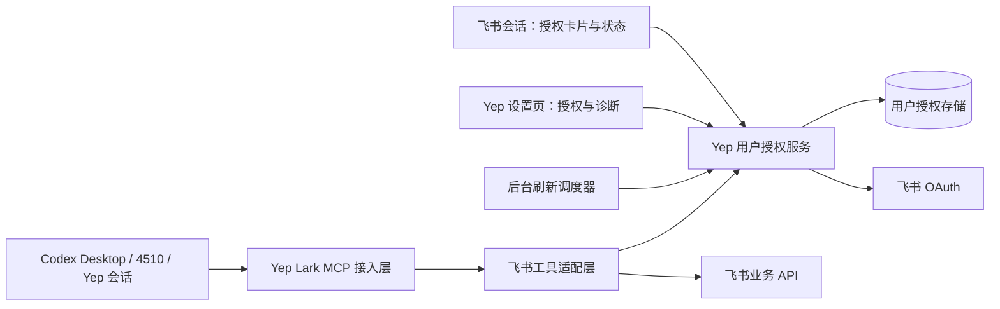

# 飞书用户授权长期修复方案

日期：2026-09-10。状态：代码已实现并通过聚焦自动化验证；尚未部署或进行真实 OAuth 验证。

本文保留设计与验收目标。实现说明见 [飞书用户授权运维说明](./feishu-user-authorization.md)；凭据迁移、真实 OAuth 和部署需按运维步骤执行。

## 1. 要解决的用户问题

目标是让用户平时直接读取文档、下载文件、查询和修改表格；正常 token 到期由服务处理。确实需要用户重新授权时，在当前飞书会话展示可用入口，授权后能继续原任务，不要求用户理解 `/auth`、token 文件或 MCP 配置。

不能承诺永远免授权。用户撤销授权、应用被禁用、权限变化、服务停机超过刷新期限，以及平台规定的强制重授权，都需要独立处理。产品目标是避免可预防的过期，并让不可避免的授权恢复有明确出口。

## 2. 已确认的事实

### 2.1 本次故障

- 故障 session：`01a08a90-7dbe-75d0-90e9-fbb575b8c74f`。
- 2026-09-10 17:27:44、17:32:13（北京时间），`lark_drive_file.download` 的 MCP stderr 都记录 `token refresh failed: code=20037 msg=undefined`。
- 现存刷新令牌的本地 JWT `exp` 对应 2026-09-04 13:57:17；签发时间为 8 月 28 日 13:57:17。JWT 解码只作为时间证据，服务端 `20037` 才是本次失效的直接证据。
- 当前 `lark` MCP 来自本机 MLB Manager 安装包，读取旧机器人工作目录的 `tokens.json`。当前应用 ID、Secret 与该机器人配置相符；这次没有发现应用配置不匹配的证据。
- MCP 仅在工具调用时尝试刷新，保存时遗漏 `refresh_token_expires_in`；失败时读取 `message/msg` 而非 `error_description`；终止刷新处理遗漏 `20037`。
- Yep 的 `parseFeishuCommand()` 不识别 `/auth`，该消息实际进入模型对话，没有触发 OAuth。
- 旧 MCP 的刷新锁是对象内的 Promise，无法协调多个 MCP 进程。它构成另外一种潜在复发风险，但尚无证据表明它造成了本次故障。

### 2.2 外部协议约束

飞书刷新接口要求使用新的 refresh token 替换旧值，旧 refresh token 只能使用一次；有效期以响应的 `expires_in` 与 `refresh_token_expires_in` 为准。官方文档还说明授权满 365 天需要重新授权，不能把滚动刷新理解为永久授权。[刷新接口文档](https://open.feishu.cn/document/uAjLw4CM/ukTMukTMukTM/authentication-management/access-token/refresh-user-access-token-v3.md)

新实现采用有独立适配器的 OAuth v3 token endpoint，Feishu 为 `https://accounts.feishu.cn/oauth/v3/token`。官方说明支持 v2、v3 下发的刷新令牌。授权码流程使用 state 与正确配对的 PKCE；不能只在换 token 时补一个 verifier。[Token 迁移说明](https://open.feishu.cn/document/authentication-management/access-token/get-user-access-token.md)

Codex 支持 STDIO MCP 与 Streamable HTTP MCP；不同入口的配置可能共享。更新配置不能直接等同于已运行会话的 MCP 已被替换。[OpenAI MCP 文档](https://learn.chatgpt.com/docs/extend/mcp?surface=cli)

## 3. 推荐架构与责任分工

推荐由 Yep 服务端成为用户授权的唯一管理者，增加 Yep 管理的 Lark MCP 接入层。令牌刷新不再依赖某个 agent 是否正在运行。



职责划分：

| 模块 | 责任 |
| --- | --- |
| `FeishuUserAuthService` | 唯一执行 token exchange/refresh 的入口，身份校验、错误分类、授权状态 |
| `FeishuUserGrantStore` | 原子保存完整令牌对、到期时间、版本和刷新进度 |
| `FeishuUserAuthScheduler` | 空闲续期、启动恢复、退避与告警去重 |
| `FeishuOAuthClient` | 封装官方 endpoint、超时、响应校验及错误映射 |
| Lark MCP 接入层 | 获取可信身份上下文、调用工具、提供结构化授权状态；不持有 refresh token |
| 飞书工具适配层 | 维持工具名称、参数及输出兼容，统一获取 user access token |
| 飞书渠道与 Web 页面 | 展示状态、启动授权、恢复关联任务 |

机器人收发消息使用的 tenant 身份与文档访问的 user 身份分别管理。机器人连接正常不代表用户授权正常；`/doctor` 必须分别报告两者。

### 3.1 身份与唯一刷新者

授权的规范主键为 `domain + appId + userOpenId`；`accountId` 是配置引用，不能让同一应用、同一用户在两个 account 别名下形成两份可刷新的令牌。tenant 信息作为身份校验条件持久化。

飞书请求者身份来自已校验的消息事件；OAuth 完成后通过飞书用户信息接口验证实际授权用户。不能相信模型参数、消息正文里的 `openId`，也不能让管理员替其他用户确认 OAuth。

Desktop/CLI 入口使用显式的本地用户绑定。不能把当前全局 `MLB_WORKSPACE` 所指向的用户凭据无条件用于所有项目。

同一授权只允许一个 Yep 实例持有刷新所有权：进程内合并并发请求，持久化层增加跨进程锁和 revision 校验。多个 profile、多个主机不得复制同一个 refresh token 后分别刷新；需要共享时统一请求持有所有权的服务。

### 3.2 MCP 与旧工具的处理

本机安装包静态扫描发现 **38 个 `lark_*` 工具名**，覆盖文档、网盘、搜索、表格、多维表格、消息、日历等。这个数字只是静态清单，实施时还要导出 `tools/list` 和每个 action 的 schema，建立兼容基线。

最终交付需要仓库内可构建、版本可固定的工具适配层；不把修改 `/Applications/MLB Manager.app/.../index.mjs` 当作正式修复，它会被应用升级覆盖。

实施顺序：

1. 先确认旧工具实现是否存在可维护的源代码及复用入口；现阶段已定位安装包实现，尚未确认可直接引用的源码包。
2. 优先将可复用的工具业务层接到统一 `getUserAccessToken()` 接口，删除该层自行刷新和写 token 文件的职责。
3. 如果只能使用旧二进制，可做限期兼容适配：每个授权独立临时工作目录，仅投放短期 access token，绝不投放 refresh token；每次工具调用前校验剩余有效时间并更新投影，调用结束后清理。旧子进程必须不能回退读取原来的 token 文件。此方案需单独验证文件下载路径和并发行为。
4. 二进制适配只作为迁移桥梁。不能以“下载工具通过”宣布全部迁移完成；实际在用的工具/action 必须完成兼容验收，再关闭旧路径。

MCP 推荐保留 `lark` server ID 与既有工具名，使用 Yep 随构建产物交付的 STDIO connector。connector 调用受限的本地工具执行接口，refresh token 只留在授权服务。远程 MCP 场景再使用认证后的 HTTP 通道，不把 openId 查询参数当作认证凭证。

本地工具执行接口也要有认证与范围限制；它接收工具请求并在服务内使用凭据，不提供能任意指定用户、直接领取 token 的公共接口。下载和上传涉及 agent 主机文件系统，connector 与服务不同机时必须经过既有受控文件传输，不能把远端路径当成本机路径。

## 4. 令牌生命周期

### 4.1 存储模型

新增 `channels/feishu/user-auth/`，独立于现有 App Secret store。每个授权记录至少包含：

```text
version, grantId, domain, appId, userOpenId, tenantKey
accessToken, accessExpiresAt
refreshToken, refreshExpiresAt
grantedScopes, authorizedAt, lastRefreshedAt, lastUsedAt
revision, status, lastErrorCode, nextAttemptAt
refreshAttempt: { id, sourceRevision, startedAt, state }
```

`status` 包括 `ready`、`refreshing`、`retrying`、`reauth_required`、`config_error`、`refresh_uncertain`。缺少到期字段或身份字段的旧记录是待迁移记录，不能假装永久有效。JWT 解析可供离线迁移诊断使用，正常运行不依赖 token 必须是 JWT。

沿用 `atomicWriteJson()` 的临时文件、fsync、rename 机制，并增加覆盖读取—外部请求—写入的锁。定时器、MCP 请求与 OAuth 回调共享同一套提交规则。OAuth 回调不能被稍早开始的刷新结果覆盖。

### 4.2 后台刷新与按需刷新

- 活跃使用时：access token 即将到期，后台提前刷新；实际调用前再检查安全余量。
- 空闲时：不需要每两小时都刷一次，但不能等用户回来才刷新。建议在 refresh token 剩余生命周期的一半之前安排维护刷新，最长间隔 24 小时；根据实际 TTL 算时间并加入向前抖动。
- 到期时间从服务端响应计算；不把“2 小时 / 7 天”写成协议常量。按需安全余量要覆盖请求耗时与时钟偏差。
- 服务启动、主机休眠恢复后立即重算到期队列；积压任务限并发启动，避免同一时刻大量刷新。
- 单用户刷新失败不阻塞其他授权，也不令整个飞书渠道启动失败。
- 关闭账号、撤销授权时停止相关调度；用户重新启用后明确展示现有状态。

刷新流程：拿锁 → 重读最新 revision → 若已有足够有效的新 token 则复用 → 持久化刷新意图 → 调用 OAuth → 校验完整响应 → 原子提交新令牌对与到期时间 → 再唤醒等待者。

### 4.3 一次性 refresh token 的故障窗口

锁只能解决并发，不能消除“飞书已消费旧 token，但响应丢失”或“收到新 token 后本机立即崩溃”的窗口。方案不得承诺 exactly-once 刷新。

处理方式：

- 发请求前持久化 attempt；重启遇到未决 attempt 时先检查是否已有更新的已提交 revision。
- 如果结果不确定，标记 `refresh_uncertain`，不无限重放一次性 token。
- 已收到新 token 但落盘失败：当前进程优先保存同一份响应，不再次兑换旧 token；成功持久化前不向其他消费者发布可继续刷新的状态。
- 仍有效的 access token 可以在身份和权限均允许时继续完成有限请求，同时显示需要恢复授权。
- 无法恢复刷新链时提供重新授权入口，记录明确原因。

### 4.4 错误分类

| 情况 | 系统行为 | 用户体验 |
| --- | --- | --- |
| access token 即将过期 | 合并为一次刷新 | 无感继续 |
| 网络明确未发送、429、明确可重试的服务错误 | 有上限退避，遵循平台重试提示 | 短暂等待，避免误报“未授权” |
| 刷新请求发送后的超时、连接中断 | 进入结果不确定路径 | 必要时恢复授权，避免反复重试旧 token |
| `20037` | 刷新令牌已过期，停止无效重试 | 一次授权入口 |
| `20064` / `20073` | 撤销或已使用；先重读 revision，再判定 | 不把旧请求的失败覆盖到新授权 |
| `20002` / `20024` / `20074` | 应用密钥、应用匹配或刷新配置问题 | 明确需管理员处理，不要求用户反复扫码 |
| 目标工具缺 scope | 按工具/action 发起增量授权 | 说明需要新增的能力 |
| 文件 ACL 不允许访问 | 返回文件权限问题 | 不诱导无意义重新授权 |

保留 `code`、`error`、`error_description`、HTTP 状态和请求关联 ID。UI 使用稳定文案，诊断保留具体原因。

## 5. 用户授权入口

### 5.1 飞书会话

实现 `/auth`、`/auth status` 和取消本次授权流程的操作。`/auth` 必须在渠道层识别，不再作为 prompt 发给模型。

用户不必主动输入命令：工具接入层确认需要授权后，通过服务端事件触发授权卡片。显示例如“需要连接你的飞书账号，才能继续读取这份文件”，提供“授权并继续”。已有有效授权时 `/auth` 返回状态，不强制替换 token。

同一用户、同一应用的并发请求复用同一授权流程；按流程 ID 更新卡片，不为每个失败工具发一张卡。用户拒绝或超时后停止催促；下一次明确点击才重新启动。

群聊只展示任务状态及发起人操作入口。授权结果必须匹配原请求者；其他成员点击链接不能把自己的凭据绑定到原请求者名下。

### 5.2 OAuth 流程选择

默认采用官方授权码流程 + state + PKCE S256：

1. 从可信请求上下文创建短期、一次性 OAuth attempt，绑定应用、用户、请求 scope 和关联任务。
2. 用户点击飞书卡片或 Yep 按钮，打开飞书授权页。
3. 回调验证 state、有效期与单次消费状态，换 token 后查询授权用户身份并与发起者匹配。
4. 原子保存 grant，检查实际授予 scope 与 refresh token 是否完整，再标记成功。
5. 更新原卡片/页面，通知待恢复任务。

部署前需确认手机可访问的稳定回调地址，并在飞书应用后台配置。推荐 HTTPS；当前 session 分享地址是 HTTP，不能直接假设它已具备可用的 OAuth 回调配置。

旧 MLB Manager 使用 device flow，可以避免服务公网回调，但它的具体兼容性不能仅凭旧 bundle 推定。把 device flow 作为无公网回调部署的备选适配器：先做独立协议核对及获准后的隔离 contract 验证，再决定启用。不能静默从 v3 授权码切换到未验证的 device endpoint。

回调是精确的独立路由，可不依赖 Yep 登录 cookie，但必须由有效 attempt/state 验证。不能把整个 `/api/channels/feishu/*` 设为匿名；管理、发起授权和查询他人状态仍需既有认证。回调完成后跳转到不带 code/state 的结果地址。

### 5.3 Web 设置与诊断

当前客户端没有已发现的完整飞书授权设置页，因此需要新增入口，不能把它估算成仅修改已有按钮。最小页面展示应用、绑定用户、是否可用、最近刷新、需要的操作；开发诊断再显示具体错误和剩余期限。

所有新增页面及反馈维护 `en`、`zh-CN`。沿用项目现有管理界面的访问控制与明文展示约定；面向模型的业务工具结果不需要包含 refresh token。

## 6. 任务如何继续

不把重授权等同于重跑整个 agent turn。授权与 task continuation 用独立的 durable 记录关联：`grantId + sessionId + turnId + toolCallId + operationId + requester + state`。

推荐分两层恢复：

- **快速路径**：工具调用前检查授权。普通刷新在调用预算内完成后继续原调用；无须通知模型重试。
- **需要用户点击的路径**：登记 `awaiting_auth` 并展示卡片。原调用仍存活且未超时，可在确认授权后继续一次；已经返回或 provider 已断开，则通过 SessionCommandService 在原 session 的安全队列中恢复一次关联任务，不伪造已完成的 MCP 响应。

恢复前检查用户是否已经 `/stop`、取消任务、切换会话或启动新的任务，以及授权 scope 是否真正满足要求。短期不支持自动恢复的 provider/入口，展示“授权完成，继续原任务”按钮，不能提示已经继续却什么都没发生。

写操作需要明确区分：

- API 请求尚未发出，因缺授权被拦截：授权后可执行一次原操作，仍遵循原有 tool approval。
- 已发出且结果不确定：查操作状态或使用平台幂等键；无法确认时要求用户决定，不自动重发。
- 已确认成功：只恢复结果展示，不再次创建文档、修改表格或发送消息。

不全量重放历史用户消息，不自动回答 InteractionBroker 中的审批问题。现有 `FeishuOperationStore` 是审批投影，不直接改造成 OAuth 唯一状态机；OAuth attempt 与 continuation 单独存储。

## 7. Codex、4510 与现有会话兼容

相关现有入口已经核对：

- `packages/server/src/codex/mcp-profile.ts`：standard 模式保留 `lark` / `feishu-mcp`，并合并 thread 配置。
- `packages/server/src/sdk/providers/codex.ts`：在 thread start/resume/fork 时传入 MCP thread config。
- `packages/server/src/codex-bridge/CodexBridgeService.ts`：4510 在转发 thread 生命周期请求时再次应用 profile。
- `references/codex/codex-rs/config/src/mcp_types.rs`：STDIO 的 command/args/env 与 HTTP transport 是不同配置分支。

实现要求：

1. 同时覆盖 Yep 创建与恢复会话、4510 bridge-owned 会话、Desktop/CLI 直接入口，不能只在一个 provider 方法里替换环境变量。
2. 用完整的 managed MCP 配置替换目标 entry，防止递归合并残留旧 command、args、workspace 或凭据；保持 clear/standard/full 行为。
3. 身份从渠道 → SessionCommandService → runtime/provider 的可信上下文传递。没有经过校验的用户绑定时，返回待连接状态。
4. 同一个群聊 session 的不同发起者不能共享一个可变的全局 user token。每次执行绑定 requester、turn 与 runtime generation；不能证明身份绑定安全的入口，先拒绝跨用户 UAT 操作，而不是默认使用最早授权者。
5. 已运行 MCP 不假定配置热更新。迁移在空闲边界执行，按真实 CLI 版本验证 reload/resume 行为；必要的重建单独纳入部署窗口，不中断活跃任务。
6. 现存全局 `lark` 配置迁移提供 dry-run、备份和准确 diff，不在后台悄悄改写用户配置。

这部分的 per-turn 身份绑定与长等待后的恢复是实施前需要先做 contract 验证的技术点，不能只根据协议中出现了某个方法名就承诺支持。

## 8. 改动范围

下列新文件名是建议拆分；实施时按职责合并，不以文件数量作为交付目标。

| 范围 | 拟新增 / 修改 | 内容 |
| --- | --- | --- |
| 共享类型 | `packages/shared/src/feishu-user-auth.ts`（新）、`feishu-channel.ts`、导出入口 | grant/attempt/status、账号授权配置、诊断与 continuation schema |
| 授权核心 | `packages/server/src/channels/feishu/user-auth/{oauth-client,grant-store,service,scheduler,attempt-store}.ts`（新） | OAuth、刷新、持久化、单写者与错误分类 |
| 任务恢复 | `user-auth/continuation-store.ts`、`user-auth/continuation-service.ts`（新） | 待授权操作去重、取消、恢复与写操作状态 |
| 渠道生命周期 | `channel-runtime.ts`、`service.ts` | 启动恢复、调度器生命周期、账号变更、doctor |
| 飞书入口 | `inbound-processor.ts`、`reply-manager.ts`、`outbound.ts` 及卡片构造模块 | `/auth`、状态卡、授权完成通知、取消联动 |
| 工具链 | `packages/server/src/feishu-mcp/`（新，目录建议） | managed connector、工具清单、统一身份/token provider、旧工具兼容 |
| Session 身份 | `services/SessionCommandService.ts`、SDK/runtime 相关 types 和传递路径 | 可信 requester/turn/grant binding，不由模型指定身份 |
| Codex 配置 | `codex/mcp-profile.ts`、`sdk/providers/codex.ts`、`codex-bridge/CodexBridgeService.ts` | managed MCP 注入与三个入口的兼容 |
| HTTP | `routes/feishu-channel.ts`、新 OAuth callback/内部工具路由、`app.ts`、`index.ts` | 授权状态、创建/取消流程、回调、受限工具执行 |
| 客户端 | 新 `FeishuAuthorizationSettings.tsx`、`SettingsLayout.tsx`、`i18n-settings`、API/hooks、两套 locale | 用户授权状态、可操作错误、管理入口 |
| 迁移与打包 | 新 `scripts/feishu-auth-migration.ts`、`scripts/build-bundle.ts` | 离线预检、单一 owner 切换、connector 随包交付 |
| 文档与发行 | 运维手册、迁移手册、`CHANGELOG.md` | 实施时更新 Unreleased；正式部署前按 CalVer bump/check |
| 测试 | server/shared/client 对应目录 | 见验收矩阵 |

这是跨授权服务、MCP、渠道、客户端的中等偏大改动。主要工作量取决于工具源码复用情况、现有 Desktop/4510 的 MCP 迁移方式，以及 task continuation 的兼容边界；不能按“加个 cron + `/auth` 按钮”估算。

## 9. 实施拆分与交付门槛

| 批次 | 交付 | 进入下一阶段的条件 |
| --- | --- | --- |
| 0：协议与工具基线 | 固定 38 个工具的运行时清单、action/schema、实际使用清单；确认工具源码/适配入口、OAuth 回调和 CLI 版本 | 有可复现基线，明确需兼容的能力；无生产配置变更 |
| 1：授权核心 | 原子 grant store、唯一刷新者、后台维护、错误状态、OAuth 流程 | 假时钟和 mock OAuth 下完成并发、空闲、重启、一次性 token 故障测试 |
| 2：完整使用链路 | managed MCP、可信用户绑定、飞书 `/auth`/卡片、Web 状态、基本任务恢复 | 在用工具兼容通过，用户可自行恢复，旧 MCP 不再刷新同一 grant |
| 3：迁移与验证 | dry-run、配置差异、build 产物、隔离 canary、回滚说明 | 获准部署后完成真实重新授权和读取验证，并观察后台续期 |

批次 1 单独完成不算修好用户问题；至少批次 2 完成、批次 3 通过，才能宣布长期修复上线。需要较大改写的冷门工具可逐组迁移，但未迁移的账号/入口必须清楚标记，不能声称全量接管。

## 10. 验收矩阵

| 场景 | 必须证明 |
| --- | --- |
| 空闲超过原 7 天窗口，服务在线 | 通过实际 TTL 的维护刷新保持可用；用户回来无需授权 |
| 活跃调用时 access token 到期 | 一次刷新后继续读取，无错误卡片 |
| 同用户多个会话、多个本地进程同时刷新 | 同一 revision 只发起一次兑换，新 token 不被旧结果覆盖 |
| 两个应用或两个用户并发 | 凭据、scope 与结果不会串用 |
| 服务正常重启 / 休眠唤醒 | 恢复调度；不会漏掉到期任务或集中重复刷新 |
| 刷新响应丢失 / 落盘失败 / 提交后崩溃 | 正确区分确定失败与结果不确定；不无限使用旧 token |
| OAuth 完成与旧刷新并发 | 新授权不会被晚到的旧结果覆盖或删除 |
| `20037` / `20064` / `20073` | 收敛为一次恢复流程，不重复诱导用户授权 |
| 错 Secret / 错 App / 未开刷新开关 | 管理员配置提示，不进入扫码循环 |
| 网络失败与限流 | 保留有效凭据，遵守退避，不误报未授权 |
| 缺 scope / 文件 ACL 错误 | 分别提示增量授权或文件权限问题 |
| 其他群成员点击授权链接 | 不能替换原发起人的 grant |
| 重复点击 `/auth`、回调重放、超时、取消 | 单一 attempt、单次消费，状态可解释 |
| 授权后继续读取 PDF | 同 session 继续，用户无需重发链接 |
| 授权后继续写操作 | 未发出则执行一次；未知结果不盲目重放 |
| 等待授权期间 `/stop` / 新任务 / provider 退出 | 不复活已取消操作，不向错误 turn 注入恢复消息 |
| Desktop / 4510 / Yep-owned | 三条入口分别验证 managed MCP 与身份绑定 |
| 主机停机超过 refresh TTL / 平台强制重授权 | 正常走恢复流程，不声称可后台修复过期令牌 |
| 38 个工具及实际使用 action | tools/list、schema、输出兼容；下载/上传位置正确 |

默认验证使用隔离临时目录、mock OAuth/API、可控时钟、进程级并发测试以及聚焦 TypeScript 检查。人工或自动浏览器验收、真实飞书授权、真实写操作及部署都在代码可评审后安排，不在本次方案阶段执行。

## 11. 迁移和回滚

当前已过期的 token 不能靠新算法复活，上线需要用户完成一次新的 OAuth。已有有效授权可以迁移，但必须先核对 app/用户与所有权，不能根据目录名推断身份。

迁移工具先只读列出：有效期元数据、应用匹配、重复授权来源、会使用旧刷新链的 MCP 配置与进程。实际迁移应在旧调用空闲时切换消费者，先保证不再有旧进程能使用同一 refresh token，再启用新 owner。

回滚保留最新 grant 数据与刷新 revision，不恢复过时 token 备份。旧代码如果不支持新的授权存储，则保留授权服务或重新授权后回退；不能把已经被消费的 refresh token 当作可还原的普通配置。

正式部署前执行项目的 CalVer version bump/check 与构建一致性检查。新版本先用于目标账号，再扩大范围；观察至少一次真实后台刷新及一次无活跃 agent 的维护刷新。真实时间长周期由假时钟测试覆盖，真实环境持续观察作补充。

## 12. 本轮结论

建议采用“Yep 唯一管理授权 + 后台维护刷新 + managed Lark MCP + 当前任务授权恢复”的完整方案。最先落实的技术决策是工具业务层如何复用，以及 OAuth 回调的部署方式；它们决定实现规模，但不改变唯一刷新者和用户恢复链路的设计。

后续开发已采用 Yep 原生工具模块，不使用第 3.2 节中的旧二进制兼容方案。已超时或已结束的工具通过用户在原会话回复“继续”恢复，不自动重放已发送的业务请求。
