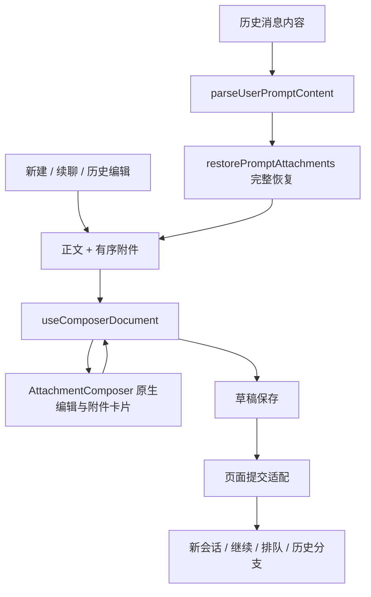

# 消息输入框：入口、状态与共享流程

本次梳理针对客户端聊天／任务输入链路，不涉及 provider 的执行协议。依据是现有源码、用户提供的截图及组件／hook 回归测试；未运行浏览器自动化，未重启或部署服务。

## 结论

各页面已经共用 `AttachmentComposer` 原生编辑器，但此前仍分别实现附件插入、粘贴、删除、撤销、光标恢复和键盘规则。只共享外观并不能保证行为一致。历史编辑又只传正文，直接丢失了图片清单。

本轮在现有组件上收敛为“共享编辑规则 + 按作用域保存草稿 + 页面提交适配”的流程。图片使用与正文基线对齐的高亮文件名卡片，预览时才加载原图，避免缩略图抬高整行。

## 入口与状态矩阵

| 入口／状态 | 当前实现 | 文档与附件 | 提交、恢复行为 |
| --- | --- | --- | --- |
| 侧栏、项目、全部会话的新建入口 | `NewSessionPage → NewSessionForm` | 文字按项目保存；待上传 `File` 留在表单内存 | 无附件直接启动；有附件先创建会话，再上传、发送；启动中锁定 |
| 新建紧凑表单 | `NewSessionForm compact` | 与完整表单相同 | 相同提交逻辑；当前生产路由未单独使用 compact |
| 会话空闲、停止后继续、恢复会话 | `SessionPage → MessageInput` | 文字、已上传附件分别按 session 保存；选文件后立即上传 | 发送捕获当时的附件并等待上传；失败恢复草稿 |
| 会话执行中补充、打断、排队 | 同一 `MessageInput` | 与空闲状态共用草稿 | 普通发送、显式打断、延迟队列由页面适配；支持排队时 Ctrl+Enter 排队 |
| 编辑历史用户消息 | 同一 `MessageInput` + `editRewind` | 正文和附件作为同一编辑请求还原 | 全部附件准备成功后一起替换；失败保留当前草稿；保留原有 provider 分支语义；历史编辑禁用普通排队 |
| 等待工具审批 | `ToolApprovalPanel` + 保持挂载的 `MessageInput` | 主草稿仍存在，输入框按状态隐藏 | 审批反馈独立提交；开始历史编辑时显示完整消息输入框 |
| 等待问题回答 | `QuestionAnswerPanel` + 折叠的 `MessageInput` | 选项、Other 文本及主草稿分别保存 | 问答结果按 request 提交，消息草稿不充当问答答案 |
| 快速新建 FAB | `FloatingActionButton` 原生 textarea | 仅文字草稿，无附件 | 通过 `fab-prefill` 转交新建表单；共用 Enter／IME 策略 |
| 问答 Other、直接回答、秘密输入 | `QuestionAnswerPanel` | Other 按 session/request 保存；秘密只留内存 | 多行回答中 Enter 换行；完成或失败由问题流程处理 |
| 拒绝工具时的反馈 | `ToolApprovalPanel` 单行 input | `useToolApprovalFeedbackDraft` | 拒绝成功才清理，失败保留 |
| 目标描述 | `GoalModal` textarea | 弹窗内存状态 | 按钮提交，忙碌时锁定；关闭不保留 |
| 报告、Agent Context、授权设置等 | 各业务表单字段 | 各自业务数据 | 普通表单提交，不接入消息发送／附件规则 |

## 统一流程与职责

1. **内容解析**：`lib/userPromptContent.ts` 是历史消息展示、复制和编辑的共同解析入口。编辑请求携带正文、附件和消息边界，不再只传字符串。原生媒体的延迟占位需要先读完整消息，不能当作空附件。
2. **编辑行为**：`hooks/useComposerDocument.ts` 负责文件选择、普通／富剪贴板、选区替换、同名附件顺序、token 插入与删除、原生撤销回调、光标恢复，以及正文内／正文外附件分组。页面只提供附件元数据和文件增删适配。
3. **原生编辑器**：`AttachmentComposer` 负责 contenteditable DOM、IME、选区和不可拆分的附件节点；`ComposerAttachmentCard` 负责正文外附件。两种位置共用文本卡片样式，图片预览由 `AttachmentPreviewModal` 按需获取。
4. **键盘策略**：`lib/composerKeyboard.ts` 统一新建、续聊、FAB 的 Enter 和 IME 判定。桌面 Enter 提交，Shift/Ctrl+Enter 换行；支持队列时 Ctrl+Enter 排队；移动端 Enter 换行；语音录制时 Enter 可完成提交。命令补全先于普通提交处理。
5. **草稿保存**：`useDraftPersistence` 在乐观清空前刷入最新输入，以 revision 区分已提交内容和后续输入；切换 key 前完成原草稿写入。`useDraftAttachments` 将 key 与文件元数据绑定保存。新建表单按 project key 挂载，避免未上传文件和表单状态混入另一个项目。
6. **提交适配**：页面继续负责 provider 配置、上传、API、队列和历史分支。`MessageInput` 发送、打断和排队共用一次语音收尾与输入清理入口；历史编辑恢复过程中禁止提交，取消或过期结果不覆盖当前文档。

审批／问答的全局快捷键只处理面板自身及非编辑区域的按键，尊重已经处理的事件和 IME，不截获主输入框里的数字、Enter 或 Tab。历史附件的鉴权读取限定为受管上传和受控图片路由，不将清单里的任意 API 路径当作附件来源。

`@[文件名]` 仍是与服务端兼容的文本格式。真实附件身份依靠有序附件列表中的 id；重名时按出现次数关联，不能仅以文件名作为唯一键。不要在新页面重新写一套 token 或剪贴板处理。

## 本轮解决的问题

- 图片缩略图把文字行撑高，图文基线不齐：改为图标、文件名、删除组成的紧凑高亮条。
- 点击历史消息编辑只传正文：改为完整文档恢复；图片、普通文件、原生图片均经过统一链路。
- 两个表单独立处理附件：抽出共享规则，新增入口一致性测试。
- 直接粘贴图片时未替换当前选区：现在与富剪贴板一致，同时移除被替换的附件。
- debounce 尚未保存就发送，失败后恢复旧文字：提交前 flush，并保留内存提交快照。
- 草稿 key 切换导致旧待保存内容写入新 key：写入绑定原作用域。
- 单次提交完成后清掉期间继续输入的新文字：按 revision 保护后续草稿。
- 新建失败后上传卡片仍显示 pending：上传进度只在启动过程中展示，失败后恢复正常编辑／预览。
- 审批与历史编辑同时可见时误触发审批快捷键：编辑区域事件与审批／问答隔离。
- 原生延迟图片以空 data 占位：先读取完整媒体，禁止把零字节图片作为恢复成功。

## 尚未收敛的边界及后续顺序

以下是源码确认的剩余实现差异，不代表本轮已完成整个输入系统重写。

1. **待上传二进制文件的持久化**。新会话文字存 localStorage，而 `File[]` 只在内存中；离开／刷新后无法自动恢复文件。会话中的已上传附件则可恢复元数据。下一步应将待上传文件放入 IndexedDB，并把文字、附件引用、顺序放入同一个版本化 draft document；恢复完成前避免只发送文字 token。需约定容量上限、过期清理和存储失败提示。
2. **提交快照与上传状态机**。`SessionPage.handleSend/handleQueue` 仍各自组织附件等待和恢复。现有 revision 保护单次提交期间的新文字，未建立每次提交独立的 transaction id；同一实例多次并发提交乱序结束，以及失败时文字／附件整体恢复，仍需统一提交快照。理想接口为 `prepare → submit(snapshot) → acknowledge/reject(snapshot.id)`，成功仅消费该快照，失败不覆盖新草稿。
3. **部分上传失败策略**。新建表单现有逻辑会提示某文件失败后继续上传其它文件，并可能提交成功的部分；续聊失败上传返回 null，也可能只发送剩余部分。应在统一提交适配中明确“全部成功后发送”或“用户显式选择发送成功部分”的产品规则，不能只靠 token 判断附件存在。本轮历史编辑的恢复已采取全部成功后替换。
4. **命令与语音适配**。续聊支持输入中的命令补全，新建主要使用工具栏命令；语音文案拼接、按钮配置仍在容器内。可继续抽出共享控制器，但 provider 命令集合、新建配置与发送方式应作为能力传入。

问答、审批反馈、目标和设置表单没有同一种提交语义，应复用适用的基础字段／键盘规则，而不强制使用带附件的聊天输入框。

## 回归重点

- 新建完整／紧凑表单与续聊执行同样的附件操作：多图粘贴、替换选区、同名图片、删除后原生撤销、原样发送 token。
- 历史正文与附件数量、次序一致；受管上传通过当前连接读取；原生图片可恢复；任一图片不可读时不替换当前草稿。
- 中文组字确认不触发提交，移动端 Enter 换行，队列快捷键只在支持的状态启用。
- 快速输入后发送失败、发送期间继续输入、key 切换和附件持久化隔离。
- 组件测试能验证数据与事件；像素对齐、真实浏览器原生撤销栈和移动软键盘仍需获准后的浏览器／设备验证。
