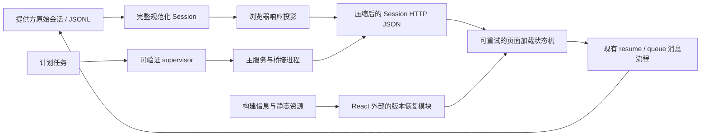

# Yep Anywhere 远程会话可靠性分层设计

## 1. 文档状态

- 日期：2026-08-17
- 状态：诊断与分层决策已确认，等待修订后的书面设计复核
- 适用范围：Yep Anywhere 浏览器端会话加载、消息续发、前端版本恢复、Windows 生产进程监管及部署回滚
- 明确排除：FRP 公网地址暴露及 FRP 拓扑调整
- 交付边界：P0 应用可靠性修复与 P1 运维可靠性加固分开实施、测试和发布

## 2. 背景与问题定义

手机通过现有公网入口访问 Yep Anywhere 时，出现了四类相互叠加的问题：

1. 发起会话、打开会话和加载消息非常慢，部分请求最终超时。
2. AI 已经回复后，用户继续回复时消息没有成功到达后端，页面随后出现 React #300。
3. 页面偶发显示 `Importing a module script failed.`，旧标签页无法自动恢复。
4. Windows 计划任务显示已经停止，但主服务和桥接进程仍然存活；维护端口没有按项目文档启用。

这些现象不是一个单点故障，发生顺序也需要区分。16:53 的旧模块加载失败发生时，最近 100 条消息估算约 0.57 MiB；16:55–16:57 大量图片工具结果写入后，最近 100 条消息才膨胀到约 62 MiB，随后出现骨架屏和 React #300。静态资源回退、超大响应和 Hook 顺序分别是独立缺陷，后两者共同阻断了当前会话的加载与续发。supervisor 丢失属于同时发现的运维可靠性问题，不是本次消息发送失败的直接原因。

### 2.1 已确认的现场证据

问题会话 `01a00ced-6cbb-7253-ac80-6d9b2dacbe5f` 的最近 100 条消息响应为 62,463,479 字节，且没有 HTTP 内容压缩。其中：

- `messages[].message` 及其嵌套 `message.content[].content` 中的原始工具结果约 15.63 MB；顶层 `messages[].content` 并不是主要载荷；
- 同一结果解析后的 `toolUseResult` 约 15.58 MB；
- API 又同时返回 `session.messages` 和顶层 `messages`，把消息列表整体重复一次；
- 最近 100 条消息中有 30 个底层 `data:image/*;base64` 图片；它们先在原始 `message` 和解析后的 `toolUseResult` 中重复，再随两份消息列表整体重复；
- 现有浏览器渲染器并不展示这些通用工具结果里的内嵌图片，但它们仍然作为 JSON 字符串被传输、解析并保存在浏览器内存中。

这些图片属于 Codex 等工具在思考或执行过程中产生的历史工具结果，不等同于用户主动上传的图片。原始会话记录需要保留它们，才能维持提供方上下文和后续模型能力；浏览器首屏既不渲染它们，也无需下载其 base64 副本。

React #300 的直接原因是 `SessionPageContent` 在部分 Hook 之后，根据错误或缺失会话提前返回，而后方仍存在其他 Hook。初次加载与失败渲染调用了不同数量的 Hook。对应时间段没有新的提供方 turn，失败后只有 WebSocket 连接和断开，因此续发请求高概率在客户端加载/恢复阶段被阻断，并非 AI 提供方拒绝续聊。当前 queue 路由没有请求级日志，不能仅凭现有日志断言该 HTTP 请求绝对未到达后端。

静态资源错误的直接原因是：请求旧的哈希资源文件不存在时，服务端继续走 SPA fallback 并返回 `index.html`。浏览器以模块脚本方式解析 HTML，因而报错。现有构建检查位于 React 挂载后的 Hook 中，无法覆盖 React 启动前或懒加载路由导入阶段的失败。

进程现场显示：计划任务为 `Ready`，上次结果为 `0xC000013A`，记录的 supervisor PID 已死亡，但 8022 主服务及桥接子进程仍存活。该结果确认 supervisor 曾被终止，但现有证据不足以区分人工中止、控制台关闭或其他终止原因。8023 未监听符合当前 `MAINTENANCE_PORT=0` 的默认配置，并非维护服务启动失败；真正的问题是生产脚本没有显式启用它。当前状态判断又过度依赖计划任务是否为 `Running`，不能准确识别“supervisor 丢失、服务仍存活”的降级状态。

## 3. 目标与成功标准

### 3.1 P0：当前用户问题的完成标准

- 最近 100 条问题会话的浏览器响应小于 1 MiB（未压缩），且不包含通用工具结果中不可见的 `data:image` 数据；
- 原始会话 JSONL、用户图片、提供方上下文和续聊能力保持完整；
- 加载失败进入可恢复错误界面，不再触发 Hook 顺序错误或 React #300；
- loading/failed/未就绪状态不能清空或提交消息；AI 回复完成后，用户的下一条消息能够调用既有 resume/queue 流程并被后端明确记录为接受或拒绝；
- 缺失的哈希静态资源返回真实 404，旧前端版本最多自动刷新一次，不形成循环；
- 通过真实公网手机入口完成响应体积、慢网加载、AI 回复后续发和 WebSocket 稳定性验收；

### 3.2 P1：后续运维加固的完成标准

- 生产状态能区分健康、可接管残留、已验证的陈旧进程、未知端口占用和完全停止；
- supervisor 异常退出后，可以在身份验证通过时无中断接管服务，验证不通过时只清理确定属于 Yep Anywhere 的进程；
- 本地维护服务明确监听 `127.0.0.1:8023`，不增加任何 FRP 公网映射；
- 部署失败时自动恢复上一版本，并验证计划任务确实能够在非人工停止场景重新拉起 supervisor。

## 4. 方案选择

### 4.1 选择：边界投影、分层恢复、分两次发布

采用以下组合方案：

- 在 Session API 边界创建纯浏览器响应投影，不修改提供方规范化结果和磁盘记录；
- 修正页面状态机和 Hook 顺序，在前端提供显式重试；
- 将构建版本检查下沉为 React 外部也可调用的恢复模块；
- P0 只发布上述应用修复和必要诊断日志；
- P1 再用可验证的进程身份清单管理 supervisor 和子进程，并改造事务式部署。

这是影响面最可控的方案。传输优化不会改变模型上下文，页面恢复不会与服务端会话逻辑耦合，静态资源恢复也不依赖 React 已成功挂载。P0 不与高风险 PowerShell 生命周期改造绑定；包含自动恢复的新前端发布后，后续 P1 发布的旧 chunk 失效才能自动恢复。首次发布 P0 前已经打开的旧标签页仍可能需要最后一次手动刷新。

### 4.2 未选择：保留两套 Session API

可以增加 `compact=true` 并保留旧响应，但目前唯一使用者是 Yep Anywhere 浏览器，没有外部 API 消费者。两套响应契约会永久增加分支、测试和回归风险，因此不采用。

### 4.3 未选择：全局删除工具图片或大规模重构

在 provider normalization 阶段删除图片虽然代码位置更靠前，但会改变内部会话对象、提供方恢复上下文或未来消费者可见数据。大规模拆分 Session 页面同样不是修复 Hook 错误的必要条件。本设计坚持在最窄边界做修改。

## 5. 总体架构与数据流

五个实施阶段形成一条闭环，但分成两个交付边界：

1. Session 响应只负责安全、紧凑地把显示数据送到浏览器。
2. 页面状态机只负责加载、错误、重试和消息提交。
3. 构建恢复只负责静态资源与客户端/服务端版本失配。
4. supervisor 只负责生产进程身份、健康和生命周期。
5. 部署流程负责把后续版本作为可回滚版本交付。

阶段 1–3 和最小诊断日志构成 P0 应用发布；阶段 4–5 构成 P1 运维发布。P0 验收通过后才能启动 P1，任何一项都不要求修改 FRP 拓扑。

## 6. 阶段一：Session 响应瘦身与 HTTP 压缩

### 6.1 浏览器响应契约

在 `packages/server/src/routes/sessions.ts` 返回 JSON 之前应用一个纯函数投影。投影不得修改输入 Session。

响应调整为：

- `session`：只含会话元数据，不含 `messages`；
- `messages`：唯一的浏览器消息列表；
- ownership、runtime、pending input、slash commands、分页等现有字段保持不变。

实时进程、桥接会话和持久化会话三条返回分支必须共用同一个响应构造器，不能只修复当前问题会话经过的持久化分支。

客户端显式定义等价于 `Omit<Session, "messages">` 的 `BrowserSessionMetadata`，同步更新 `getSession`/`getSessionMetadata` 和相关状态合并调用点，不保留空的、过期的或兼容性的 `session.messages` 字段。

### 6.2 工具结果图片省略规则

清理范围严格限制在结果消息的 `tool_result` 内容及对应的 `toolUseResult`，规则如下：

1. 递归复制数组和普通 JSON 对象。
2. 遇到 `input_image.image_url` 为 `data:image/*;base64,...` 时，移除 `image_url`。
3. 在同一位置写入紧凑的 `omitted_image` 元数据，至少包含 MIME 类型和解码后的二进制字节数。
4. 字节数应根据 base64 长度和 padding 计算，避免为了统计而再分配完整图片缓冲区。
5. 保留相邻的文字、状态、错误、详情和其他结构化字段。
6. 如果原始工具结果字符串可以解析为对象或数组，则清理解析值；只有实际省略图片时才重新序列化，防止原始字符串继续携带第二份 base64。
7. 如果字符串不是合法 JSON，则原样保留，不对任意工具文本做正则替换。

以下内容必须保持不变：

- 用户主动上传的 `input_image`；
- 普通 HTTP/HTTPS 图片 URL；
- 生成图片的本地路径或资源引用；
- `ViewImage` 工具输入；
- 当前点击后经 `/api/local-image` 加载原图的流程；
- 磁盘中的原始会话和提供方上下文。

浏览器当前只显示通用工具输出中的路径引用，点击后才请求原图。本阶段不会新增通用 `exec` 内嵌图片渲染器；省略的是浏览器不会展示、但当前仍占用网络和解析内存的 base64 数据。

### 6.3 HTTP 压缩

只对 Session API 所在 JSON 路由组中达到最小有效体积的 `application/json` 响应启用 Hono 协商式 gzip/deflate，并通过 `contentTypeFilter` 明确限制内容类型。不得把 `compress()` 作为无条件全局中间件。WebSocket upgrade、`text/event-stream` 和其他流式响应必须通过集成测试证明没有进入压缩中间件。未声明支持编码的客户端继续收到正确的未压缩 JSON。

压缩仅作为结构瘦身后的第二层优化。base64 图片压缩率有限，而且即使在线路上变小仍会占据浏览器解析内存，因此不能代替响应投影。

### 6.4 错误与数据完整性

- 意外的 primitive 值原样通过。
- 单个无法解析的原始工具结果不能使整个 Session 加载失败。
- 投影失败不得写回 Session、JSONL 或附件。
- API 不得静默恢复成同时返回两份消息列表。

## 7. 阶段二：Session 页面 Hook 顺序与可恢复加载

### 7.1 Hook 顺序

`SessionPageContent` 中所有 Hook 必须在每次渲染按相同顺序无条件调用。现有 error 和 missing-session 的提前返回移动到最后一个 Hook 之后、主 JSX 之前。

本阶段不进行大规模组件拆分。只有在测试需要提取纯状态逻辑时，才创建最小单元，避免把一个明确的 Hook 顺序修复扩大为页面重构。

### 7.2 初始加载与重试状态机

初始加载函数可以由 `useSessionMessages` 复用，但加载错误的所有权仍在 `useSession`。`retryInitialLoad()` 必须通过 `useSession` 清除旧错误后再触发加载：

- 初次请求：`loading -> ready` 或 `loading -> failed`；
- 手动重试：清除当前错误，重新进入 `loading`，成功后恢复消息与会话状态；
- 失败期间不提交消息，也不做无限自动重试；
- 错误界面提供明确的重试按钮；
- 重试不清空用户尚未发送的草稿和附件。

项目或 Session key 变化时必须清除上一个会话残留的加载错误。重试失败时重新进入 failed，而不能留下“消息已加载但页面仍被旧 error 分支遮挡”的矛盾状态。

加载失败与发送失败要分开表达。加载失败由重试重新取得 Session；发送失败则恢复原输入和附件，让用户可以再次提交，避免出现界面已清空但后端没有收到消息的假成功。

### 7.3 后续消息提交

`handleSend` 和 `MessageInput` 必须使用同一个真实就绪条件。loading、failed、Session 不存在或初始快照尚未应用时，输入框禁用或隐藏，`handleSend` 也必须在清空草稿、附件或插入 optimistic message 之前直接拒绝提交。

页面进入 ready 且当前 AI 回合已经完成后，继续复用现有分支：

- 可立即续聊时调用 `resumeSession`；
- 有运行中回合且支持排队时调用 `queueMessage`；
- failed/loading 状态不发起这两个调用。

不在本阶段改变 provider resume 协议。验收重点是从真实页面点击发送后观察实际 HTTP 请求和后端接受结果，而不是只观察前端气泡。

为 `POST /sessions/:sessionId/messages` 增加最小结构化日志，记录 `sessionId`、`tempId`、消息长度、会话状态以及接受/拒绝结果；禁止记录消息正文、附件内容或凭据。resume 与 queue 两条入口使用相同关联字段，方便把浏览器操作、后端请求和提供方 turn 串联起来。

## 8. 阶段三：静态资源 404 与旧版本自动恢复

### 8.1 正确的静态资源语义

`packages/server/src/frontend/static.ts` 按请求类型区分 fallback：

- 缺失的 `/assets/**`、JavaScript、CSS、字体和其他明确静态资源返回真实 404，并设置 `Cache-Control: no-store`；
- `/api/**` 和其他非页面请求永不进入 SPA fallback；
- 只有请求声明接受 `text/html` 且路径不是静态资源或 API 的浏览器页面导航，才允许返回 SPA `index.html`；
- 带哈希的现有资源继续使用长期 immutable 缓存；
- `index.html` 和 `build-info.json` 必须重新验证或 no-cache。

这样浏览器不会再把 HTML 200 当成 JavaScript 模块执行。

### 8.2 React 外部版本恢复模块

把现有 `useBuildRefresh` 中的核心检查抽成可命令式调用的独立模块，使其可从应用入口、React Hook 和 ErrorBoundary 共用。

在 `createRoot` 之前由入口模块同步注册：

- Vite `vite:preloadError`；
- `unhandledrejection` 和必要的全局 `error` 兜底，用于识别 `Importing a module script failed`、`Failed to fetch dynamically imported module` 等浏览器变体。

`vite:preloadError` 处理器必须先调用 `event.preventDefault()`，再执行异步版本检查或刷新，避免原始 preload 错误继续向上触发 ErrorBoundary。

捕获后以 `cache: no-store` 获取 `build-info.json`，并比较编译进客户端的 build ID 与服务端 build ID：

- build ID 不同：先记录本次恢复标记，再自动刷新一次；
- build ID 相同但属于瞬时模块加载失败：每个 build/error 组合最多自动刷新一次；
- 构建信息请求失败，或同一组合刷新后仍失败：停止自动刷新，交给 ErrorBoundary；
- 刷新使用当前 URL，不丢失 Session 路径、查询参数或 hash。

一次性标记保存在当前标签页的 `sessionStorage`，键包含客户端 build ID、服务端 build ID 和归一化错误类型。标记写入必须先于刷新，防止刷新循环。

ErrorBoundary 显示客户端 build ID、服务端 build ID 和语义版本，方便区分资源缓存、部署版本和普通运行时错误。

首次发布这一修复时，部署前已经打开的旧页面尚不包含新的入口监听器，仍可能需要最后一次手动刷新；从包含本设计的新版本开始，后续版本切换才具备自动恢复能力。

静态资源与恢复逻辑测试必须覆盖非根路径 `BASE_PATH`、页面导航的 `Accept: text/html`、静态资源请求的 Accept 变体，以及根入口脚本本身缺失时只能由浏览器/用户刷新恢复的限制。

### 8.3 WebSocket 稳定性观察，不预先改代理

现场日志存在多次接近 30 秒的连接断开，而服务端 ping 和订阅心跳当前同为 30 秒。该现象可能与公网代理空闲超时竞争，但现有日志没有连接 ID、持续时间、关闭码或关闭原因，证据不足以直接修改心跳或 FRP 配置。

P0 只增加可关联的 WebSocket 连接日志，并通过真实公网手机入口持续连接至少两分钟，记录连接 ID、持续时间、关闭码和关闭原因。若实际端点能稳定复现约 30 秒断开，再单独选择降低心跳间隔或调整代理空闲超时，每次只改变一个变量；未复现前不把该改动纳入 P0。

## 9. 阶段四：Windows supervisor、残留进程接管与维护端口

### 9.1 原子进程清单 v2

`prod-process.json` 升级为版本化、原子写入的进程清单。先写同目录临时文件，再 rename 替换，避免半写状态。清单至少记录：

- schema version；
- supervisor instance ID、PID、启动时间、可执行文件和命令身份；
- 每个关键子进程的 role、PID、启动时间和命令身份；
- 生产 build ID；
- 影响运行行为的配置指纹；
- 主端口、维护端口及桥接端口/参数。

PID 不能单独作为身份依据，因为 Windows 会复用 PID。验证必须组合进程启动时间、可执行文件/命令行、role 参数、端口与健康信息。

### 9.2 状态模型

状态检查不再只看计划任务是否为 `Running`，而是输出以下一种状态：

1. `healthy`：supervisor、关键子进程、端口、健康接口、build/config 均匹配。
2. `degraded-adoptable`：supervisor 已消失，但所有关键子进程身份和健康均可验证，可以逻辑接管。
3. `verified-stale`：进程确认属于 Yep Anywhere，但 build、配置或健康不符合当前目标，可以安全清理后重启。
4. `unknown-conflict`：端口被占用但身份无法验证；必须拒绝启动和清理，并报告冲突。
5. `stopped`：没有受管 supervisor、子进程或端口占用。

因此计划任务显示 `Ready` 而服务仍存活时，状态会明确显示 degraded/orphan，而不是错误报告“生产已停止”。

### 9.3 启动、接管和退出

新 supervisor 启动时读取并验证旧清单：

- 若子进程身份、build、配置和健康全部匹配，则逻辑接管它们，重写 supervisor 实例信息，不中断正在使用的服务；逻辑接管不要求改变 Windows 父子进程关系；
- 若确认是 Yep Anywhere 进程，但版本、配置或健康不匹配，则只终止清单中验证通过的旧进程，再启动新组；
- 若存在未知端口占用，不尝试 kill，启动失败并给出诊断信息。

任何关键子进程意外退出时，supervisor 清理同一受管组内其余经过验证的进程并以失败码退出。计划任务的常驻 watchdog 随后重新启动内层 supervisor，由它拉起整个组或接管仍健康的已验证子进程。`start-prod`、`stop-prod` 和部署脚本共享同一身份验证逻辑；即使 supervisor 已消失，stop/deploy 也能清理经过验证的残留进程。

验收必须区分两种语义：非人工的 inner supervisor 异常退出后，仍在运行的 watchdog 应在配置的间隔内重新启动 supervisor，并完成身份验证和接管；显式执行 `Stop-ScheduledTask` 或受控停机时先终止 watchdog，因此不能再自动重启 inner supervisor。仅验证“新 supervisor 启动后能够接管”不足以证明 watchdog 会主动拉起它。

### 9.4 维护服务

生产脚本的 `Set-ProductionEnvironment` 显式设置 `MAINTENANCE_PORT=ServerPort+1`（当前为 8023），并把该值写入清单和 readiness 条件。维护服务只监听 `127.0.0.1:8023`。主服务仍使用现有 8022 配置。维护端口加入本机 status/readiness 检查，但不加入 FRP 配置，不允许外部公网访问。

## 10. 阶段五：P1 部署验证与自动回滚

### 10.1 发布边界

阶段五只随 P1 运维加固交付，不阻塞 P0 应用修复。P0 从无无关修改的已提交 HEAD 构建一次应用生产包，部署时至少人工保留可恢复的上一包并完成版本与功能冒烟验证；P1 再把该流程改造成自动事务和回滚。两个发布都必须记录准确的 commit 和 build ID。

部署前必须完成：

- P1 专项测试及 P0 关键回归测试；
- lint、共享包构建和 TypeScript 检查；
- 生产依赖安装及 bundle 完整性验证；
- 当前生产状态预检；
- 确认没有正在执行的 AI 回合，再进入停机切换。

### 10.2 事务式部署

部署按以下顺序执行：

1. 在独立暂存目录构建并验证新生产包。
2. 保留当前生产目录为备份，不立即删除。
3. 通过统一身份验证逻辑停止当前受管进程组。
4. 将暂存目录原子切换为生产目录。
5. 启动计划任务和新 supervisor。
6. 验证计划任务、supervisor、主服务、维护服务、桥接进程及端口。
7. 验证 `/api/version` 的 build ID 与暂存包完全一致。
8. 执行功能冒烟测试和问题场景验收。
9. 全部成功后才删除旧生产包备份。

### 10.3 自动回滚

启动、版本、readiness 或冒烟测试任一失败时：

1. 停止新版本中身份验证通过的进程；
2. 保留失败的新包用于诊断；
3. 恢复旧生产目录；
4. 启动旧版本并验证其健康；
5. 报告原始部署错误和回滚结果。

回滚不得修改 Session JSONL、附件或其他用户数据。如果回滚也失败，则同时保留新旧目录和进程证据，停止进一步破坏性清理并明确报告人工介入点。

## 11. 测试策略

所有缺陷先以能够复现现场行为的测试固定，再实现修复。

### 11.1 Session 响应

- 单元测试：递归省略嵌套 data URL；保留相邻文本和结构；不修改输入对象。
- 边界测试：用户图片、普通 URL、生成图片路径、`ViewImage` 输入保持不变。
- 原始内容测试：合法 JSON 被安全清理；非法 JSON 原样保留。
- 路由测试：实时进程、桥接会话和持久化会话三条分支都不返回 `session.messages`，消息只返回一次。
- 大体积 fixture：序列化结果不含隐藏工具图片，并满足固定体积预算。
- 压缩测试：Session JSON 协商压缩；非 JSON、WebSocket 和 SSE/其他流式响应不受影响。
- 数据完整性：只读加载前后原 Session JSONL 字节不变；显式续聊后只允许追加新记录。

### 11.2 页面加载和发送

- 用真实 `SessionPage` 先完成一次成功渲染，再让初始快照/API 失败，确认不触发 React #300；仅测试提取后的纯状态函数不算完成该回归。
- `failed -> retry -> ready` 清除 `useSession` 的旧错误并恢复 Session；切换项目/Session 后不保留前一个错误。
- failed/loading 状态不会提交消息。
- 从真实页面操作：AI 完成后继续回复会发出实际 `resumeSession` 网络请求。
- 从真实页面操作：运行中允许排队时会发出实际 `queueMessage` 网络请求。
- 发送失败后恢复草稿与附件。

### 11.3 构建和静态资源

- 缺失哈希资源返回 404/no-store，而页面导航仍能 SPA fallback。
- `BASE_PATH`、`Accept: text/html` 和静态资源 Accept 变体均保持上述语义。
- `vite:preloadError` 被 `preventDefault()`，再进入一次性恢复流程。
- 不同 build ID 触发一次刷新并保留完整 URL。
- 同 build 的瞬时模块失败最多刷新一次。
- 第二次相同失败进入 ErrorBoundary，不产生循环。
- ErrorBoundary 正确展示客户端和服务端构建信息。
- 使用两个构建产物模拟“旧标签页 + 新服务端”。

### 11.4 supervisor 和部署

- 模拟非人工 supervisor 退出后，验证计划任务按配置重新拉起新 supervisor，且新 supervisor 无中断接管健康子进程。
- 显式计划任务停止时不意外重启，并输出可解释状态。
- build/config 不匹配时，只清理已验证残留并安全重启。
- 未知进程占用端口时拒绝 kill。
- 关键子进程崩溃后整组恢复。
- status 能区分 orphan/degraded 与 stopped。
- 8023 只在 loopback 健康，不存在 FRP 映射。
- 新版本启动、版本校验或冒烟测试失败时自动恢复旧包。

## 12. 生产验收清单

P0 部署后，以真实问题会话和现有手机公网入口验收：

1. 最近 100 条消息未压缩响应小于 1 MiB，响应中没有通用工具结果的 `data:image`。
2. 支持压缩的客户端收到正确 `Content-Encoding`。
3. 模拟慢网络或首次加载失败时显示可重试错误，不出现 React #300。
4. AI 返回后继续发送，后端日志出现真实 resume 或 queue 请求、明确接受结果并完成下一回合。
5. 新版旧标签页遇到下一次部署的失效 chunk 时只刷新一次，当前 Session URL 不变。
6. 公网 WebSocket 连续保持至少两分钟；若断开，日志能够给出连接 ID、持续时间、关闭码和原因。
7. 浏览器显示的客户端 build ID、`/api/version` 和部署记录一致。
8. 观察日志期间没有新增未捕获异常。

P1 另行验收 supervisor、主服务、桥接和 8023 维护状态，计划任务异常拉起、残留进程接管以及部署失败自动回滚。

公网测试只复用现有 FRP 入口验证用户体验，不修改其地址、映射、认证或暴露范围。

## 13. 实施顺序与提交边界

实施计划按两个发布拆分，并在每阶段通过专项测试后再进入下一阶段：

**P0 应用修复：**

1. Session 响应投影、客户端契约和 HTTP 压缩。
2. Hook 顺序、加载重试、发送保护、queue/resume 诊断日志和公网 WebSocket 观察。
3. 静态资源 404、React 外版本检查和一次性刷新，然后独立构建、部署并完成手机验收。

**P1 运维加固：**

4. 进程清单 v2、状态模型、接管/清理及本地维护端口。
5. 部署备份保留、冒烟验证、自动回滚及运维端到端验收。

代码提交应与上述边界对应，便于审查和定位回归。P0 验收通过前不启动 P1；P1 不得回头扩大 P0 的浏览器或 Session API 改动。

## 14. 非目标

- 不修改 FRP 公网地址、端口映射或公网暴露策略。
- 不从原始会话、提供方上下文或历史记录中删除工具图片。
- 不新增通用 `exec` 结果图片渲染器。
- 不改变 Codex、Claude、Gemini 或 OpenCode 的 resume 协议。
- 不为不存在的外部 API 客户端保留旧版双消息响应。
- 不进行与本次可靠性问题无关的 Session 页面或进程脚本重构。

## 15. 最终交付定义

当阶段 1–3 的自动化测试、真实问题会话检查、手机续发测试和公网稳定性验收通过，并且 P0 生产 build ID 与提交一致时，即可声明本次用户可见问题完成修复。

阶段 4–5 的进程恢复、维护端口和事务式部署验证通过后，才能另行声明 P1 运维可靠性加固完成。P1 未完成不能掩盖 P0 状态，但也不能把尚未验证的运维能力描述为已交付。
